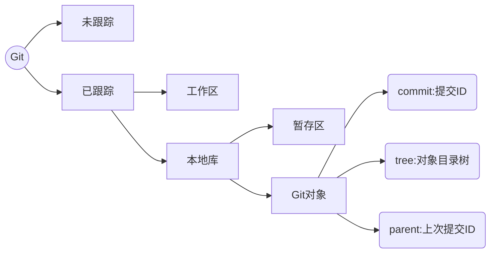

# 3.1 Git文档模型

## 

```mermaid
graph LR
1((Git)) --> 1.1[未跟踪]
1((Git)) --> 1.2[已跟踪]
1.2 --> 1.2.1[工作区]
1.2 --> 1.2.2[本地库]
1.2.2 --> 2.1[暂存区]
1.2.2 --> 2.2[Git对象]
2.2 --> 2.2.1(commit:提交ID)
2.2 --> 2.2.2(tree:对象目录树)
2.2 --> 2.2.3(parent:上次提交ID)
```
