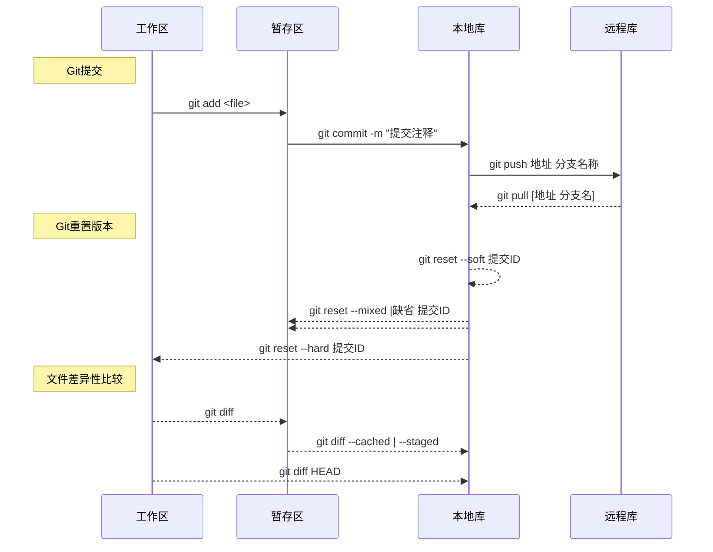

# 4.1 Git文件模型与常用操作

## 

```mermaid
sequenceDiagram
	Note left of 工作区: Git提交
	工作区 ->> 暂存区: git add <file>
	暂存区 ->> 本地库: git commit -m "提交注释"
	本地库 ->> 远程库: git push 地址 分支名称
	远程库 -->> 本地库: git pull [地址 分支名]
    Note left of 工作区: Git重置版本 
	本地库 -->> 本地库: git reset --soft 提交ID
	本地库 -->> 暂存区: git reset --mixed |缺省 提交ID
	本地库 -->> 暂存区: 
	本地库 -->> 工作区: git reset --hard 提交ID
	Note left of 工作区: 文件差异性比较
	工作区 -->> 暂存区 : git diff
	暂存区 -->> 本地库 : git diff --cached | --staged
	工作区 -->> 本地库 : git diff HEAD
```
