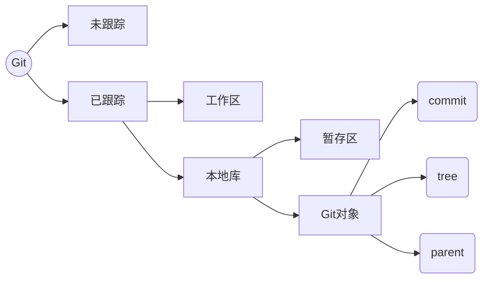
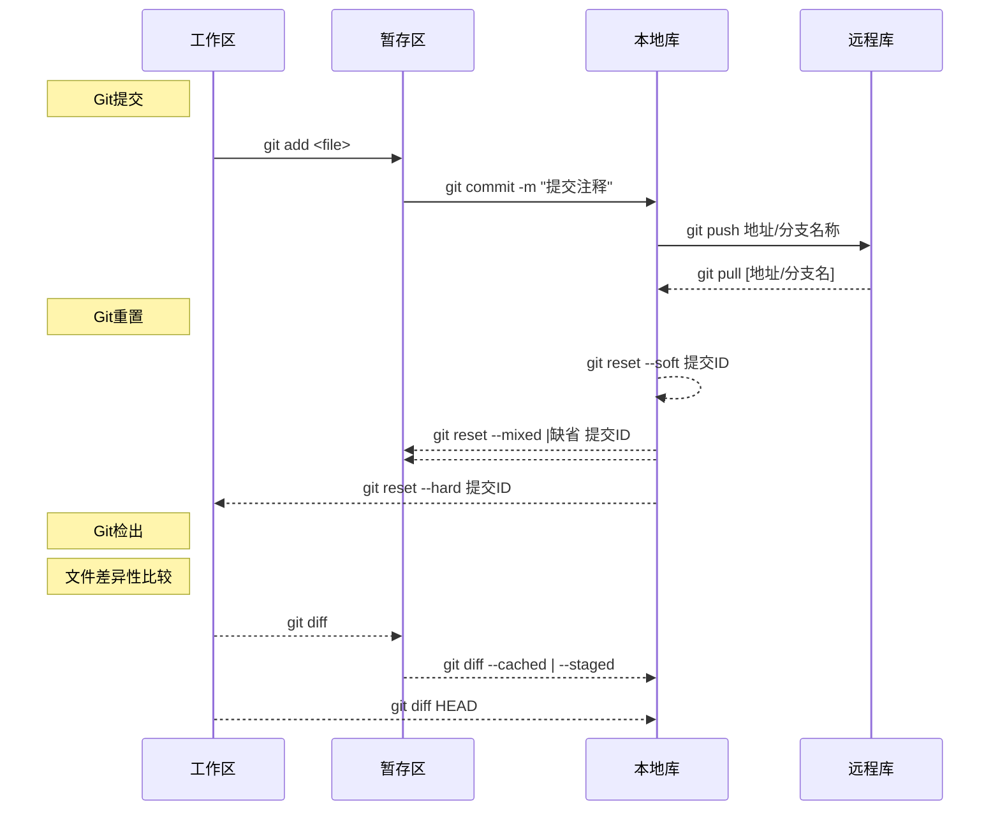

# 第四章 初始化

## 4.1 初始化本地库

1. 查看Git版本

    ```sh
    git --version
    ```

2. 本地初始化

    ```sh
    git init [本地库目录名称]
    ```

    > 缺省目录名称默认会将当前目录初始化为本地库
    >
    > 带目录名称参数会新建目录并将改目录初始化本地库

3. 远程库克隆

    ```sh
    git clone 远程库URL
    ```

    > ① 根据远程库的版本信息克隆为本地库
    >
    > ② 将远程库的工作文件拉取到本地工作区

## 4.2 本地库初始化配置

### 1. git config

- 选项说明:`git config [选项] <配置key> <value>`
    - `--system` : Git系统配置,当前主机所有用户都有效
    - `--global` : Git全局配置,当前主机的当前用户的所有版本库都有效
    - `缺省` 或 `--local` : Git本地库配置,只有本地库配置有效
- GIT常用`配置选项`
    - `user.name` : Git 版本库的操作人员标识
    - `user.email` : Git 版本库的操作人员标识
    -  `alias.自定义别名` : Git命令的别名设置
    - `color.ui` : Git命令的颜色标识 , 默认是true

- 案例说明

    ```sh
    # Git用户名配置
    	git config [选项] user.name '名称'
        
    # Git邮箱设置
    	git config [选项] user.email '邮箱名称'
    	
    # Git别名设置
    	git config [选项] alias.别名 <git命令>
    ```

### 2.  Git配置文件

- 系统配置文件 : 

    ```sj
    ./.git/config 		= 		--local (缺省)
    ~/.gitconfig		=		--global
    /etc/gitconfig		=		--system
    ```

- 配置文件原理 : INI文件格式

    ```sh
    # 设置属性值
    	git cofnig [选项] <section>.<key> <value>
    	
    # 读取属性值
    	git config [选项] <section>.<key>
    
    # 删除属性
    	git config [选项] --unset <section>.<key>
    ```

### 3. Git状态

- 查看文件状态详细描述

    ```sh
    git status
    ```

- 查看文件状态简单描述

    ```sh
    git status -s
    ```

    > 第一个 M : 表示暂存区和版本库之间有差异
    >
    > 第二个 M : 表示暂存区和工作区只有有差异

- 

### *4. Git的操作日志*

- 查看提交人的详细信息

    ```sh
    git log --pretty=full
    # 或
    git log --pretty=fuller
    ```

- 查看提交信息显示在一行

    ```sh
    git log --pretty-oneline
    ```

- 查看提交的变更信息

    ```sh
    git log --stat
    ```

- 查看指数量的日志

    ```sh
    git log -n 查看数量
    ```

- 查看详细操作日志

    ```sh
    git reflog
    ```

- 查看日志图形方式显示分支

    ```sh
    git log --graph
    ```

- 查看提交对象信息

    ```sh
    git log --pretty=raw
    ```

### 5. Git其他命令

- 删除工作区文件

    ```sh
    # 使用系统命令删除文件
    	rm [选项] 文件名称 		# 只删除工作区文件,不影响暂存区和本地库
    	
    # 使用Git命令删除
    	git rm [选项] 文件名称	# 删除工作区文件并且将修改添加到暂存区
    ```

- 重命名工作区文件

    ```sh
    # 使用系统命令
    	mv 文件名称 		# 剪切并移动文件,不影响暂存区和本地库
    	
    # 使用Git命令删除
    	git mv 文件名称 	# 剪切并移动文件,并且将修改添加到暂存区
    ```

# 第五章 暂存区

## 5.1GIt文件存储模型

### 1. 模型图



### 2. 暂存区

- 暂存区是包含文件索引的目录树 : 记录工区文件的时间戳和文件基本信息

### 3. Git对象的组成

```sh
# 查看ID类型
	git cat-filt -t <ID>
```

- commit : 提交ID,标识提交的唯一标识
- tree : 表示与提交关联的文件目录树
- parent : 表示提交的上次提交ID

## 5.1 暂存区的常用操作



## 5.2 Git操作对文件的改变

### 1. Git提交

- **<kbd>git add</kbd>**
    - ① 将工作区的文件目录信息保存在暂存区的文件目录树中
    - ② 将工作区改变的文件内容保存在git新的对象中,根据文件内容计算的ID值保存在暂存区的目录树中
- **<kbd>git commit</kbd>**
    - ① 暂存区的目录树会写到版本库 ( git 对象 ) 的目录树中
    - ② 分支指针的指向改变为最近提交的目录树

### 2. Git重置

- **<kbd>git reset -- file</kbd>**
    - 将暂存区的文件回退到版本库文件记录(覆盖暂存区目录价 + 覆盖暂存区对象)
- **<kbd>git reset --soft 提交ID</kbd>**
    - ① 将HEAD的执行改为指定提交ID
    - ② 不会改变暂存区和工作区文件
- **<kbd>git reset --mixed | 缺省 提交ID</kbd>**
    - ① 将HEAD的执行改为指定提交ID
    - ② 将指定提交ID的文件目录树覆盖暂存区的文件目录树
- **<kbd>git reset --hard 提交ID</kbd>**
    - ① 将HEAD的执行改为指定提交ID
    - ② 将指定提交ID的文件目录树覆盖暂存区的文件目录树
    - ③ 将指定提交ID的Git对象覆盖工作区文件内容

### 3. Git检出


### 4. Git查看差异

- **<kbd>git diff [ file ]</kbd>**
    - 查看工作区和暂存区文件的差别
- **<kbd>git diff --cached | --staged [ file ]</kbd>** 
    - 查看暂存区和版本库之间的差别
- **<kbd>git diff HEAD [ file ]</kbd>** 
    - 查看工作区和版本库之间的差别

### 5. Git其他命令

- git mv oldFile newFile
    - 移动 | 剪切文件并将修改添加到暂存区
- git rm  --cached file
    - 删除工作区文件并将修改添加到暂存区

# 第六章 Git 版本操作

