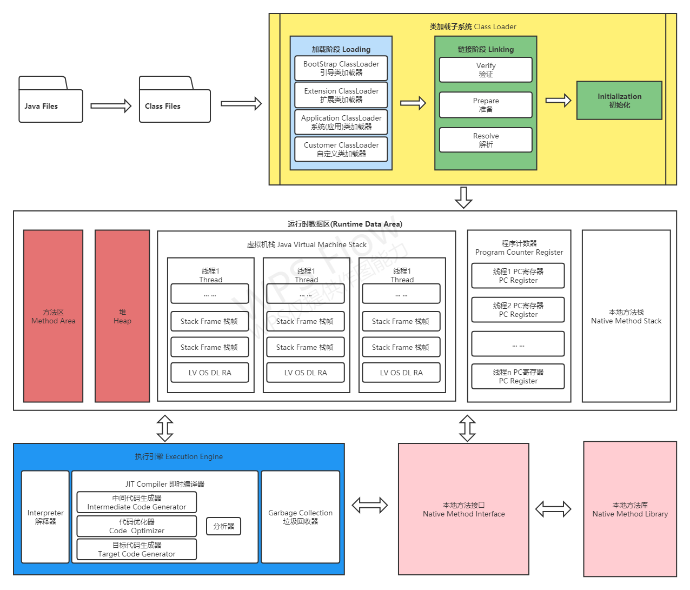
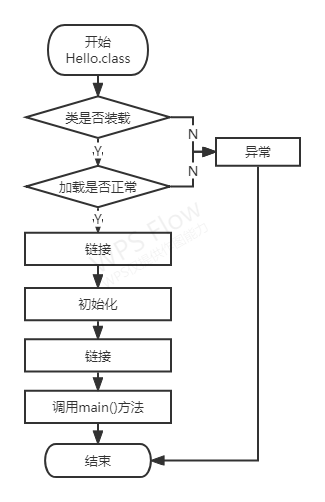

javap -v class文件


# 第二章 类加载子系统

## 2.1 内存结构概述



## 2.2 类加载器

1. Class文件：文件开头有特定的文件标识（CA FE BA BE）
2. 类加载器子系统功能：
   - 从文件系统或网络中加载class文件，ClassLoader（类加载器）只负责class文件的加载，至于是否可以运行，则由Execution Engine（执行引擎）决定；
   - 加载的类信息存储于方法区，除了类信息，方法区还会存放运行时常量池信息（字符串字面量或数字常量，这部分常量信息是class文件中常量的内存映射）
3. 举例说明：
   - 用户自定义一个Car.java类，编译后生成 Car.class文件存放与本地硬盘中（这个Car.class相当于一个模板，根据这个模板实例化出的Class对象就保存到JVM内存中）
   - class文件加载到JVM中被称为DNA元数据模板，存放与方法区
   - class文件 → 元数据模板这个过程需要一个运输工具（类加载器）扮演类似快递员的角色。

## 2.3 类加载过程



```java
public class Hello01 {
    private static int a = 1;

    public static void main(String[] args) {
        System.out.println(a);
    }
}
```

1. Loading（加载）：

   - 通过一个类的全限定名获取定义此类的二进制字节流

     > 补充：class文件来源
     >
     > 1. 本地系统
     > 2. 通过网络获取
     > 3. 中zip包中读取（jar、war）
     > 4. 运行时计算生成：动态代理技术
     > 5. 其他文件生成：JSP应用
     > 6. 从专有数据库提取

   - 将这字节流所代表的静态存储结构转换为方法区的运行是数据结构

   - 在内充中生成一个这个类的java.lang.Class对象（该对象作为这个方法区这个类的各种数据访问入口）

2. Linking（链接）：分成三个子阶段

   - Verify（验证）：验证阶段作用是保证Class文件的字节流包含的信息符合JVM规范，不会给JVM造成危害。如果验证失败，就会抛出一个java.lang.VerifyError异常或其子类异常。验证过程分为四个阶段：

     > 1. 文件格式验证：验证字节流文件是否符合Class文件格式的规范，并且能被当前虚拟机正确的处理。
     > 2. 元数据验证：是对字节码描述的信息进行语义分析，以保证其描述的信息符合Java语言的规范要求
     > 3. 字节码验证：主要是进行数据流和控制流的分析，保证被校验类的方法在运行时不会危害虚拟机。
     > 4. 符号引用验证：符号引用验证发生在虚拟机将符号引用转化为直接引用的时候，这个转化动作将在解析阶段中发生。

   - Prepare（准备）：准备阶段为变量分配内存并设置类变量的初始化。在这个阶段分配的仅为类的变量（static修饰的变量），而不包括类的实例变量。对已非final的变量，JVM会将其设置成“零值”，而不是其赋值语句的值：pirvate static int size = 12;。那么在这个阶段，size的值为0，而不是12。但final修饰的类变量将会赋值成真实的值。

     > 准备阶段变量a的值为0；

   - Resolve（解析）：解析过程是将常量池内的符号引用替换成直接引用。主要包括四种类型引用的解析。类或接口的解析、字段解析、方法解析、接口方法解析。

3. Initialization（初始化）：初始化阶段就是执行类构造器方法`<clinit>()`的过程，此方法不需要定义，是javac编译器自动收集类中所有类变量的赋值动作和静态代码块中语句合并而来；

   - 是为标记为常量值的字段赋值的过程。换句话说，只对static修饰的变量或语句块进行初始化。
   - 如果初始化一个类的时候，其父类尚未初始化，则优先初始化其父类。
   - 如果同时包含多个静态变量和静态代码块，则按照自上而下的顺序依次执行。
   - 虚拟机必须保证一个类的`<clinit>()`方法在多线程下被同步加锁

## 2.4 ClassLoader说明

1. 类加载器分类：JVM支持两种类加载器：引导类加载器、自定义类加载器（是指派生于抽象类ClassLoader的类加载器都划分为自定义类加载器），程序中场景的类加载器有三个：

   - ExtClassLoader和AppClassLoader都间接继承自ClassLoader：所以ExtClassLoader和AppClassLoader属于自定义类加载器

   - BootstrapClassLoader、ExtensionClassLoader、SystemClassLoader、UserDefinedClassLoader：这死者直接的关系是包含关系，不是上下层的关系，也不是父子类的继承关系（类似于目录结构的包含关系），BootstrapClassLoader用代码是无法获取到的，只负责核心类库加载

     > ```java
     > public class Hello01 {
     > 
     >     public static void main(String[] args) {
     >         // 获取系统类加载器
     >         ClassLoader app = ClassLoader.getSystemClassLoader();
     >         System.out.println(app);
     > 
     >         // 获取上层: 扩展类加载器
     >         ClassLoader ext = app.getParent();
     >         System.out.println(ext);
     > 
     >         // 获取上层
     >         ClassLoader parent = ext.getParent();
     >         System.out.println(parent);
     > 
     >         // 对用用户自定义类
     >         ClassLoader loader = Hello01.class.getClassLoader();
     >         System.out.println(loader);
     >       
     >       	// String类使用引导类加载器：系统核心类库都是引导类加载器
     >         ClassLoader str = String.class.getClassLoader();
     >         System.out.println(str);
     >     }
     > }
     > sun.misc.Launcher$AppClassLoader@18b4aac2
     > sun.misc.Launcher$ExtClassLoader@5e481248
     > null
     > sun.misc.Launcher$AppClassLoader@18b4aac2
     > ```

2. 虚拟机自带的加载器：启动类加载器（引导类加载器）BootstrapClassLoader

   - 使用C++实现的，嵌套在JVM内部
   - 用来加载Java核心库（JAVA_HOME/jre/lib/rt.jar、resources.jar、或者sun.boot.class.path路径下的内容，用于提供JVM自身使用的类），处于安全考虑，Bootstrap只加载java、javax、sun等开头的类
   - 不是继承自java.lang.ClassLoader，没有父加载器；
   - 加载扩展类加载器和应用程序类加载器，并指定为他们的父加载器

3. 虚拟机自带的加载器：扩展类加载器ExtensionClassLoader

   - java语言编写，sun.misc.Launcher$ExtClassLoader实现、派生于ClassLoader
   - 父加载器为启动类加载器
   - 从java.ext.dirs系统属性所指定的目录中加载类库，或者重JDK的安装目录的jre/lib/ext子目录下紧挨着类库，如果用户创建的jar放在此目录下，也会自动由扩展类加载器加载；

4. 虚拟机自带的加载器：应用类加载器（系统类加载器）APPClassLoader

   - java语言编写，sun.misc.Launcher$AppClassLoader实现、派生于ClassLoader
   - 父加载器为启动类加载器
   - 负责紧挨着classpath或系统属性java.class.path指定路径下的类库，一般来说Java应用所有的类都是有这个类完成

5. 为什么要自定义类加载器：

   - 隔离加载类：中间件模块和项目jar包隔离，为了不冲突（比如同名类）
   - 修改类的加载方式：比如在使用的时候再加载
   - 扩展加载源：
   - 防止源码泄漏：防止被反编译篡改

6. 自定义类加载器实现步骤

   - 继承ClassLoader，如果没有太复杂的需求，可以继承URLClassLoader
   - 将自定义类加载逻辑定义在findClass()方法

7. ClassLoader的常用获取方式

   | 方法名称                     | 描述                                         |
   | ---------------------------- | -------------------------------------------- |
   | getParent()                  | 返回该加载器的超类加载器                     |
   | loadClass(String name)       | 加载name的类,返回Class类的实例               |
   | findClass(String name)       | 查找name的类,返回Class类的实例               |
   | findLoadedClass(String name) | 查找name的已经被加载过的类,返回Class类的实例 |
   | defineClass()                |                                              |
   | resolveClass()               | 链接指定的一个Java类                         |

## 2.5 双亲委派机制

1. 双亲委派机制：Java虚拟机对Class文件采用的是按需加载的方式，也就是说当需要使用的改类时才会将它的Class文件加载到内存中生成class对象。而且加载某个类的class文件时，java虚拟机采用的是双亲委派模式：即把请求交由父类处理，是一种任务委派模式

2. 工作原理

   

   - 如果一个类加载器收到了类加载的请求，他并不会自己先去加载，而是把这个请求委托给父类的加载器去执行；
   - 如果父类加载器还存在父类加载器，则进一步向上委托，依次递归请求最终将达到顶层的启动类加载器
   - 如果父类加载器可以完成类加载任务，就成功返回；
   - 如果父类加载器无法完成加载任务，子类加载器才会常识自己去加载，这就是双亲委派模式；

3. 双亲委派优势：

   - 避免类的重复加载
   - 保护程序安全，防止核心API被篡改

4. 沙箱安全机制：

   - 保证对Java核心源代码的保护，这就是沙箱安全机制

5. JVM中两个Class对象完全一直的必要条件

   - 类的完整名称必须一致，包括报名
   - 加载这个类的ClassLoader必须相同

# 第三章 运行时数据区

## 3.1 概述

​        内存是非常重要的系统资源，是硬盘和CPU的中间桥梁，承载着操作系统和应用程序的实时运行。JVM内存布局规定了Java在运行过程中内存申请、分配、管理的策略，保证JVM的高效稳定运行；

​        类加载器子系统将Class文件中数据加载到运行时数据区，执行引擎执行指令过程中的数据就是从运行时数据区获取；运行时数据区基本结构：①方法区、②堆、③程序计数器、④本地方法栈、⑤虚拟机栈

1. 方法区（元数据区）：存在Class元数据信息、类静态常量池、方法元信息

2. 堆：①新生代（Eden、S0、S1）②老年代

3. 程序计数器：记录当前线程的执行位置

4. 虚拟机栈：局部变量表、操作栈、动态链接、方法返回地址

5. 本地方法栈：

6. Java虚拟机定义了若干种程序运行期间会使用到的运行时数据区，其中有一些会随着虚拟机启动而创建，随着虚拟机退出而销毁。另外一些则是与线程一一对应的，这些与线程对应的数据区域会随着线程开始和结束而创建和销毁

   - 每个线程：独立包括程序计数器、栈、本地栈

   - 线程间共享：堆、堆外内存（永久代或元空间）

7. Runtime：每个JVM只有一个Runtime实例（运行时环境），

## 3.2 线程

1. 线程是程序的运行单元，JVM运行一个应用有多个线程并行的执行

2. 在Hotspot JVM里，每个线程都与操作系统的本地线程直接映射（当一个Java线程准备好执行以后，此时一个操作系统的本地线程也同时创建。Java线程执行终止后，本地线程也同时回收）

3. 操作系统负责所有的线程的安排，调度到任意一个可用的CPU上。一旦本地线程初始化成功，它就会调用java线程中的run方法

4. JVM系统线程

   

# 第四章 程序计数器

1. 概述：JVM的程序计数寄存器，Register的命名源于CPU寄存器，寄存器存储指令相关的执行信息，CPU只讲把数据装载到寄存器才能运行。在JVM中的PC寄存器是对物理PC寄存器的一种抽象模拟
2. 作用：PC寄存器用来存储指向下一条指令的地址，即将要执行的指令的代码，由执行引擎读取下一条指令；
   - 很小的内存空间，运行速度最快的存储区域
   - 在JVM规范中，每个线程都有自己的程序计数器，是线程私有的，生命周期与线程的生命周期保持一致
   - 任何时间只有一个线程中的一个方法在执行，也就是当前方法，程序计数器会存储当前线程正在执行的Java方法的JVM指令地址，如果执行的是native方法，则是位指定值（undefined）；

# 第五章 虚拟机栈

# 第六章 本地方法接口

# 第七章 本地方法栈

# 第八章 堆

# 第九章 方法区

# 第十章 直接内存


