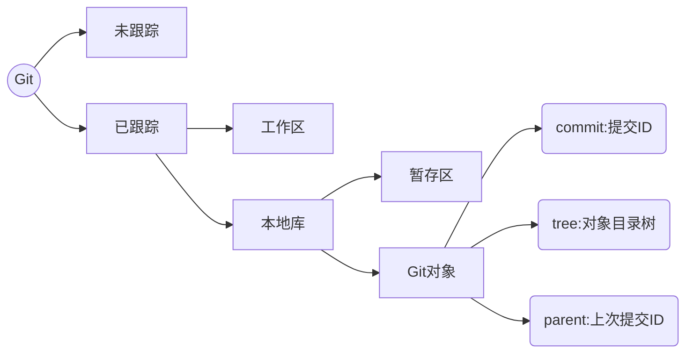
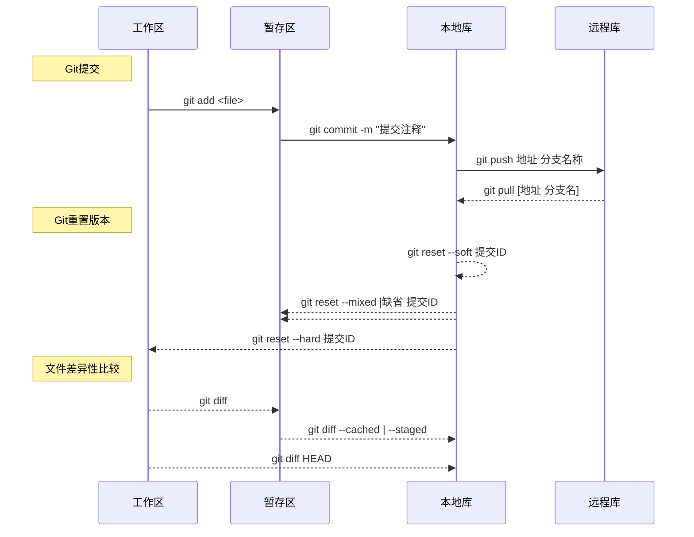

# GIT目录

- [说明](README.md)

- [第一章 Git概述](data/class01/README.md)
  - [1.1 版本控制发展历程](data/class01/1.1 版本控制发展历程.md)
  - [1.2 Git的特点](data/class01/1.2 Git的特点.md)
  - [1.3 Git 安装](data/class01/1.3 Git 安装.md)

- [第二章 Git初始化与配置](data/class02/README.md)

  - [2.1 初始化本地库](data/class02/2.1 初始化本地库.md)
  - [2.2 Git配置原理](data/class02/2.2 Git配置原理.md)

- [第三章 Git模型与帮助](data/class03/README.md)

  - [3.1 Git文档模型](data/class03/3.1 Git文档模型.md)
  - [3.2 查看Git文件状态](data/class03/3.2 查看Git文件状态.md)
  - [3.3 查看Git操作日志](data/class03/3.3 查看Git操作日志.md)
  - [3.4 Git其他命令](data/class03/3.4 Git其他命令.md)

- [第四章 Git基本操作](data/class04/README.md)

  - [4.1 Git文件模型与常用操作](data/class04/4.1 Git文件模型与常用操作.md)
  - [4.2 Git暂存区与Git对象](data/class04/4.2 Git暂存区与Git对象.md)
  - [4.3 Git提交](data/class04/4.3 Git提交.md)
  - [4.4 Git版本穿梭](data/class04/4.4 Git版本穿梭.md)
  - [4.5 查看Git差异](data/class04/4.5 查看Git差异.md)

- [第五章 Git远程库](data/class05/README.md)

  - [5.1 Git协议](data/class05/5.1 Git协议.md)
  - [5.2 配置SSH秘钥](data/class05/5.2 配置SSH秘钥.md)
  - [5.3 Git远程库相关操作](data/class05/5.3 Git远程库相关操作.md)

- [第六章 分支与标签](data/class06/README.md)

  - [6.1 分支](data/class06/6.1 分支.md)
  - [6.2 标签](data/class06/6.2 标签.md)

- [第七章 Git submodule](data/class07/README.md)

  - [7.1 子模块设计原理](data/class07/7.1 子模块设计原理.md)
  - [7.2 子模块的使用流程](data/class07/7.2 子模块的使用流程.md)
  - [7.3 克隆父模块并初始化](data/class07/7.3 克隆父模块并初始化.md)
  - [7.4 删除子模块](data/class07/7.4 删除子模块.md)

- [第八章 Git subtree](data/class08/README.md)

  - [8.1 subtree介绍](data/class08/8.1 subtree介绍.md)
  - [8.2 subtree的配置](data/class08/8.2 subtree的配置.md)
  - [8.3 subtree操作细节](data/class08/8.3 subtree操作细节.md)

  [第九章 搭建Git服务器](data/class09/README.md)

  - [9.1 离线安装Gitlib](data/class09/9.1 离线安装Gitlib.md)
  - [9.2 在线安装Gitlib](data/class09/9.2 在线安装Gitlib.md)
  - [9.3 Docker 安装Gitlib](data/class09/9.3 Docker 安装Gitlib.md)

# 第一章 Git概述

## 1.1 版本控制发展历程

1. 1982年的RCS。现在你可能还能在Unix的发布包中找到它

   - 早在70年代末80年代初，**VCS的概念**已经存在
   - RCS的互斥写入机制避免了多人同时修改同一个文件的可能

2. 1986年，Dick Grune 开发出**CVS**

   > CVS继承了RCS的集中管理的理念。在CVS管理下的文件构成一个库(repository)。与RCS的锁定文件模式不同，CVS采用复制-修改-合并(copy-modify-merge)的模式，来实现多线开发

3. **Subversion**的开发者Karl Fogel和Jim Blandy是长期的CVS用户

   - Subversion在许多方面沿袭CVS，也是集中管理库，通过记录改变来追踪历史，允许分支和合并，但并不鼓励过多分支。Subversion在一些方面得到改善
   - Subversion采用关系型数据库来存储改变集。VCS相关数据变得不透明。
   - CVS中的版本是针对某个文件的，CVS中每次commit生成一个文件的新版本。Subversion中的版本是针对整个文件系统的(包含多个文件以及文件组织方式)，每次commit生成一个整个项目文件系统树的新版本。

4. Git的第一个版本是Linux之父Linus Torvalds亲手操刀设计和实现的

   - 分布式版本控制系统

## 1.2 Git的特点

1. Git是分布式的，SVN是集中式的
2. Git复杂概念多，SVN简单易上手
3. Git分支廉价，SVN分支昂贵

## 1.3 Git 安装

# 第二章 Git初始化与配置

## 2.1 初始化本地库

### 1. 初始化当前目录为本地库

```sh
git init
```

> - 将当前所在的目录初始化git仓库
> - 在当前目录会生成`.git`文件夹 : `.git`表示本地库

### 2. 初始化指定文件夹为本地库

```sh
git init 指定文件夹路径
```

> - 将指定文件夹初始化git仓库
> - 会在该文件夹下生成`.git`文件夹 : `.git`表示本地库

### 3. 根据远程库初始化本地库

```sh
git clone 远程仓库URL
```

> - 在当前目录中生成与远程仓库同名的文件夹
> - 在该文件夹中的`.git`文件夹中包含了版本库信息

## 2.2 Git配置原理

### 1. 配置命令基本语法

```sh
git config [作用域选项] <group>.<key> <value>
```

- **作用域选项**

  - `--system` : 表示为系统配置,作用域最大,当前系统都有效
  - `--global` : 表示为用户配置,只对当前系统登录用户有效
  - `--local` 或 `缺省` : 表示为本地库配置,只会对当前版本库有效

- **查看作用域配置文件**

  ```sh
  --local 或 缺省	  = 		  ./.git/config  (.git目录下)
  --global			=			~/.gitconfig   (用户目录中)
  --system			=			/etc/gitconfig (系统配置目录)
  ```


### 2. 配置文件原理 : INI文件格式

```sh
# 设置属性值
	git cofnig [选项] <group>.<key> <value>
	
# 读取属性值
	git config [选项] <group>.<key>

# 删除属性
	git config [选项] --unset <section>.<key>
```

### 3. 常用配置项

- `user.name` : Git 版本库的操作人员标识
- `user.email` : Git 版本库的操作人员标识
- `alias.自定义别名` : Git命令的别名设置
- `color.ui` : Git命令的颜色标识 , 默认是true

# 第三章 Git模型与帮助

## 3.1 Git文档模型



## 3.2 查看Git文件状态

1. 查看本地库文件详细信息

   ```sh
   git status
   ```

2. 查看文件状态

   ```sh
   git status -s
   ```

   - 第一个 M : 表示暂存区和版本库之间有差异
   - 第二个 M : 表示暂存区和工作区只有有差异

## 3.3 查看Git操作日志

### 1. 查看提交日志

```sh
git log [选项] [参数]
```

- **选项 `--pretty=full` :** 查看提交人与开发作者

  ```sh
  commit 提交ID
  Author: 开发作者 <邮箱>
  Commit: 提交人 <邮箱>
  
      提交的注释信息
  ```

- **选项 `--pretty=fuller` :** 查看提交人与开发作者以及详细时间

  ```sh
  commit 提交ID
  Author: 开发作者 <邮箱>
  AuthorDate: 开发提交时间
  Commit: 提交人 <邮箱>
  CommitDate: 开发提交时间
  
      提交的注释信息
  
  ```

- **选项 `--pretty=oneline` :** 一行显示提交ID信息

- **选项 `--oneline` :** 一行显示提交ID信息

  ```sh
  提交ID 提交的注释信息
  ```

- **选项 `--stat` :**  查看提交的文件变更

  ```sh
  commit 提交ID
  Author: 开发作者 <邮箱>
  Date:   Fri Jul 5 13:07:54 2019 +0800
  
      提交的注释信息
  
   变更文件 | 1 +
   1 file changed, 1 insertion(+)
  
  ```

- **选项 `-n 查看数量` :**  查看指定数量是日志

- **选项 `--pretty=raw` :**  查看提交的Git对象ID

  ```sh
  commit 提交ID
  tree 版本库对象树ID
  parent 父级提交ID
  author 作者 <邮箱> 1562303274 +0800
  committer 提交人 <邮箱> 1562303274 +0800
  
      提交的注释信息
  
  ```

### 2. Git操作日志

```sh
git reflog
```

## 3.4 Git其他命令

1. `git rm` 与 `rm`

   ```sh
   # 使用系统命令删除文件
   	rm [选项] 文件名称 		# 只删除工作区文件,不影响暂存区和本地库
   	
   # 使用Git命令删除
   	git rm [选项] 文件名称	# 删除工作区文件并且将修改添加到暂存区
   ```

2. `git mv` 与 `mv`

   ```sh
   # 使用系统命令
   	mv 文件名称 		# 剪切并移动文件,不影响暂存区和本地库
   	
   # 使用Git命令删除
   	git mv 文件名称 	# 剪切并移动文件,并且将修改添加到暂存区
   ```

# 第四章 Git基本操作

## 4.1 Git文件模型与常用操作



## 4.2 Git暂存区与Git对象

### 1. 暂存区功能介绍

- **暂存文件** : `.git`目录中的`index`文件 : 记录工区文件的时间戳和文件基本信息

  > Linux系统的所有信息都是以文件的形式保存
  >
  > Git根据`.git/index`文件中记录的时间戳, 长度信息判断工作区文件是否改动

- `.git/index`文件实际上是包含工作区文件索引的目录树
- 用于记录提交任务

### 2. Git对象

- **Git对象** :保存在`.git/objects`目录中

- **GIt对象的组成**

  - commit : 提交ID,标识提交的唯一标识
  - tree : 表示与提交关联的文件目录树
  - parent : 表示提交的上次提交ID

  > 每个组成都有其固定的ID值

- 查看Git对象中的各种ID信息

  ```sh
  git cat-filt -t <ID>
  ```

### 3. Git中的概念

- **分支** : 由一系列提交组成的有关联的提交记录,每个分支都有其指定名称
- **HEAD** : 指游标 或 指针, 始终指向当前分支的提交点

## 4.3 Git提交

- **<kbd>git add</kbd>**
  - ① 将工作区的文件目录信息保存在暂存区的文件目录树中
  - ② 将工作区改变的文件内容保存在git新的对象中,根据文件内容计算的ID值保存在暂存区的目录树中
- **<kbd>git commit</kbd>**
  - ① 暂存区的目录树会写到版本库 ( git 对象 ) 的目录树中
  - ② 分支指针的指向改变为最近提交的目录树

## 4.4 Git版本穿梭

### 1. 重置命令的基本操作

- **<kbd>git reset -- file</kbd>**
  - 将暂存区的文件回退到版本库文件记录(覆盖暂存区目录价 + 覆盖暂存区对象)
- **<kbd>git reset --soft 提交ID</kbd>**
  - ① 将HEAD的执行改为指定提交ID
  - ② 不会改变暂存区和工作区文件
- **<kbd>git reset --mixed | 缺省 提交ID</kbd>**
  - ① 将HEAD的执行改为指定提交ID
  - ② 将指定提交ID的文件目录树覆盖暂存区的文件目录树
- **<kbd>git reset --hard 提交ID</kbd>**
  - ① 将HEAD的执行改为指定提交ID
  - ② 将指定提交ID的文件目录树覆盖暂存区的文件目录树
  - ③ 将指定提交ID的Git对象覆盖工作区文件内容

### 2. 重置命令使用说明

- 重置命令会改变HEAD指针的指向从而完成提交版本的改变
- 重置原理改变HEAD指针提交对象的文件内容, 从而完成对工作区 或 暂存区文件内容的重置
- 可以通过查看提交日志查看历史版本

## 4.5 查看Git差异

- **<kbd>git diff [ file ]</kbd>**
  - 查看工作区和暂存区文件的差别
- **<kbd>git diff --cached | --staged [ file ]</kbd>** 
  - 查看暂存区和版本库之间的差别
- **<kbd>git diff HEAD [ file ]</kbd>** 
  - 查看工作区和版本库之间的差别

# 第五章 Git远程库

## 5.1 Git协议

### 1.http协议

- 特点 : 传输不加密,每次远程连接需要验证用户名与密码

### 2. https协议

- 特点 : 传输加密, 第一次连接远程需要验证用户名与密码

### 3. SSH协议

- 特点 : 远程连接是使用秘钥和公钥验证用户

## 5.2 配置SSH秘钥


## 5.3 Git远程库相关操作

### 1. Git远程版本库

- [Github](https://github.com/)
- [码云](https://gitee.com)

### 2.  push 和 pull的完整格式

```sh
git pull 远程URL 分支名称
```

```sh
git push 远程URL 分支名称
```

### 3. 本地库中配置远程库

- 配置连接远程库的URL

  ```sh
  git remote add 别名 URL
  ```

  > 连接远程库的操作使用别名即可

- 查看本地库中远程库信息

  ```sh
  git remote				 # 查看所有的远程仓储名称
  git remote show 别名		# 查看远程库别名对应的详细信息
  git remote  -v			 # 查看关联的所有的远程仓储名称及地址
  ```

- 删除远程库信息

  ```sh
  git remote remove 远程库别名
  ```

# 第六章 分支与标签

## 6.1 分支

### 1. 添加分支

- 添加本地仓库分支

  ```sh
  git branch 分支名称
  ```

- 添加远程仓库分支

  ```sh
  git push --ser-upstream 远程URL 分支名称
  ```

  > 表示将推送到远程分支的上游分支设置问本地正在提交的分支

### 2. 同步远程分支

- **拉取远程分支到本地**

  ```sh
  git pull 
  ```

- **关联本地分支到本地远程库分支**

  ```sh
  git branch --set-upstream-to=远程URL/远程分支名称
  	# 或
  git branch --track 远程URL/远程分支名称
  ```

  > 第一次推送分支需要设置分支关联
  >
  > **本地分支关联** : 表示将本地远程分支与本地对应的分支做关联

### 3. 删除分支

- 删除本地分支

  ```sh
  git checkout -d 分支名称
  ```

  > `-D` : 强制删除, 没有合并分支也会被删除

- 删除远程分支

  ```sh
  git push origin [空格]:远程分支
  ```

  ```sh
  git push origin --delete 分支名称
  ```

- 删除本地远程不存在的分支

  ```sh
  git remote prune origin
  ```

### 4 合并分支

```sh
git merge 被合并分支名称
```

- 被合并的分支不可以是当前分支

## 6.2 标签

### 1. 标签的作用

- 版本库中打一个标签（tag），这样，就唯一确定了打标签时刻的版本。
- 将来无论什么时候，取某个标签的版本，就是把那个打标签的时刻的历史版本取出来。
- 标签也是版本库的一个快照

### 2. 标签的创建

- 创建简单标签 : 没有注释信息

  ```sh
  git tag 标签名称
  ```

- 创建注释标签 : 给标签添加注释信息

  ```sh
  git tag 标签名称 -m "标签注释信息"
  ```

### 3. 提交标签到远程仓库

```sh
git push origin --tags
```

> -tags可以把本地的打的标签全部提交到远程仓库

### 4. 删除标签

- 删除本地标签

  ```sh
  git tag -d 标签名称
  ```

- 删除远程库标签: 提交空的形式

  ```sh
  git push origin :refs/tags/标签名称
  ```

  > 冒号前为空表示删除远程仓库的tag

- 删除远程库标签:`--delete` 选项

  ```sh
  git push origin --delete 标签名称
  ```

### 5. 查看标签

- 查看标签名称

  ```sh
  git tag
  git tag -l
  ```

- 查看标签版本信息

  ```sh
  git show 标签名称
  ```

# 第七章 Git submodule

## 7.1 子模块设计原理

- 指一个通用的模块被多个项目所依赖
- 这个通用模块会被频繁更新
- 使用原理 : 在父模块中添加子模块并且都是独立的远程仓库
  - 操作子模块或父模块需要在各自的仓库中执行git命令

## 7.2 子模块的使用流程

### 1. 初始化远程库

- 在远程库中子模块与父模块是独立远程库

### 2. 在本地库初始化父模块

- 配置父模块的用户信息与本地远程库信息

### 3. 在父模块中添加子模块

```sh
 git submodule add 子模块的远程URL 子模块存放的文件夹
```

> 子模块存放的文件夹在此之前不可以存在

- 作用一 : 将子模块中的文件保存在指定的文件夹中,并且将该文件设置为子模块的本地仓库

- 作用二 : 在父模块根目录中生成 `.gitmodules`文件 : 是子模块的配置文件

  ```ini
  [submodule "子模块所在的文件夹"]
          path = 相对父模块的路径
          url = 子模块的远程库URL地址
  ```

### 4. 将子模块推送到远程

- 将新增的文件添加到父模块的版本库并提交
- 并正常推送到远程

### 5. 子模块的与父模块的操作

- 子模块和父模块在同一文件夹中的操作相互不影响
- 子模块和父模块可以可以作为单独的项目正常操作
- 父模块中更新/操作子模块需要进入子模块项目中

- 在父模块中拉取子模块的文件 : 在父模块中更新所有的子模块

  ```sh
  git submodule foreach pull
  ```

## 7.3 克隆父模块并初始化

### 1. 克隆方式一 : 正常克隆

- 克隆父模块时候不会将子模块中的文件一起克隆到本地

  ```sh
  git clone 父模块远程URL
  ```

- 初始化子模块信息

  ```sh
  git submodule init
  ```

- 更新子模块文件

  ```sh
  git submodule update --recursive
  ```

  > `--recursive` : 表示递归更新文件

- 此时子模的指向是克隆对应的提交ID,需要将子模块的指向切换到指定分支

### 2. 克隆方式二 : 递归克隆

```sh
git clone 父模块远程URL --recursive
```

## 7.4 删除子模块

- 删除原理 : 正常删除文件的方式顺序删除子模块

  1. 删除暂存区中的子模块

     ```sh
     git rm --cached 子模块文件夹
     ```

  2. 删除工作区子模块文件

     ```sh
     rm -rf  子模块文件夹
     ```

  3. 删除子模块的配置文件

     ```sh
     rm -rf .gitmodules
     ```

  4. 将本地库修改提交并push到远程库

# 第八章 Git subtree

## 8.1 subtree介绍

### 1. 基本介绍

- git subtree与git submodule不同，它不增加任何像`.gitmodule`这样的新的元数据文件.
- git subtree对于项目中的其他成员透明，意味着可以不知道git subtree的存在.
- 子仓库的更新与推送指令相对复杂。
- git subtree 可以实现一个仓库作为其他仓库的子仓库。

### 2. 使用原理

- subtree项目是作为被依赖项目的文件存在, 和项目文件的操作相同

- 对subtree项目的同步需要执行额外的命令完成

## 8.2 subtree的配置

### 1. 初始化远程库

- 依赖库与被依赖库是独立的远程库

### 2. 初始化本地库 : 父项目

- 配置用户信息和本地库的远程信息

  ```sh
  git remote add origin 父项目的URL
  ```

### 3. 在父项目中配置子项目的远程信息

- 需要给父项目配置, 方便之后的操作

  ```sh
  git remote add origin 子项目的URL
  ```

### 4. 根据远程库的URL克隆子项目

```sh
git subtree add --prefix=子项目的文件夹 子项目URL 需要克隆的名称 --squash [克隆选项]
```

- 这是固定格式 : 对子模块的操作需要指定子模块的所在的位置以及远程分支
- [克隆选项] --squash : 合并压缩, 添加该参数, 每次合并( merge | pull )操作会将子模块的提交压缩为一个提交在父模块中, 这样会丢失子模块的提交完整信息, 但是可以保证父项目的提交历史完整
  - 如果首次克隆时候添加的该选项,之后的每次合并操作都需要带该选项

## 8.3 subtree操作细节

### 1. 更新:pull

- git pull : 子项目作为父项目的文件, git更新操作只会更新父项目中的子项目,不会更新到远程的子项目

- 在父模块中更新子项目文件

  ```sh
  git subtree pull --prefix=子项目的文件夹 子项目URL 需要克隆的分支名称 --squash [更新选项]
  ```

### 2. 提交

- 首先提交父项目

  - 在父项目在子项目中的改动, 首先将改动信息提交到父项目的历史中

- 再次提交子项目

  ```sh
  git subtree push --prefix=子项目的文件夹 子项目URL 需要克隆的分支名称
  ```

# 第九章 搭建Git服务器

## 9.1 离线安装Gitlib

### 1. 在线环境预下载GitLab

- 在虚拟机环境中依次输入如下命令

  ```sh
  # 使用阿里云作加速
  cd /etc/yum.repos.d/ 
  mkdir bak
  mv *.repo ./bak
  wget -O /etc/yum.repos.d/epel.repo http://mirrors.aliyun.com/repo/epel-7.repo
  wget -O /etc/yum.repos.d/CentOS-Base.repo http://mirrors.aliyun.com/repo/Centos-7.repo
  
  # 添加 GitLab 镜像源并安装，建议切换国内资源加速访问
  curl https://packages.gitlab.com/install/repositories/gitlab/gitlab-ce/script.rpm.sh | sudo bash
  
  # 创建 gitlab-ce 的 repo，使用清华大学加速
  vim /etc/yum.repos.d/gitlab_gitlab-ce.repo
  
  [gitlab-ce]
  name=gitlab-ce
  baseurl=http://mirrors.tuna.tsinghua.edu.cn/gitlab-ce/yum/el7
  repo_gpgcheck=0
  gpgcheck=0
  enabled=1
  gpgkey=https://packages.gitlab.com/gpg.key
  
  # 安装 yum-plugin-downloadonly 插件
  yum install -y yum-plugin-downloadonly
  
  # 下载 gitlab-ce 相关 rpm 到指定目录
  mkdir -p /tmp/repo/gitlab-ce/
  yum install --downloadonly --downloaddir=/tmp/repo/gitlab-ce/ gitlab-ce
  
  # 通过scp拷贝安装文件至内网CentOS7环境
  cd /tmp/repo/gitlab-ce
  scp gitlab-ce-11.4.5-ce.0.el7.x86_64.rpm root@服务器IP:/tmp/
  ```

### 2. 内网环境安装GitLab

- 安装GitLab内存必须大于2GB以上，内存或swap过低会出现502错误

- 配置本地yum源

  ```sh
  # 挂载CentOS7光盘镜像
  mkdir /media/CentOS
  mount /dev/cdrom /media/CentOS
  
  # 本地yum源配置
  cd /etc/yum.repos.d/ 
  mkdir bak
  mv *.repo ./bak
  
  # 创建本地yum源文件
  vi CentOS-Base.repo
  [base]
  name=base
  baseurl=file:///media/CentOS
  gpgcheck=0
  enabled=1
  
  # 重建yum源
  yum makecache
  ```

- 环境依赖包安装及防火墙配置

  ```sh
  # 安装依赖包
  yum install -y pygpgme yum-utils
  yum install -y curl policycoreutils-python openssh-server
  yum install -y git
  
  # 防火墙永久开启http
  firewall-cmd --permanent --add-service=http
  systemctl reload firewalld
  
  # 安装postfix邮件服务
  yum install postfix
  systemctl enable postfix
  systemctl start postfix
  ```

- 安装gitlab并启动服务

  ```sh
  # rmp安装
  cd /tmp
  rpm -ivh gitlab-ce-11.4.5-ce.0.el7.x86_64.rpm
  
  # gitlab预配置
  vi /etc/gitlab/gitlab.rb
  # 找到并修改external_url 'http://gitlab.example.com'
  external_url 'http://服务器IP'
  
  # gitlab邮件配置
  gitlab_rails['smtp_enable'] = true
  gitlab_rails['smtp_address'] = "smtp.exmail.qq.com"
  gitlab_rails['smtp_port'] = 465
  gitlab_rails['smtp_user_name'] = "xxx@xxx.com"
  gitlab_rails['smtp_password'] = "*****"
  gitlab_rails['smtp_domain'] = "xxx.com"
  gitlab_rails['smtp_authentication'] = "login"
  gitlab_rails['smtp_enable_starttls_auto'] = true
  gitlab_rails['smtp_tls'] = false
  gitlab_rails['gitlab_email_from'] = "xxx@xxx.com"
  
  # 自动配置gitlab
  gitlab-ctl reconfigure
  
  # 启动所有服务
  gitlab-ctl start 
  ```

### 3. 访问GitLab并测试

- 浏览器访问 http://服务器IP， 初次访问会提示设置root账户密码

- root账户gitlab，依次访问Configure  GitLab->Settings->CI/CD->取消勾选Default to Auto DevOps pipeline for all projects，取消勾选Enable shared runners for new projects

- 注册用户，并创建一个test项目

  ```sh
  # 本地环境clone测试
  git cone git@服务器ID:用户名/test.git
  cd test 
  vi ReadME.md
  git add ReadME.md
  git commit -m "测试"
  git push
  ```

### 4. 故障排查

- 如果出现502错误，检查端口是否被占用，服务器内存是否大于2GB，然后尝试 gitlab-ctl reconfigure 重新配置gitlab
- 如果已经在gitlab上添加了公钥，git操作时还是提示需要输入密码，需要输入的是git用户的密码，而不是gitlab账户的密码，这个时候需要检查git用户是否能ssh登录服务器

## 9.2 在线安装Gitlib

## 9.3 Docker 安装Gitlib

### 1.gitlab镜像拉取

```sh
# gitlab-ce为稳定版本，后面不填写版本则默认pull最新latest版本
$ docker pull gitlab/gitlab-ce
```

### 2.运行gitlab镜像

```sh
$ docker run -d  -p 443:443 -p 80:80 -p 222:22 --name gitlab --restart always -v /home/gitlab/config:/etc/gitlab -v /home/gitlab/logs:/var/log/gitlab -v /home/gitlab/data:/var/opt/gitlab gitlab/gitlab-ce
# -d：后台运行
# -p：将容器内部端口向外映射
# --name：命名容器名称
# -v：将容器内数据文件夹或者日志、配置等文件夹挂载到宿主机指定目录
```

### 3.配置

> 按上面的方式，gitlab容器运行没问题，但在gitlab上创建项目的时候，生成项目的URL访问地址是按容器的hostname来生成的，也就是容器的id。作为gitlab服务器，我们需要一个固定的URL访问地址，于是需要配置gitlab.rb（宿主机路径：/home/gitlab/config/gitlab.rb）

```sh
$ vim /home/gitlab/config/gitlab.rb
```

```sh
# 配置http协议所使用的访问地址,不加端口号默认为80
external_url 'http://192.168.199.231'

# 配置ssh协议所使用的访问地址和端口
gitlab_rails['gitlab_ssh_host'] = '192.168.199.231'
gitlab_rails['gitlab_shell_ssh_port'] = 222 # 此端口是run时22端口映射的222端口
```

### 4. 重启gitlab容器

```sh
$ docker restart gitlab
```

