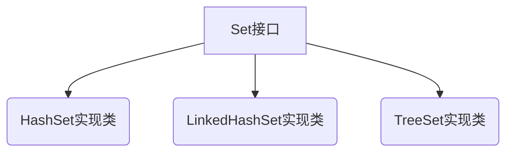

# 第三章 Set集合

## 3.1 Set接口

#### ① HashSet

- 简介
  - 不能保证元素的顺序；
  - 不可重复；
  - 不是线程安全的；
  - 集合元素可以为 NULL
  - 底层其实是一个数组

#### ② LinkedHashSet

- 简介
  - 不可以重复，有序

#### ③ TreeSet

- 简介
  - 有序；
  - 不可重复；
  - 底层使用 红黑树算法，擅长于范围查询