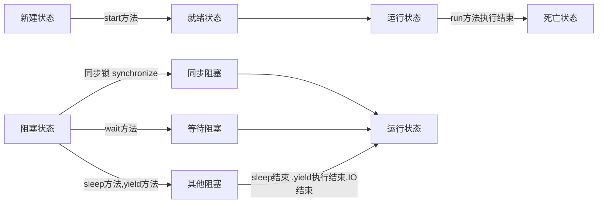

# 第一章 多线程基础知识

##1.1 程序、线程与进程

### 1. 程序

- 程序只是一组指令的有序集合 
  - 每个程序内部，存在一个或者多个执行线程 
- 在系统级别内，程序并排执行 
  - 分配到每个程序的执行时间是基于该程序的所需时间和其他程序的所需时间来决定的 

### 2.进程

- 一个运行着的程序就是一个进程或者叫做一个任务 
  - 进程是表示资源分配的基本单位。

### 3.线程

- 一个进程至少包含一个线程
  - 线程则是进程中执行运算的最小单位 
- 线程就是程序的执行流 

### 4.多线程特点

- 优点
  - 能适当提高程序的执行效率
  - 能适当提高资源利用率（CPU、内存利用率） 
- 缺点
  - 开启线程需要占用一定的内存空间（默认情况下，主线程占用1M，子线程占用512KB） 
  - 线程越多，CPU在调度线程上的开销就越大 
  - 程序设计更加复杂：比如线程之间的通信、多线程的数据共享  

### 5.并发

- 并发就是在**单核处理器**中同时处理多个任务.(这里的同时指的是逻辑上的同时) 
- 并行就是在**多核处理器**中同时处理多个任务.(这里的同时指的就是物理上的同时) 

### 6.线程安全

- 线程安全就是指程序按照你的代码逻辑执行，并始终输出预定的结果 
- 当多个线程访问某个类时，这个类始终都能表现出正确的行为，那么就称这个类是线程安全的

# 第二章 Java创建线程

## 2.1 继承Thread类

```java
public class 线程类 extends Thread{
	public void run() {
		//方法体
	}
}
//执行线程类中的run方法
① new 一个线程类的实例对象
② 线程实例对象执行 start()方法;
```

## 2.2 实现Runable接口

```java
public class 线程类 implements Runnable{
	public void run() {
		//方法体
	}
}
//执行线程类中的run方法
① new 一个线程类的实例对象
② 根据 Runnable 实例创建Thread实例对象
③ Thread实例对象执行  start()方法;
```

## 2.3 实现Callable接口


# 第三章 Lambda表达式

## 3.1 内部类

### 1 线程类的基本形式

- 定义线程类

  ```java
  public class LambdaThread implements Runnable{
  	@Override
  	public void run() {
  		//线程方法
  	}
  }
  ```

- 测试线程

  ```java
  @Test
  public void thread01() throws Exception {
  	LambdaThread da = new LambdaThread();
  	new Thread(da).start();
  }
  ```

### 2. 用静态内部类实现线程

- 静态内部类原理

  - 静态内部类也是定义在另一个类里面的静态static类

    ```java
    public class LambdaThread {
    
    	static class InnerClass implements Runnable{
    		@Override
    		public void run() {
    			//线程方法
    		}
    	}
    }
    ```

  - 静态内部类是不需要依赖于外部类的，这点和类的静态成员属性有点类似 

  - 不能使用外部类的非static成员变量或者方法 

- 测试静态内部类线程

  ```java
  @Test
  public void threadTest() throws Exception {
  	InnerClass innerClass = new InnerClass();
  	new Thread(innerClass).start();
  }
  ```

### 2. 用成员内部类实现

- 成员内部类原理

  - 成员内部类是最普通的内部类，它的定义为位于另一个类的内部 

    ```java
    public class LambdaThread {
    
    	class InnerClass implements Runnable{
    		@Override
    		public void run() {
    			//线程方法
    		}
    	}
    }
    ```

  - 测试线程

    ```java
    @Test
    public void threadInner() throws Exception {
    	LambdaThread outter = new LambdaThread();
    	InnerClass inner = outter.new InnerClass();
    	new Thread(inner).start();
    }
    ```

- 特点

  - 成员内部类可以无条件访问外部类的所有成员属性和成员方法（包括private成员和静态成员）。

  - 当成员内部类拥有和外部类同名的成员变量或者方法时，默认情况下访问的是成员内部类的成员 

    ```java
    外部类.this.成员变量
    外部类.this.成员方法
    ```

  - 在外部类中如果要访问成员内部类的成员，必须先创建一个成员内部类的对象，再通过指向这个对象的引用来访问 

  - 成员内部类是依附外部类而存在的，如果要创建成员内部类的对象，前提是必须存在一个外部类的对象 

    ```java
    Outter outter = new Outter();
    Outter.Inner inner = outter.new Inner();  //必须通过Outter对象来创建   
    ```

### 2.局部内部类 

- 原理

  - 是定义在一个方法或者一个作用域里面的类 

  ```java
  @Test
  public void thread3() throws Exception {
  	class InnerMethod implements Runnable{
  		public void run() {
  			//线程方法
  		}
  	}
  	new Thread(new InnerMethod()).start();
  }
  ```

- 特点

  - 局部内部类就像是方法里面的一个局部变量一样，是不能有public、protected、private以及static修饰符的 
  - 局部内部类的访问仅限于方法内或者该作用域内 

### 3. 匿名内部类

- 原理

  - 匿名内部类用于继承其他类或是实现接口，并不需要增加额外的方法，只是对继承方法的实现或是重写 

    ```java
    @Test
    public void testName() throws Exception {
    	new Thread(new Runnable() {
    		public void run() {
    			//线程方法
    		}
    	}).start();
    }
    ```

- 匿名内部类也是不能有访问修饰符和static修饰符的。 

- 匿名内部类用于**继承其他类或是实现接口**，并不需要增加额外的方法，只是对继承方法的实现或是重写 

## 3.4 Lambda表达式

### 1. JDK1.8制定Lambda表达式

- 必须有一个接口
- 接口中必须有一个方法

### 2. Lambda使用细节

- **空方法的Lambda**
  - 定义接口

    ```java
    public interface LambdaInterface {
    	void doWork();
    }
    ```

  - Lambda表达式

    ```java
    @Test
    public void lambda() throws Exception {
    	LambdaInterface interface = () -> {
    		//接口方法实现
    	};
    	interface1.doWork();
    }
    ```

- **带返回值**

  - 定义接口

    ```java
    public interface LambdaInterface {
    	String doWork();
    }
    ```

  - Lambda表达式

    ```java
    @Test
    public void returnTest() throws Exception {
        LambdaInterface res = () -> {
            return result;
        };
    	String doWork = res.doWork();
    }
    ```

    - 返回值只有一句,关键字 `return` 可以省略

      ```java
      LambdaInterface res = () -> {
      	result;
      };
      ```

    - 返回值只有一句 , `{}` 可以省略

      ```java
      LambdaInterface res = () -> result;
      ```

- **有一个参数**

  - 定义接口

    ```java
    public interface LambdaInterface {
    	void doWork(int a);
    }
    ```

  - Lambda表达式

    ```java
    @Test
    public void lambdaOneParam() throws Exception {
        LambdaInterface param = (int a) -> {
            //方法实现逻辑
        };
    	param.doWork(200);
    }
    ```

    - 方法的`()`可以省略

      ```java
      LambdaInterface param = int a -> {
              //方法实现逻辑
      };
      ```

    - 参数类型可以省略

      ```java
      LambdaInterface param = a -> {
              //方法实现逻辑
      };
      ```

      

- **有多个参数**

  - 定义接口

    ```java
    public interface LambdaInterface {
    	void doWork(int a,String s);
    }
    ```

  - Lambda表达式

    ```java
    @Test
    public void lambdaOneParamTwo() throws Exception {
        LambdaInterface two = (int a,String s) -> {
            //接口实现
        };
    	two.doWork(200, "这是字符串");
    }
    ```

    - 参数类型可以省略

      ```java
      LambdaInterfaceParamTwo two = (a,s) ->{
          //接口实现
      };
      ```

# 第四章 线程状态

## 4.1 线程的5种状态


### 1. 新建线程

- `new` 一个线程即会进入新生状态
- 每个线程拥有自己的内存工作空间
- 工作空间的数据是与主存进行交互

### 2. 就绪状态

- 线程执行 `start()` 方法即进入就绪状态 ;
- 就绪状态的线程进入就绪队列 ,等待CUP调度 ;
- 阻塞状态的线程阻塞结束后也会进入就绪状态 ;
- `yield()` 会将线程转换到就绪队列 ;
- JVM 也会将本地线程切换到其他线程,本地线程会进入就绪状态

### 3. 执行状态

- CUP调度到线程

### 4. 阻塞状态

- `sleep()` 方法
- `wait()` 方法
- `yield()` 方法
- IO操作

### 5. 死亡状态

- 死亡状态的线程不会再复活

## 4.2 线程常用API

### 1.停止线程

- 方式一 : 正常执行完毕的线程会停止
- 方式二 : 加入外部标识 , 标记线程运行状态

### 2.暂停线程 `sleep()`

- 指当前线程阻塞的毫秒数
- 阻塞时间到达后线程进入就绪状态
- 每一个对象都有一个锁, sleep()不会是否锁

### 3.礼让线程 `yield()`

- 让当前正在执行的线程暂停,让线程从运行状态从运行状态转换为就绪状态
- 让CPU调度器重新调度线程

### 4.插队线程`join()`

- 待此线程执行完毕后再执行其他线程
- 其他线程被阻塞

### 5.线程优先级

- 线程状态的描述

  ```java
  Thread.getState(); 			// 获取当前线程的运行状态
  Thread.State 枚举		  // 描述线程状态的枚举类
  ```

- 线程优先级

  - 线程调度器按照线程的优先级节点调用哪个线程

  - 线程的优先级用数字表示 : 1 - 10

    ```java
    Thread.MAX_PRIORITY == 10
    Thread.MIN_PRIORITY == 1
    Thread.NORM_PRIORITY == 5
    ```

  - 线程的优先级只是表示线程被执行的概率 

- 线程优先级相关API

  ```java
  int getPriority();		// 返回线程的优先级
  setPriority(int newPriority);	//更改线程的优先级。
  ```

  > 线程优先级的设定建议在线程 `start()` 方法之前

### 6.线程类型

- 线程分类 : 分**`为用户线程`**和 **`守护线程`**

  - 虚拟机必须保证用户线程执行完毕
  - 虚拟机不用等待守护线程执行完毕
  - 默认都是用户线程

- 改变线程类型

  ```java
  setDaemon(boolean on);			//将该线程标记为守护线程或用户线程
  ```

  > true : 表示改为守护进程
  >
  > false : 表示改为用户线程

###7.判断线程状态`isAlive()`

- 判断线程是否活着

### 8.设置线程名称`setName()`

### 9.获取线程名称`getName()`

### 10.获取运行线程`currentThread()`

# 第五章 线程并发

## 5.1并发与并发控制

### 1. 并发

- 指同一个对象由多个线程同时操作

### 2. 并发控制

- 在多线程环境下要保证数的准确性和安全性 ;
- 并且需要保证线程的性能 .

### 3. 线程同步

- 是一种等待机制
- 多个线程需同时访问一个对象,这些线程会进入这个对象的等待池形成队列 ;
- 等待前面的线程使用完毕后, 下一个线程再使用该对象.

### 4.锁机制

- 什么是锁
  - 每一个对象都有一个排它锁 ,
  - 当一个线程获得对象的排它锁, 这个线程会独占资源, 其他线程必须等待
- 锁机制存在的问题
  - 一个线程持有锁会导致其他线程挂起 ;
  - 多个线程竞争的情况下,加锁会引起性能问题 ;
  - 如果高优先级线程等待低优先级线程,会导致优先级倒置 .
- `synchronized`同步锁
  -  锁定的是对象 (多线程共同操作的资源)
  - 如果声明在类成员上,表示锁定的是`this`
  - 如果声明在静态成员表示锁定的是类的`class`对象

## 5.2 同步方法

### 1. `synchronize`方法

- 使用方式
  - 在对象的成员方法上,用`synchronized`关键字修饰
- `synchronized`方法的缺点
  - 锁定的对象不对,则同步控制无效
  - 锁定的方法范围太大,影响同步效率

### 2.`synchronize`代码块

- 使用方式

  ```java
  synchronized(obj){
      //同步块
  }
  ```

  - `obj` 表示同步监视器
  - 同步方法不需要指定同步监视器,同步方法的监视器默认为`this` ,即对象本身

- 性能提高

  - 在同步快之前添加判断

### 3. 性能分析

- 同步代码块的方式注意要锁定正确的对象,而不是对象的一个属性
- 同步快尽可能的锁定合理的范围(指的是数据的完整性)
  - 双重检测控制临界值的数据

# 第六章 线程池

## 6.1 线程池概述

### 1.为什么使用线程池

- 创建/销毁线程伴随着系统开销，过于频繁的创建/销毁线程，会很大程度上影响处理效率 
- 线程并发数量过多，抢占系统资源从而导致阻塞 
- 对线程进行一些简单的管理,比如：延时执行、定时循环执行的策略等 

###2.线程池简介

- 一种线程使用模式


## 6.2 Java线程池


### CachedThreadPool

```java
ExecutorService cachedThreadPool = Executors.newCachedThreadPool();
```

> 可缓存线程池 

1. 线程数无限制
2. 有空闲线程则复用空闲线程，若无空闲线程则新建线程
3. 一定程序减少频繁创建/销毁线程，减少系统开销

### FixedThreadPool

```java
ExecutorService fixedThreadPool = Executors.newFixedThreadPool(int nThreads);
```

> 定长线程池 

1. 可控制线程最大并发数（同时执行的线程数）
2. 超出的线程会在队列中等待

### ScheduledThreadPool

```java
ExecutorService scheduledThreadPool = Executors.newScheduledThreadPool(int corePoolSize);
```

>  调度线程池

1. 支持定时及周期性任务执行

### SingleThreadExecutor()

```java
ExecutorService singleThreadPool = Executors.newSingleThreadPool();
```

>  单线程化的线程池

1. 有且仅有一个工作线程执行任务
2. 所有任务按照指定顺序执行，即遵循队列的入队出队规则

