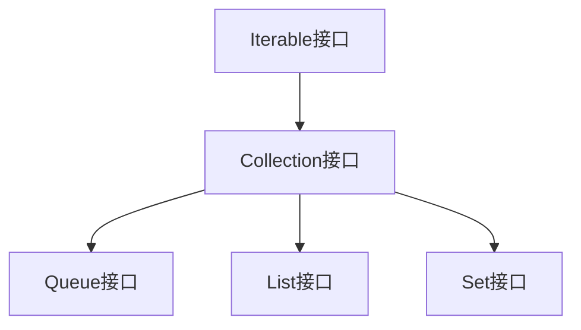

# 第一章 集合概述

## 1.1 数组与集合

### 1. 数组

- 数组特点
  - 数组是一个简单的复合数据类型，它是一系列有序数据的集合，
  - Java 语言中提供的数组是用来**存储固定大小的同类型元素**
- 优点
  - 内存特点是**线性存储** ： 可以快速访问 ，效率高
- 缺点
  - 不灵活 ，因为数组的**容量是固定**的

### 2. 集合 : Java中的容器对象

- 由Java类库的一系列接口、抽象类以及具体实现类组成
- 集合类型就是容纳对象的一个容器
  - 集合存放的是多个对象的引用，对象本身还是放在堆内存中。
  - 集合可以存放不同类型，不限数量的数据类型。

- 根据集合中是否允许有重复的对象、对象组织在一起是否按某种顺序等标准来划分的话，集合类型又可以细分为许多种不同的子类型。

### 3. 泛型 : 类型参数化

- 泛型是在JDK1.5新增的
- 作用 : 帮助建立类型安全的集合
- 泛型定义 :数据的类型参数化,对数据类型的约束

## 1.2 Collection接口

### 1. Collection接口的描述

### 2.**迭代器（Iterator）**

- 实现了`Iterator`接口的类是一个**迭代器**

- 通过迭代器来遍历 : 将对于集合类型的遍历行为与被遍历的集合对象分离

### 3. 可迭代的( Iterable )

- 实现`了Iterable`接口的类是**可迭代的**

- `hasNext() `判断是否还有下一个元素
- `next()`返回下一个元素
- `remove() `移除最近一次调用next方法返回的元素

### 4. Collection常用API

| 方法名                    | 方法说明                               |
| ------------------------- | -------------------------------------- |
| size()                    | 返回此容器中的元素数                   |
| add(E e)                  | 给容器中添加一个元素                   |
| addAll(Collection c)      | 给集合中添加另一集合中的所有元素       |
| contains(Object o)        | 判断集合中是否包含指定元素对象         |
| containsAll(Collection c) | 判断集合中是否包含另一个集合中所有元素 |
| clear()                   | 移除此集合中的所有元素                 |
| isEmpty()                 | 判断容器是否为空                       |
| remove(Object o)          | 将指定元素的引用从指定容器中移除       |
| removeAll(Collection c)   | 从容器中移除另一个容器中包含的所有元素 |
| retainAll(Collection c)   | 保留两个容器都包含的元素【交集】       |
| toArray()                 | 把容器转为Object数组                   |
| toArray(T[] a)            | 把容器转为指定类型的数组               |
| iterator()                | 返回该容器的元素上进行迭代的迭代器     |