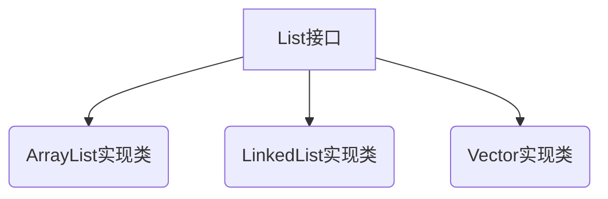

# 第二章 List接口

## 2.1 List接口

### 1. List实现类

### 2. 基本介绍

- **有序** 每个元素都有索引标记，可以根据元素的索引快速访问容器中元素
- **可重复** List允许加入重复的元素

### 3. 扩展API

| 方法名                              | 方法说明                               |
| ----------------------------------- | -------------------------------------- |
| add(int index, E element)           | 在列表的指定位置插入指定元素           |
| get(int index)                      | 返回列表中指定位置的元素               |
| indexOf(Object o)                   | 返回此列表中第一次出现的指定元素的索引 |
| lastIndexOf(Object o)               | 返回此列表中最后出现的指定元素的索引   |
| set(int index, E element)           | 用指定元素替换列表中指定位置的元素     |
| subList(int fromIndex, int toIndex) | 返回列表中指定的索引之间的部分视图     |

## 2.2 ArrayList

### 1. 底层数据结构

- 底层数据结构是数组，查询快，增删慢;线程不安全，效率高
- 允许 null 的存在
- 线程不安全,支持快速访问、复制、序列化的
- 数组扩容 : 重新定义一个1.5倍大的数组,将小列表中的元素拷贝到大的列表中
- 数组删除 : 本质是一个数组拷贝操作
- 数组基本属性 
  - ① 一个数组
  - ② 常量=10:表示默认的列表长度
  - ③ size()属性:表示列表中元素个数

### 2. 源码解析

## 2.3 LinkedList

### 1. 底层数据结构

- 底层数据结构是链表，查询慢，增删快;
- 线程不安全
- 链表结构 : 每个数据结点都会有两个指针,分别指向上一个结点和下一个节点
- 节点对象 : 包括上个节点对象和下个节点的引用和数据对象 

### 2.源码解析

## 2.4 Vector

### 1. 底层数据结构

- 底层数据结构是数组，和ArrayList原理相同
- 查询快，增删慢;
- 线程安全，大部分方法使用synchronized标记, 效率低,几乎已经淘汰了这个集合

### 2.源码解析