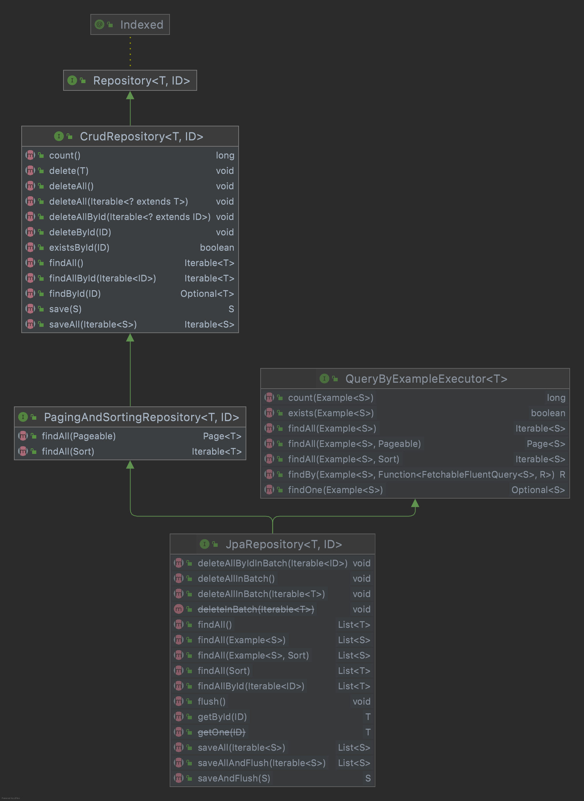

# 前言

1. JPA问题解决
2. JPA的坑

# 第一章 JPA概述

## 1.1 

## 1.2 HelloWorld

1. 创建SringBoot项目集成SpringDataJpa

   ```xml
   <dependencyManagement>
       <dependencies>
           <dependency>
               <groupId>org.springframework.boot</groupId>
               <artifactId>spring-boot-dependencies</artifactId>
               <version>2.6.4</version>
               <scope>import</scope>
               <type>pom</type>
           </dependency>
       </dependencies>
   </dependencyManagement>
   <dependencies>
       <dependency>
           <groupId>org.springframework.boot</groupId>
           <artifactId>spring-boot-starter-web</artifactId>
       </dependency>
       <dependency>
           <groupId>org.springframework.boot</groupId>
           <artifactId>spring-boot-starter-data-jpa</artifactId>
       </dependency>
       <dependency>
           <groupId>org.springframework.boot</groupId>
           <artifactId>spring-boot-starter-test</artifactId>
       </dependency>
       <dependency>
           <groupId>mysql</groupId>
           <artifactId>mysql-connector-java</artifactId>
       </dependency>
               <dependency>
               <groupId>junit</groupId>
               <artifactId>junit</artifactId>
               <version>4.13.2</version>
           </dependency>
           <dependency>
               <groupId>org.projectlombok</groupId>
               <artifactId>lombok</artifactId>
               <version>1.18.22</version>
           </dependency>
           <dependency>
               <groupId>cn.hutool</groupId>
               <artifactId>hutool-all</artifactId>
               <version>5.6.2</version>
           </dependency>
   </dependencies>
   ```

2. 添加MySQL数据源配置

   ```yaml
   spring:
     datasource:
       driver-class-name: com.mysql.cj.jdbc.Driver
       url: jdbc:mysql://localhost:3306/xlxs_jap
       username: root
       password: root
     jpa:
       hibernate:
         ddl-auto: update
       show-sql: true
       database-platform: org.hibernate.dialect.MySQL8Dialect
       generate-ddl: true
   ```

3. 添加实体类

   ```java
   @Getter
   @Setter
   @ToString
   @Entity
   @Table(name = "person")
   public class Person01 {
       @Id
       @GeneratedValue(strategy= GenerationType.IDENTITY)
       @Column(name="id")
       private String id;
   
       @Column(name="card_id")
       private Long cardId;
   
       @Column(name="name")
       private String name;
   
       @Column(name="gmt_create")
       private Date gmtCreate;
   
       @Column(name="gmt_modify")
       private Date gmtModify;
   }
   ```

4. 添加实体类Repository

   ```java
   @Repository
   public interface Person01Repository extends JpaRepository<Person01,String> {
   }
   ```

5. 使用SpringBoot单元测试：是个SpringBoot项目，需要添加主启动类

   ```java
   @SpringBootTest
   @RunWith(SpringRunner.class)
   public class Test01Person01 {
   
       @Autowired
       private Person01Repository repository;
   
       @Test
       public void testInit() throws Exception{
           List<Person01> all = repository.findAll();
           for (Person01 person01 : all) {
               System.out.println(person01);
           }
       }
   }
   ```

## 1.3 SpringData

- SpringDataCommon是所有默认的公共部分：封装了核心操作规范
- 支持关系型和非关系型数据库的实现
- 子项目
  - 主要项目：Commons、MongoDB、KeyValue、JPA、Solr、Gemfire、Redis、Cassandra、LDAP
  - 社区项目：Aerosilke、ElasticSearch、Hazelcast、Couchbase、DynamoDB、Neo4j
  - 其他：JDBCExtensions、ApacheHadoop、SpringContent

# 第二章 JPA核心

## 2.1 Repository

- Spring Data Common定义了很多公共接口和一些相对数据操作的公共实现（分页、排序、结果映射、事务等等）

- SpringDataJPA依赖关系

  

- 核心内容：Repository是SpringDataCommon里的顶级接口，是操作DB的入口类

  ```java
  @Indexed
  public interface Repository<T, ID> {
  }
  ```

- 继承体系

  

  > - ReactiveCrudRepository：是为了支持响应式编程，当前支持NoSql相关操作
  > - RxJava2CrudRepository：为了支持RxJava2做的标准响应式接口
  > - CoroutineCrudRepository：是为了支持Coroutine语法
  > - CrudRepository：是Java操作关系型数据库的的操作接口

- Repository类层次结构图

  

  > - 七大接口
  >   - Repository：顶级接口，没规定任何方法
  >   - CrudRepository：单表操作的基本CRUD方法
  >   - PagingAndSortingRepository：定义了带分页和排序的方法
  >   - QueryByExampleExecutor：件的Example查询
  >   - JpaRepository：JPA的扩展方法
  >   - JpaSpecificationExecutor：Jpa Specification扩展查询
  >   - QueryByExampleExecutor：QueryDSL的封装
  > - 两个实现类
  >   - SimpleJpaRepository：JPA所有接口的默认实现类
  >   - QuerydslJpaRepository：QueryDsl的实现类

- Repository使用示例：SimpleJpaRepository是Repository七大接口的默认实现类，自定义Repository接口都是SimpleJpaRepository的代理实现的；

  - 自定义Repository的DAO，继承Repository，Repository是空接口，所有DAO的操作方式只能定义在自定义的Repository中
  - 自定义Repository的DAO，继承CrudRepository：当前DAO可以做单表简单的CRUD操作
  - 自定义Repository的DAO，继承JpaRepository：DAO具有的JPA常用的方法->分页、排序、CRUD

## 2.2 利用方法名定义查询方法来做CRUD操作

1. DQM语法：①直接通过方法名实现②@Query手动在方法上定义

   - 方法名：findByEmailAddress(String emailAddress)

   - 修改默认策略：通过 `@EnableJpaRepositories` 注解来配置方法的查询策略，详细配置方法如下

     ```java
     @EnableJpaRepositories(queryLookupStrategy= QueryLookupStrategy.Key.CREATE_IF_NOT_FOUND)
     public class Example1Application {
         public static void main(String[] args) {
             SpringApplication.run(Example1Application.class, args);
         }
     }
     ```

     > - **Create**：直接根据方法名进行创建，规则是根据方法名称的构造进行尝试，一般的方法是从方法名中删除给定的一组已知前缀，并解析该方法的其余部分。如果方法名不符合规则，启动的时候会报异常，这种情况可以理解为，即使配置了 @Query 也是没有用的。
     > - **USE_DECLARED_QUERY**：声明方式创建，启动的时候会尝试找到一个声明的查询，如果没有找到将抛出一个异常，可以理解为必须配置 @Query。
     > - **CREATE_IF_NOT_FOUND**：这个是默认的，除非有特殊需求，可以理解为这是以上 2 种方式的兼容版。先用声明方式（@Query）进行查找，如果没有找到与方法相匹配的查询，那用 Create 的方法名创建规则创建一个查询；这两者都不满足的情况下，启动就会报错。

2. 自定义Repository基础Repository接口可以实现Defining Query Methods的功能，定义方法名时的关键字明细如下表：基础语法`查询策略(关键字)+查询字段+限制条件`

   | 查询策略-PartTree                                          | 示例                                                         | 对应的sql片段                                                |
   | ---------------------------------------------------------- | ------------------------------------------------------------ | ------------------------------------------------------------ |
   | find<br />read<br />get<br />query<br />search<br />stream | findByFirstname<br />queryFirst10ByLastname                  | `select … `                                                  |
   | count                                                      | countByLastName                                              |                                                              |
   | delete<br />remove                                         | removeByLastName                                             | delete from  …                                               |
   | exists                                                     |                                                              |                                                              |
   | **限制条件-Type**                                          | **示例**                                                     | **对应SQL片段**                                              |
   | `And`                                                      | `findByLastnameAndFirstname`                                 | `… where x.lastname = ?1 and x.firstname = ?2`               |
   | `Or`                                                       | `findByLastnameOrFirstname`                                  | `… where x.lastname = ?1 or x.firstname = ?2`                |
   | `Is,Equals`                                                | `findByFirstname`<br />`findByFirstnameIs`<br />`findByFirstnameEquals` | `… where x.firstname = ?1`                                   |
   | `Between`                                                  | `findByStartDateBetween`                                     | `… where x.startDate between ?1 and ?2`                      |
   | `LessThan`                                                 | `findByAgeLessThan`                                          | `… where x.age < ?1`                                         |
   | `LessThanEqual`                                            | `findByAgeLessThanEqual`                                     | `… where x.age <= ?1`                                        |
   | `GreaterThan`                                              | `findByAgeGreaterThan`                                       | `… where x.age > ?1`                                         |
   | `GreaterThanEqual`                                         | `findByAgeGreaterThanEqual`                                  | `… where x.age >= ?1`                                        |
   | `After`                                                    | `findByStartDateAfter`                                       | `… where x.startDate > ?1`                                   |
   | `Before`                                                   | `findByStartDateBefore`                                      | `… where x.startDate < ?1`                                   |
   | `IsNull`                                                   | `findByAgeIsNull`                                            | `… where x.age is null`                                      |
   | `IsNotNull,NotNull`                                        | `findByAge(Is)NotNull`                                       | `… where x.age not null`                                     |
   | `Like`                                                     | `findByFirstnameLike`                                        | `… where x.firstname like ?1`                                |
   | `NotLike`                                                  | `findByFirstnameNotLike`                                     | `… where x.firstname not like ?1`                            |
   | `StartingWith`                                             | `findByFirstnameStartingWith`                                | `… where x.firstname like ?1` (parameter bound with appended `%`) |
   | `EndingWith`                                               | `findByFirstnameEndingWith`                                  | `… where x.firstname like ?1` (parameter bound with prepended `%`) |
   | `Containing`                                               | `findByFirstnameContaining`                                  | `… where x.firstname like ?1` (parameter bound wrapped in `%`) |
   | `OrderBy`                                                  | `findByAgeOrderByLastnameDesc`                               | `… where x.age = ?1 order by x.lastname desc`                |
   | `Not`                                                      | `findByLastnameNot`                                          | `… where x.lastname <> ?1`                                   |
   | `In`                                                       | `findByAgeIn(Collection<Age> ages)`                          | `… where x.age in ?1`                                        |
   | `NotIn`                                                    | `findByAgeNotIn(Collection<Age> ages)`                       | `… where x.age not in ?1`                                    |
   | `True`                                                     | `findByActiveTrue()`                                         | `… where x.active = true`                                    |
   | `False`                                                    | `findByActiveFalse()`                                        | `… where x.active = false`                                   |
   | `IgnoreCase`                                               | `findByFirstnameIgnoreCase`                                  | `… where UPPER(x.firstame) = UPPER(?1)`                      |

3. 分页和排序：Sort和Pageable

4. 限制查询结果

   - Fires、Top
     - 数值可以追加到For实体或Top后面，指定返回最大结果的大小
     - 如果数字被省略，则假设结果大小为1
     - 限制表达式也支持Distinct关键字
     - 直接将结果包装到Optional中国
     - 如果将Pageable作为参数，以Top和First后面的数字为准
   - @NonNullApi：在包级别用于声明参数，以及返回值的默认行为是不接受会产生空值的
   - @NonNull：用于不能为空的参数或返回值
   - @Nullable：用于可以为空的参数或返回值

## 2.3 Repository返回值

1. Repository支持的返回结果：Streamable、Page、Slice、List、Entity、Boolean、Long、

2. Repository返回异步结果

   ```java
   @Async("asyncServiceExecutor")
   @Override
   public Future<Person01> findByName(String name) {
       logger.info("start findByName");
       return person01Repository.findByName(name);
   }
   ```

3. DTO类型返回结果自定义：Projections值的是和DB的查询结果的字段映射，对专用返回类型进行建模

   - 方式一：新建一个新的@Entity类：用@Table指向同一个表，再为这个Entity创建一个新的Repository进行
   - 方式二：直接定义个JavaDTO类，在原Entity的Repository中作为方法的返回值，DTO类必须是全参构造器
   - 方式三：返回结果是一个POJO接口，直接调用接口中的属性即可

4. @Query：①方法②JpaQueryLookupStrategy③@Query基本用法④@Query的返回值⑤@Query动态查询方法

   - @Query属性

   - @Query + HQL：可以在参数中添加Sort对象,可以在参数中添加Pageable对象

   - @Query + SQL：排序分页字段必须在SQL内，

   - @Query + @Param：通过参数名称绑定参数

   - @Query返回自定义DTO：

     ```java
     @Query(value = "select new com.jpa.entity.Person02(p.cardId,p.name) from Person01 p")
     List<Person02> query3();
     ```

   - @Query返回DTO接口

     ```java
     @Query(value = "select p.cardId as cardId,p.name as name,p.gmtCreate as gmtCreate from Person01 p")
     List<Person> query4();
     ```

   - Query实现动态查询:

     ```java
     @Query(value="... where (r.name is null or r.name = :name)")
     ```

   - @Query获取对象中的属性

     ```java
     :#{#对象.属性}
     @Query(value="... where (r.name is null or r.name = :name)")
     ```

## 2.4 @Entity

1. JPA中Entity的规定

   - 实体类是直接进行数据库持久化操作的领域对象，必须通过@Entity注解
   - 实体类必须有一个public或者protected的无参构造函数
   - 持久化映射的注解可以标注在Entity的字段上，也可以标注在get或set方法上
   - 在@Entity的实体类 里面被标注的字段都会映射到数据库中，除了@Transient注解的字段
   - 实体类中必须有一个主键，可以是单个字段，也可以是复合主键字段

2. 联合主键

   - @IdClass0
     1. 新建一个Java类，这个类保存联合主键
     2. 再新建一个Entity类，在实体类上用@IdClass标注联合主键类，在这个Entity中的两个属性用@Id标注
     3. 在为真个Entity类新增一个Repository类，这个Repository类的主键类型就是联合主键的Java类
   - @Embeddable
     1. 新建联合主键类，并用@Embeddable标注
     2. 新建一个Entity类，将这个联合主键类作为一个属性，并用@Embeddedld标注
   - 区别：
     - 在使用的是时候@IdClass的Entity调用的是属性，而另一个调用的是对象的属性
     - JPAL也会不一样，对象.属性

3. 实体之间的继承关系：**不建议使用这种结构**

   - 纯粹的继承，和表没关系，对象之间的字段共享：@MappedSuperclass，父类不能是Entity
   - 单表多态的问题：同一张Table，表示了不同的对象，痛恶一个字段来区分，利用注解@Inheritance=SINGLE_TABLE注解完成，只有父类有@Table
   - 多表多态：每个子类是一张表，父类的表拥有所有的公共字段，通过注解@Inheritance=JOINED注解完成
   - Object的继承，数据库里每一张表都是分开的，相互独立不受影响，Inheritance=TABLE_PER_CLASS，父类可以是一张表，也可以不是，相互独立不受影响

4. 关联对象之间的关系

   - OneToOne：①可以定义在字段或Get|Set方法②如果配置双向关联,维护关联关系的是拥有外键的一方,另一方必须指定Mapped

     ```java
     @OneToOne
     private User user;
     
     // 如果是双向关联,指的是另一个属性中的字段名称
     @OneToOne(mappedBy="user")
     private UserInfo info;
     ```

     > 1. 级联关系
     >    - 级联新增
     >    - 级联删除
     >    - 级联刷新
     >    - 级联更新
     >    - ALL
     > 2. @OneToOne属性

   - OneToMany： 

   - ManyToOne：

   - ManyToMany：

5. @Entity中的注解

   | 注解            | 说明                               |
   | --------------- | ---------------------------------- |
   | @Entity         | 标注为是一个实体类                 |
   | @Table          |                                    |
   | @Access         | 标注映射生效的位置                 |
   | @Id             | 主键注解                           |
   | @GeneratedValue | 主键生产策略                       |
   |                 |                                    |
   | @EnumType       |                                    |
   | @Basic          | 默认的注解                         |
   | @Transient      | 忽略的字段                         |
   | @Column         |                                    |
   | @Temporal       | 设置Date类型的属性映射到对应的精度 |
   |                 |                                    |


# JPA

## 第一部分 数据初始化

- 数据库准备：一对一、一对多、多对多、层级表

  ```sql
  drop table if exists orm_dept;
  create table if not exists orm_dept
  (
      id   varchar(100) primary key comment 'UUID的主键',
      parent_id    varchar(100) comment '上级部门ID',
      code    varchar(50) comment '部门编号',
      name     varchar(100) comment '部门名称',
      level   smallint comment '部门层级',
      gmt_create     varchar(14) comment '字符串格式创建时间',
      gmt_create_time datetime comment '日期格式创建时间',
      gmt_modify     varchar(14) comment '字符串格式创建时间',
      gmt_modify_time datetime comment '日期格式创建时间'
  );
  
  create table orm_emp
  (
      id   bigint auto_increment primary key comment '自增主键',
      dept_no     varchar(100) comment '所在部门',
      username    varchar(100) comment '用户名',
      gmt_create     varchar(14) comment '字符串格式创建时间',
      gmt_create_time datetime comment '日期格式创建时间',
      gmt_modify     varchar(14) comment '字符串格式创建时间',
      gmt_modify_time datetime comment '日期格式创建时间'
  );
  
  create table orm_emp_info
  (
      emp_id bigint primary key comment '员工ID',
      username   varchar(100) comment '用户名',
      phone    varchar(11) comment '手机号',
      password    varchar(100) comment '密码'
  );
  
  create table orm_role
  (
      id   bigint primary key comment '雪花ID',
      code   varchar(20) comment '角色编号',
      name   varchar(20) comment '角色名称'
  );
  create table orm_emp_role
  (
      emp_id  bigint comment '员工ID',
      role_id bigint comment '角色ID'
  );
  
  insert into orm_dept(id, parent_id, code, name, level, gmt_create, gmt_create_time, gmt_modify, gmt_modify_time)
  values ( 'e262fef8e057424b81b6805db4b4ac20','','WEB_SOFT','软件开发部',1,'20211223120000',now(),'20211223120000',now() );
  insert into orm_dept(id, parent_id, code, name, level, gmt_create, gmt_create_time, gmt_modify, gmt_modify_time)
  values ( 'e262fef8e057424b81b6805db4b4ac22','e262fef8e057424b81b6805db4b4ac20','d_java','Java开发部',2,'20211223120000',now(),'20211223120000',now() );
  
  ```
  
- 实体类创建：基本结构

  1. Dept
  
     ```java
     import lombok.Getter;
     import lombok.Setter;
     
     import javax.persistence.*;
     import java.time.LocalDateTime;
     
     public class Dept {
     
         private String id;
         private String parentId;
         private String code;
         private String name;
         private Short level;
         private String gmtCreate;
         private LocalDateTime gmtCreateTime;
         private String gmtModify;
         private LocalDateTime gmtModifyTime;
     
         @Override
         public String toString() {
             return "Dept{" +
                     "id='" + id + '\'' +
                     ", parentId='" + parentId + '\'' +
                     ", code='" + code + '\'' +
                     ", name='" + name + '\'' +
                     ", level=" + level +
                     ", gmtCreate=" + gmtCreate +
                     ", gmtCreateTime=" + gmtCreateTime +
                     ", gmtModify=" + gmtModify +
                     ", gmtModifyTime=" + gmtModifyTime +
                     '}';
         }
     }
     ```

  2. Emp
  
     ```java
     
     ```
  
  3. EmpInfo
  
     ```java
     
     ```
  
  4. Role
  
     ```java
     
     ```
  
  5. EmpRole
  
     ```java
     
     ```

## 第二部分 JPA

### 2.1 依赖

1. 添加JPA相关依赖

   ```xml
   <dependency>
     <groupId>org.springframework.boot</groupId>
     <artifactId>spring-boot-starter-data-jpa</artifactId>
   </dependency>
   <dependency>
     <groupId>com.zaxxer</groupId>
     <artifactId>HikariCP</artifactId>
   </dependency>
   <dependency>
     <groupId>mysql</groupId>
     <artifactId>mysql-connector-java</artifactId>
   </dependency>
   ```

2. 添加工具包

   ```xml
   <!--UTIL-->
   <dependency>
     <groupId>org.projectlombok</groupId>
     <artifactId>lombok</artifactId>
   </dependency>
   <dependency>
     <groupId>cn.hutool</groupId>
     <artifactId>hutool-all</artifactId>
     <version>5.6.2</version>
   </dependency>
   <!--TEST-->
   <dependency>
     <groupId>junit</groupId>
     <artifactId>junit</artifactId>
     <scope>test</scope>
   </dependency>
   <dependency>
     <groupId>org.springframework.boot</groupId>
     <artifactId>spring-boot-starter-test</artifactId>
     <scope>test</scope>
   </dependency>
   ```

### 2.2 JPA入门

1. Dept

   ```java
   @Getter
   @Setter
   @Builder
   @NoArgsConstructor
   @AllArgsConstructor
   @Entity
   @Table(name = "orm_dept")
   public class Dept {
       @Id
       @GenericGenerator(name = "system-uuid", strategy = "uuid")
       @GeneratedValue(generator = "system-uuid")
       @Column(name = "id")
       private String id;
   
       @Column(name = "parent_id",length = 100)
       private String parentId;
   
       @Column(name = "code")
       private String code;
   
       @Column(name = "name")
       private String name;
   
       @Column(name = "level")
       private Short level;
   
       @Column(name = "gmt_create")
       private String gmtCreate;
       @Column(name = "gmt_create_time")
       private LocalDateTime gmtCreateTime;
   
       @Column(name = "gmt_modify")
       private String gmtModify;
       @Column(name = "gmt_modify_time")
       private LocalDateTime gmtModifyTime;
   
       @Override
       public String toString() {
           return "Dept{" +
                   "id='" + id + '\'' +
                   ", parentId='" + parentId + '\'' +
                   ", code='" + code + '\'' +
                   ", name='" + name + '\'' +
                   ", level=" + level +
                   ", gmtCreate=" + gmtCreate +
                   ", gmtCreateTime=" + gmtCreateTime +
                   ", gmtModify=" + gmtModify +
                   ", gmtModifyTime=" + gmtModifyTime +
                   '}';
       }
   }	
   ```

2. DeptRepository

   ```java
   @Repository
   public interface DeptRepository extends JpaRepository<Dept,String> {
   
   }
   ```

3. 测试类

   ```java
   @SpringBootTest
   @RunWith(SpringRunner.class)
   public class SpringbootJap01ApplicationTests {
   
       @Autowired
       private DeptRepository deptRepository;
       @Test
       public void testFindAll() throws Exception {
           List<Dept> all = deptRepository.findAll();
           System.out.println("all = " + all);
       }
   }
   ```

### 2.3 JPA API

1. 新增

   ```java
   // save(S entity)
   // saveAndFlush(S entity);
   // saveAll(Iterable<S> entities);
   // saveAllAndFlush(Iterable<S> entities);
   ```

2. 修改

   ```java
   // 执行save方法, 如果存在主键值则是更新操作
   ```

3. 查找

   ```java
   // 1. 基础查询
   
   ```

4. 删除 

   ```java
   ```

### 2.4 JPA级联

1. 一对一

   ```java
   ```

2. 一对多

   ```java
   ```

3. 多对多

   ```java
   ```

   