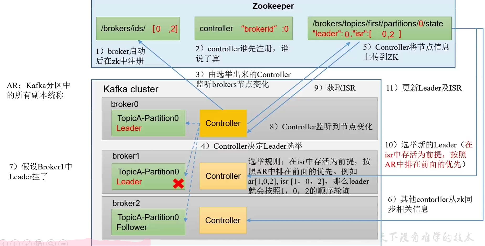

# 前言

## 1. 技能要求

- JavaSE+Maven
- Linux
- Idea+SpringBoot

# 第一部分 Kafka基础

## 第一章 概述

### 1.1 介绍

1. Kafka介绍
   - Kafka是采用Scala语言开发的一个多分区、多副本并且基于Zookeeper协议的分布式消息系统。目前Kafka已经定位为衣蛾分布式流式处理平台，它以高吞吐、可持久化、可水平扩展、支持流处理等对种特性而被广泛应用。
   
   - **传统定义**：Kakfa是一个分布式的发布-订阅消息系统，能够支撑海量数据的传输；用于大数据实时处理
   
     > 发布订阅:消息发布者不会直接把消息发送给订阅者,而是将消息分为不同的类别(topic),订阅者只接收感兴趣的类别
   
     - Kafka将消息持久化到磁盘中，并对消息创建了备份保证数据的安全；
     - Kafka在保证了较高的处理速度的同时，又能保证数据处理的低延迟和零丢失；
   
   - **最新定义**：开源的分布式事件流平台，用于高性能数据管道、流分析、数据继承、关键任务应用。
   
2. Kafka特性
   - 高吞吐量、低延迟：每秒处理几十万条，延迟最低只有几毫秒，每个主题可以分多个分区，消费者对分区进行消费
   - 可扩展性：支持热扩展
   - 持久性、可靠性：消息持久化到磁盘，并支持数据备份
   - 容错性：允许集群节点失败
   - 高并发：支持数千个客户同时读写
   - 可伸缩：
   
3. Kafka使用场景
   - 日志收集：通过Kaka以统一接口服务的方式开放给各种consumer
   - 消息系统：结构生成和消费者；缓存消息
   - 用户活动跟踪：记录用户活动
   - 运营指标：记录运营监控数据
   - 流式处理：
   
4. Kafka记录
   - 前端埋点记录用户行为到日志服务器，最终日志会落盘到Hadoop集群，用于数据分析
   - 在日志服务器会安装Flume监控日志，采集速度小于100M/s，效率低
   - 所以需要提供Kafka集群解决方案：可以大量接收推送消息，并且按消费者的速度接收消息

### 1.2 消息队列

1. 常见消息队列
   
   | 特性     | ActiveMQ                                                     | Kafka                                                        | RocketMQ                                                     | RabbitMQ                                                     |
   | -------- | ------------------------------------------------------------ | ------------------------------------------------------------ | ------------------------------------------------------------ | ------------------------------------------------------------ |
   | 开发语言 | java                                                         | Scala                                                        | java                                                         | erLang                                                       |
   | 协议     | AMQP                                                         | 自行设计                                                     | AMQP                                                         | AMQP                                                         |
   | 跨语言   | 支持                                                         | 支持                                                         | 支持                                                         | 支持                                                         |
   | 优点     | 单机吞吐量：万级 可用性：非常高 功能支持： MQ功能完备 高扩展性 | 单机吞吐量：百万级 可用性：分布式的非常高 依赖ZK可动态扩展节点高性能高吞吐，消息可指定追溯 | 单机吞吐量：十万级 可用性： 非常高，分布式 架构： 消息可靠性高 功能支持：MQ功能完备 高扩展性：支持事务 | 单机吞吐量： 万级 健壮、稳定、医用、跨平台、支持多种语言； 功能支持： MQ功能完备 高扩展性： 支持事务 |
   | 缺点     | 项目比较陈旧，官方社区在5.X之后对其维护越来越少              | 严格的顺序机制，不支持消息优先级，不支持标准协议             | 目前只支持java及c++；                                        | Elang语言难度大，很难扩展,研发人员较少                       |
   | 综合评价 | 小型系统比较适用，但是因为维护越来越少，建议不用             | 在日志和大数据方向使用较多                                   | 阿里系，国内互联网公司使用居多                               | 适用于稳定性要求优先的企业级应用                             |
2. 消息队列使用场景
   - 缓冲/消峰：控制数据流经过系统的速度，解决消息生成和消费的处理速度不一致的问题
   - 解耦：独立大数据组件的处理情况，用中间件保证他们遵循相同的接口
   - 异步通信：运行用户把消息放入队列，但是不是立即处理，在需要使用的时候再处理
3. Kafka消息队列模式
   - 点对点模式：消费者主动拉取消息，消息收到后清除消息
   - 发布订阅模式：可以有多个topic主题，将消息进行分类，发布者将消息发送给Topic；消费者只订阅关心的Topic，消费数据后，不删除数据，每个消费者相互独立，都可以消费到数据

### 1.3 Kafka架构简图


1. Zookeeper：kafka通过zookeeper来存储集群的meta信息
2. Producers将消息发送给Topic
3. 每个Topic包含一个或多个partition,接收消息后把消息保存到对应的Partition并且同步给对应的副本
4. ConsumerGroup:每个消费者组订阅一个Topic,接收发送到Topic中的数据

### 1.4 Kafka架构术语


- **zookeeper**：zookeeper负责维护和协调broker。当kafka系统中新增broker或某个broker发生故障失效时，由zookeeper通知生产者和消费者。生产者和消费者依据zookeeper的broker状态与broker协调数据段发布和订阅任务，在最新版本kafka中zookeeper已经成为kafka的瓶颈，去zookeeper化在进行中；
- **broker**：Kafka 集群包含一个或多个服务器，服务器节点称为broker。broker存储topic的数据。如果某topic有N个partition，集群有N个broker，那么每个broker存储该topic的一个partition。如果某topic有N个partition，集群有(N+M)个broker，那么其中有N个broker存储该topic的一个partition，剩下的M个broker不存储该topic的partition数据。如果某topic有N个partition，集群中broker数目少于N个，那么一个broker存储该topic的一个或多个partition。在实际生产环境中，尽量避免这种情况的发生，这种情况容易导致Kafka集群数据不均衡
- **topic**：在kafka中，使用一个类表属性来划分数据段所属类，划分数据的这个类称为topic。如果把kafka看做一个数据库，topic可以理解为数据库中的一张表，topic的名字即为表名。物理上不同Topic的消息分开存储；逻辑上一个Topic的消息虽然保存于一个或多个broker上，但用户只需指定消息的Topic即可生产或消费数据而不必关心数据存于何处
- **partition**：分区，topic中的数据分割为一个或多个partition。每个topic至少有一个partition。每个partition中的数据使用多个segment文件存储。partition中的数据是有序的，partition间的数据不一定是有序的。如果topic有对个partition，消费数据时就不能保证数据的顺序。在需要严格保证消息的消费顺序的场景下，需要将partition的数目设置为1。
- **Segment**：partition物理上由多个segment组成。
- **replicas of partition**：副本是一个分区的副本。副本不会被消费者消费，副本只用于防止数据丢失，即消费者不从为follwer的partition中消费数据，而是从为leader的partition中读取数据。副本之间是一主多从的关系。保障 partition 的高可用。
- **Producer**：生产者即数据发布者，该角色将消息发布到Kafka的Topic中。broker接收到生产者发送的消息后，broker将该消息追加到当前用于追加数据的segment文件中。生产者发送的消息，存储到一个partition中，生产者也可以指定数据存储的partition
- **consumer**：消费者可以从broker中读取数据。消费者可以消费多个topic中的数据，消费者可以定义在同一个组（group）中，每个group也是只对应一个partition，
- **partition offset**：每条消息都有一个档期partition下唯一的64字节的offset，他指明了这条消息的起始位置,每个partition都由一系列有序的、不可变的消息组成，这些消息被连续的追加到partition中。partition中的每个消息都有一个连续递增的序列号叫做offset，偏移量offset在每个分区中是唯一的。
- **leader**：replica 中的一个角色， producer 和 consumer 只跟 leader 交互。
- **follower**： replica 中的一个角色，从 leader 中复制（fentch）数据。
- **leader + follower**：Follower跟随Leader，所有写请求都通过Leader路由，数据变更会广播给所有Follower，Follower与Leader保持数据同步。如果Leader失效，则从Follower中选举出一个新的Leader。当Follower与Leader挂掉、卡住或者同步太慢，leader会把这个follower从“in sync replicas”（ISR）列表中删除，重新创建一个Follower。
- **AR（Assigned Replicas）**：分区中所有的副本统称为AR
- **ISR（In-Sync Replicas）**：所有与Leader部分保持一定程度的副本（包括Leader副本在内）组成ISR
- **OSR（Out-of-Sync Replicas）**：与Leader副本同步滞后过多的副本
- **HW（High Watermark）**：高水位，标识了一个特定的offset，消费者只能拉取到这个offset之前的消息
- **LEO（Log End Offset）**：日志末尾位移（log end offset），记录是该副本底层日志（log）中下一条消息的位移值（注意：是下一条），如果LEO=10，那么表示该副本保存了10条消息，位移范围为[0,9]。

## 第二章 快速入门

### 2.1 环境准备

1. 安装VMware，并且准备安装Kafka集群的3台虚拟机

2. 配置虚拟机：①固定IP、②关闭防火墙、③修改主机名称、④配置host用主机名称、⑤ssh免密登陆

   - 固定IP:network-scripts目录中的文件名称非固定名称

     ```sh
     cd /etc/sysconfig/network-scripts/{ifcfg-ens160}
     vim ifcfg-ens160
     # 修改
     BOOTPROTO=static
     # 添加
     IPADDR=192.168.10.101
     GATEWAY=192.168.10.2
     DNS1=192.168.10.2
     ```

   - 关闭防火墙

     ```sh
     # 1.关闭防火墙
     systemctl stop firewalld.service
     
     # 2.开机禁查看防火墙状态
     systemctl disable firewalld.service
     
     # 3.查看防火墙状态
     systemctl status firewalld.service
     ```

   - 修改主机名称

     ```sh
     vim /etc/hostname
     ```

   - ssh免密登陆配置

     

3. Kafka环境准备：①JDK安装、②Zookeeper集群安装

4. Kafka安装包下载：https://kafka.apache.org/downloads

### 2.2 Kafka安装

1. 安装zookeeper集群

2. 解压Kafka安装包到安装位置，配置Kafka环境变量
   
   ```sh
   # KAFKA 环境变量
   export KAFKA_HOME=/opt/module/kafka3
   export PATH=$PATH:$KAFKA_HOME/bin
   ```

3. 修改Kafka配置文件：`$KAFKA_HOME/config/server.properties`
   
   ```shell
   # 唯一,每台机器的broker.id必须保证不相同
   broker.id=0
   # 日志目录
   log.dirs=/opt/module/kafka3/logs
   # zookeeper集群：Zookeeper中新建kafka目录
   zookeeper.connect=BigDataNode101:2181,BigDataNode102:2181,BigDataNode103:2181/kafka
   ```

4. 启动Kafka集群之前需要提前准备好Zookeeper集群，**关闭Zookeeper集群之前确保Kafka全部关闭**

5. 在虚拟机中准备Kafka集群启动脚本
   
   ```shell
   #!/bin/bash
   
   case $1 in
   "start"){
       for i in BigDataNode101 BigDataNode102 BigDataNode103
       do
           echo  ------------- kafka $i 启动 ------------
           ssh $i "/opt/module/kafka3/bin/kafka-server-start.sh -daemon /opt/module/kafka3/config/server.properties"
       done
   }
   ;;
   "stop"){
       for i in BigDataNode101 BigDataNode102 BigDataNode103
       do
           echo  ------------- kafka $i 停止 ------------
           ssh $i "/opt/module/kafka3/bin/kafka-server-stop.sh"
       done
   }
   ;;
   "clean"){
       for i in BigDataNode101 BigDataNode102 BigDataNode103
       do
           echo  ------------- kafka.meta $i 删除 ------------
           ssh $i "rm -rf /opt/module/kafka3/logs/ meta.properties"
       done
   }
   ;;
   esac
   ```

### 2.3 Kafka安装包

1. Kafka安装包根据开发语言和功能场景分为三个部分
   
   - broker：是kafka服务，由Scala语言开发
   - consumer：消费者，由Java语言开发
   - producer：生产者，由java语言开发

2. Kafka服务脚本
   
   | 内置Zookeeper               | 说明                         |
   | ------------------------- | -------------------------- |
   | zookeeper-server-start.sh | 单机启动Kafka时不需要单独安装Zookeeper |
   | zookeeper-server-stop.sh  |                            |
   | **Kafka服务**               | **说明**                     |
   | kafka-server-start.sh     | 启动Kafka服务                  |
   | kafka-server-stop.sh      | 关闭Kafka服务                  |
   | kafka-topics.sh           | Kafka服务Topic               |
   | **生产者和消费者**               | **说明**                     |
   | kafka-console-consumer.sh | 生产者                        |
   | kafka-console-producer.sh | 消费者                        |

### 2.4 Kafka基本操作

1. 启动/停止kafka服务
   
   ```sh
   # 启动Kafka服务
   kafka-server-start.sh -daemon /opt/module/kafka3/config/server.properties
   
   # 关闭Kafka服务
   kafka-server-stop.sh
   ```

2. Kafka主题（topic）操作
   
   ```shell
   # --create: 创建Topic，--partitions 分区数；--replication-factor 副本数
   kafka-topics.sh --bootstrap-server BigDataNode101:9092 --topic test --create --partitions 1 --replication-factor 3
   
   # --list: 查看Kafka中全部Topic
   kafka-topics.sh --bootstrap-server BigDataNode101:9092 --list
   
   # --describe: 查看指定Topic详细信息
   kafka-topics.sh --bootstrap-server BigDataNode101:9092 --describe --topic test
   
   # --alter: 修改Topic分区数(只能增加不能减少),不能通过命令行修改副本
   kafka-topics.sh --bootstrap-server BigDataNode101:9092 --alter  --partitions 2
   
   # --delete： 删除Topic
   kafka-topics.sh --bootstrap-server BigDataNode101:9092 --topic test --delete
   ```

3. Kafka生产者基本操作
   
   ```sh
   # 执行命令后向test主题中发送消息
   kafka-console-producer.sh --bootstrap-server BigDataNode101:9092 --topic test
   ```

4. Kafka消费者基本操作
   
   ```sh
   # 执行命令后从test主题中获取消息
   kafka-console-consumer.sh --bootstrap-server BigDataNode101:9092 --topic test
   ```

## 第三章 Kafka生产者

> 1. 异步发送
> 2. 异步发送带回调
> 3. 同步发送
> 4. 同步发送带回调

### 3.1 Kafka生产者发送原理

1. 在消息发送过程中，涉及到两个线程：mian线程和sender线程（主要目的是将外部数据发送到kafka集群）；main线程中创建了几个双端队列（RecordAccumulator）。Sender线程不断从RecordAccumulator中拉取消息发送到Kafka Broker；
2. 外部数据发送到kafka集群的数据流
   - 首先会创建一个Producer，调用send方法发送数据
   - （可选）数据经过拦截器：对数据进行加工扩展处理，通常会使用Flume中的拦截器
   - 数据处理过后经过Kafka序列化器：做简单校验并序列化，高效
   - 数据需要给哪个分区发送：由分区器中进行处理
3. RecordAccumulator默认32M
   - 分区器会将消息发送到指定的队列中，这些操作都是在内存中执行
   - 整个双端队列大小为32M，给DQueue中传送每批次大小16K
4. Sender线程拉取队列中消息，发送到kafka集群
   - batch.size：队列中每个批次中数据库装满后sender线程拉取数据
   - linger.ms：批次数据不够时sender线程等待时间
   - 队列中的数据需要发送的不同的Broker节点：发送时候会以Broker为key，将消息发送，如果Broker接受没有应答，最多缓存5个请求
   - Kafka集群收到数据会应答：0、1、-1
5. 消息成功会清理队列中数据；如果失败会重试；


### 3.3 Kafka发送

1. 异步发送：在Kafka中异步发送是指将外部数据发送到队列中即完成，不再等待数据发送到Kafka中的Broker

2. 案例演示：
   
   - 引入Maven依赖
     
     ```xml
     <dependency>
      <groupId>org.apache.kafka</groupId>
      <artifactId>kafka-clients</artifactId>
      <version>3.1.0</version>
     </dependency>
     ```
   
   - 连接Kafka集群，发送普通消息
     
     ```java
     public class CustomProducerDemo01 {
         public static void main(String[] args) {
             // 连接
             Properties properties = new Properties();
             properties.put(ProducerConfig.BOOTSTRAP_SERVERS_CONFIG,"BigDataNode101:9092,BigDataNode102:9092");
             properties.put(ProducerConfig.KEY_SERIALIZER_CLASS_CONFIG, StringSerializer.class.getName());
             properties.put(ProducerConfig.VALUE_SERIALIZER_CLASS_CONFIG, StringSerializer.class.getName());
             // 创建对象
             KafkaProducer<String, String> producer = new KafkaProducer<>(properties);
     
             // 发送消息
             for(int i = 0; i < 5; i++) {
                 producer.send(new ProducerRecord<>("test", "小刘学生"));
             }
             // 关闭资源
             producer.close();
         }
     }
     ```
   
   - 连接Kafka集群，发送带回调消息
     
     ```java
     public class CustomProducerDemo02 {
         public static void main(String[] args) {
             // 连接
             Properties properties = new Properties();
             properties.put(ProducerConfig.BOOTSTRAP_SERVERS_CONFIG,"BigDataNode101:9092,BigDataNode102:9092");
             properties.put(ProducerConfig.KEY_SERIALIZER_CLASS_CONFIG, StringSerializer.class.getName());
             properties.put(ProducerConfig.VALUE_SERIALIZER_CLASS_CONFIG, StringSerializer.class.getName());
             // 创建对象
             KafkaProducer<String, String> producer = new KafkaProducer<>(properties);
     
             // 发送消息
             for(int i = 0; i < 5; i++) {
                 producer.send(new ProducerRecord<>("test", "小刘学生"),(meta,e)->{
                     if (e == null) {
                         System.out.println("主题: " + meta.topic() + ",分区: " + meta.partition());
                     }
                 });
             }
             // 关闭资源
             producer.close();
         }
     }
     ```

3. 同步发送
   
   ```java
   // send发送后调用get()方法
   producer.send(new ProducerRecord<>("test", "小刘学生")).get();
   ```

### 3.4 自定义分区器

1. 分区的作用
   
   - 便于合理使用存储资源：可以把海量数据按照分区切割成一块一块的数据存储在多个Broker上
   - 提高并行度：生产者可以根据分区为单位发送数据，消费者可以根据分区为单位消费数据；

2. 分区策略：是指使用JavaAPI调用发送时候的partition等参数指定发送消息到指定分区的计算方法；
   
   - 指明partition情况下，partition的值就是传入的值；
   
   - 在没有指定partition值，但是有key的情况下，将key的hash值与topic的partition数进行取余得到partition值；
   
   - 既没有指定partition也没有key的情况，Kafka采用年限分区器,会随机选择一个分区，并且尽可能一直使用该分区，知道分区的batch已满或者已完成，Kafka会再随机一个分区使用；

3. 自定义类实现接口
   
   ```java
   public class MyPartitioner implements Partitioner {
       @Override
       public int partition(String topic, Object key, byte[] keyBytes, Object values, byte[] valBytes, Cluster cluster) {
           // 自定义key或者value计算需要发送的分区值
           return 0;
       }
   
       @Override
       public void close() {
   
       }
   
       @Override
       public void configure(Map<String, ?> map) {
   
       }
   }
   ```

4. 关联自定义分区器
   
   ```java
   // 连接Kafka参数
   Properties properties = new Properties();
   properties.put(ProducerConfig.BOOTSTRAP_SERVERS_CONFIG,"BigDataNode101:9092,BigDataNode102:9092");
   properties.put(ProducerConfig.KEY_SERIALIZER_CLASS_CONFIG, StringSerializer.class.getName());
   properties.put(ProducerConfig.VALUE_SERIALIZER_CLASS_CONFIG, StringSerializer.class.getName());
   properties.put(ProducerConfig.PARTITIONER_CLASS_CONFIG, MyPartitioner.class.getName());
   // 创建KafkaProducer对象
   KafkaProducer<String, String> producer = new KafkaProducer<>(properties);
   ```

### 3.5 生产者提高吞吐量

1. 从队列中拉取消息到Kafka集群的效率
   
   - batch.size：表示没个批次拉取的数据大小，默认16k，可以修改为32k
   - linger.ms：表示等待时间，默认0ms（只要有数据就拉取），修改为5~100ms（会提高数据的延迟）
   - compression.type：发送时候将数据压缩
   - RecordAccumulator：缓冲区大小，默认32M，修改为64M

2. 代码配置
   
   ```java
   public class ProducerParamDemo {
       public static void main(String[] args) {
           // 参数配置
           Properties properties = new Properties();
           properties.put(ProducerConfig.BOOTSTRAP_SERVERS_CONFIG, "BigDataNode101:9092,BigDataNode102:9092");
           properties.put(ProducerConfig.KEY_SERIALIZER_CLASS_CONFIG, StringSerializer.class.getName());
           properties.put(ProducerConfig.VALUE_SERIALIZER_CLASS_CONFIG, StringSerializer.class.getName());
   
           // 缓冲区大小: 默认32MB -> 修改为 64MB
           properties.put(ProducerConfig.BUFFER_MEMORY_CONFIG, 1024 * 1024 * 64);
   
           // 批次大小:默认16KB -> 32KB
           properties.put(ProducerConfig.BATCH_SIZE_CONFIG, 1024 * 32);
   
           // 等待时间
           properties.put(ProducerConfig.LINGER_MS_CONFIG, 50);
   
           // 压缩
           properties.put(ProducerConfig.COMPRESSION_TYPE_CONFIG, "snappy");
   
           // 创建对象
           KafkaProducer<String, String> producer = new KafkaProducer<>(properties);
           // 发送数据
           // 发送消息
           for (int i = 0; i < 6; i++) {
               producer.send(new ProducerRecord<>("test", "小刘学生"), (meta, e) -> {
                   if (e == null) {
                       System.out.println("主题: " + meta.topic() + ",分区: " + meta.partition());
                   }
               });
           }
           // 关闭资源
           producer.close();
       }
   }
   ```

### 3.6 生产者数据

1. 数据可靠性：需要理解消息发送流程：发送到队列→发送到集群→集群应答；通过应答机制确认消息是否正确发送，
   
   - ack应答原理以及数据可靠性：
     
     - 0：生产者发送过来的数据，不需要等待数据罗盘应答；数据可靠性：丢失数据
     
     - 1：生产者发送过来的数据，Leader收到数据后应答；数据可靠性：Leader应答后还没有开始同步副本，Leader挂掉了，副本中没有数据
     
     - -1：生产者发送过来的数据，Leader和ISR队列里面所有节点收到数据后应答，存在问题，如果某个Follower故障，此时的应答机制：Leader维护一个动态的in-sync replica set（ISR），如果Follower长时间未向Leader发啊送通信请求或者同步数据，则该Follower会被提出ISR，通信时间阈值设置：replica.lag.time.max.ms=30s（默认值）；这样就不用长期等待联系不上的节点了；
   
   - 数据可靠性分析
     
     - 如果分区副本设置为1个，或者ISR里应答的最小副本数量设置为1，和ask=1的效果是一样的，仍然有丢失数据的风险；
     - 数据完全可靠条件：ACK应答级别设置-1；分区副本数大于等于2；ISR里应答的最小副本数量大于等于2；
   
   - 总结
     
     - acks=0：可靠性差，效率高，生产环境基本不用
     - acks=1：可靠性中等，效率中等，一般用于日志传输，允许个别数据流式
     - acks=-1：可靠性搞，效率低，用户传输高敏感数据，对可靠性要求高的场景；
   
   - ack配置
     
     ```java
     public class ProducerData01Safe {
         public static void main(String[] args) {
             // 参数配置
             Properties properties = new Properties();
             properties.put(ProducerConfig.BOOTSTRAP_SERVERS_CONFIG, "BigDataNode101:9092,BigDataNode102:9092");
             properties.put(ProducerConfig.KEY_SERIALIZER_CLASS_CONFIG, StringSerializer.class.getName());
             properties.put(ProducerConfig.VALUE_SERIALIZER_CLASS_CONFIG, StringSerializer.class.getName());
     
             // 设置应答机制
             properties.put(ProducerConfig.ACKS_CONFIG, "-1");
             // 重试次数,默认值Integer最大值
             properties.put(ProducerConfig.RETRIES_CONFIG, 30);
     
             // 创建对象
             KafkaProducer<String, String> producer = new KafkaProducer<>(properties);
             // 发送数据
             for (int i = 0; i < 3; i++) {
                 producer.send(new ProducerRecord<>("test", "小刘学生"), (meta, e) -> {
                     if (e == null) {
                         System.out.println("主题: " + meta.topic() + ",分区: " + meta.partition());
                     }
                 });
             }
             // 关闭资源
             producer.close();
         }
     }
     ```

2. 数据重复：即时数据可靠，但是任然可能出现数据重复的问题
   
   - 数据传递语义：
     
     - 至少一次：ACK应答级别设置-1；分区副本数大于等于2；ISR里应答的最小副本数量大于等于2；保证数据不丢失，但是不能保证数据不重复
     - 最多一次：ADK级别设置为0；可以保证数据不重复，但是不能保证数据不丢失
     - 精确一次：在Kafka0.11版本后，引入重大特性，幂等性和事务；
   
   - 幂等性：是指Producer不论向Broker发送多少次重复数据，Broker端只会持久化一条，保证了不重复，精确一次=幂等性+至少一次；重复数据的判断标准：（PID + Partition + SeqNumber）理解为联合主键，保证唯一性；PID是Kafka进程号，Partition表示分区号，Sequence Number是单调递增的；所以幂等性只能保证单分区单会话内不重复；配置幂等性（enable.idempotence=true）：默认是开启的，
   
   - 生产者事务：（开启事务，必须开启幂等性）
     
     
     
     - 事务协调器：用来处理事务，存储在用来存储事务信息的特殊主题中，每个broker都会有事务协调器，如果选择对应的事务协调器：首先会有一个用户手动指定的事务ID，对事务ID的hash值对分区数取模确认事务属于哪个分区，改分区Leader所在的Broker节点就是这个事务ID对应的事务协调器
     
     - Producer在使用事务功能前，必须先定义一个唯一的transactional.id，即时客户端挂掉了，它重启后也能继续处理未完成的事务；
     
     - Kafka事务API
       
       ```java
       // 1. 初始化事务
       producer.initTransactions();
       // 2. 开启事务
       producer.beginTransaction();
       // 3. 在事务内提交已经消费的偏移量,主要用于消费者
       
       // 4. 提交事务
       producer.commitTransaction();
       // 5. 放弃事务
       producer.abortTransaction();
       ```
     
     - 生成者模拟添加事物配置发送消息
       
       ```java
       public class ProducerData02Repeat {
           public static void main(String[] args) {
               // 参数配置
               Properties properties = new Properties();
               properties.put(ProducerConfig.BOOTSTRAP_SERVERS_CONFIG, "BigDataNode101:9092,BigDataNode102:9092");
               properties.put(ProducerConfig.KEY_SERIALIZER_CLASS_CONFIG, StringSerializer.class.getName());
               properties.put(ProducerConfig.VALUE_SERIALIZER_CLASS_CONFIG, StringSerializer.class.getName());
       
               // 必须指定事务ID
               properties.put(ProducerConfig.TRANSACTIONAL_ID_CONFIG, "001");
       
               // 创建对象
               KafkaProducer<String, String> producer = new KafkaProducer<>(properties);
               // 初始化事务
               producer.initTransactions();
               // 开启事务
               producer.beginTransaction();
               try {
                   // 发送数据
                   for (int i = 0; i < 9; i++) {
                       producer.send(new ProducerRecord<>("test", "小刘学生"), (meta, e) -> {
                           if (e == null) {
                               System.out.println("主题: " + meta.topic() + ",分区: " + meta.partition());
                           }
                       });
                   }
                   int i = 1/0;
                   // 提交事务
                   producer.commitTransaction();
               }catch (Exception e){
                   producer.abortTransaction();
               }finally {
                   // 关闭资源
                   producer.close();
               }
       
           }
       }
       ```

3. 数据有序：单分区内，有序；多分区，分区与分区无序；

4. 数据乱序：①在kafka的1版本之前，保证数据单分区有序，需要配置参数（max.in.flight.requests.per.connection=1）②kafka在1版本后保证单分区有序，需要配置参数：如果未开启幂等性（max.in.flight.requests.per.connection=1）；如果开启幂等性（max.in.flight.requests.per.connection需要小于等于5），原因是kafka在1.x后，启动幂等性，kafka服务端sender线程会缓存producer发来的5个request的元数据，故物理如何，都可以保证最近5个request的数据都是有序的；

## 第四章 Kafka Broker

### 4.1 Broker工作流程

1. Zookeeper存储的Kafka信息：通过zookeeper客户端查看kafka信息，或者通过可视化工具PrettyZoo：https://github.com/vran-dev/PrettyZoo
   
   ​    
   
   - /kafka/brokrs/ids：记录有哪些服务器
   - /kafka/brokrs/topics/topic名称/partitions/0/state：记录Leader是哪个，哪些服务器可用
   - /kafka/controller：辅助选举Leader

2. Kafka Broker总体工作流程
   
   

### 4.2 节点服役和退役

1. 环境准备：
   
   - 准备一个Kafka节点：BigDataNode104
   
   - 修改为静态IP：/etc/sysconfig/network-scripts/ifcfg-ens160
     
     ```sh
     IPADDR=192.168.10.104
     ```
   
   - 修改主机名称：/etc/hostname
     
     ```sh
     BigDataNode104
     ```
   
   - 修改Kafka配置文件：①清除安装目录中的data和log②修改配置文件server.properties
     
     ```sh
     broker.id=4
     ```

2. 节点服役
   
   - 先启动Kafka正常服务的集群 ，并且历史数据中已经存在Topic信息
   
   - 正常启动需要扩展的Kafka服务：
     
     ```sh
     kafka-server-start.sh -daemon /opt/module/kafka3/config/server.properties
     
     # 查看Kafka机器上的历史数据中的Topic，但是没有历史节点中的分片信息
     kafka-topics.sh --bootstrap-server BigDataNode101:9092 --topic first --describe
     
     Topic: first    TopicId: DXkgGqHBRuWHlvPnn6ZpXA PartitionCount: 3       ReplicationFactor: 3    Configs: segment.bytes=1073741824
     Topic: first    Partition: 0    Leader: 1       Replicas: 1,2,3 Isr: 1,2,3
     Topic: first    Partition: 1    Leader: 2       Replicas: 2,3,1 Isr: 2,3,1
     Topic: first    Partition: 2    Leader: 3       Replicas: 3,1,2 Isr: 3,1,2
     ```
   
   - 执行负载均衡操作
     
     - 创建一个需要负载均衡的主题的配置文件：topic-to-move.json
       
       ```json
       {
         "topics":[
           {
             "topic":"first"
           }
         ],
         "version":1
       }
       ```
     
     - 生成一个负载均衡计划
       
       ```sh
       kafka-reassign-partitions.sh  --bootstrap-server BigDataNode102:9092 --topics-to-move-json-file=topic-to-move.json --broker-list "1,2,3,4" --generate
       
       # 表示当前topic的信息
       Current partition replica assignment
       {"version":1,"partitions":[{"topic":"first","partition":0,"replicas":[1,2,3],"log_dirs":["any","any","any"]},{"topic":"first","partition":1,"replicas":[2,3,1],"log_dirs":["any","any","any"]},{"topic":"first","partition":2,"replicas":[3,1,2],"log_dirs":["any","any","any"]}]}
       
       Proposed partition reassignment configuration
       {"version":1,"partitions":[{"topic":"first","partition":0,"replicas":[1,3,4],"log_dirs":["any","any","any"]},{"topic":"first","partition":1,"replicas":[2,4,1],"log_dirs":["any","any","any"]},{"topic":"first","partition":2,"replicas":[3,1,2],"log_dirs":["any","any","any"]}]}
       ```
     
     - 执行计划：创建计划执行文件，increase-replication-factor.json并添加执行计划信息
       
       ```json
       {"version":1,"partitions":[{"topic":"first","partition":0,"replicas":[3,4,1],"log_dirs":["any","any","any"]},{"topic":"first","partition":1,"replicas":[4,1,2],"log_dirs":["any","any","any"]},{"topic":"first","partition":2,"replicas":[1,2,3],"log_dirs":["any","any","any"]}]}
       ```
     
     - 执行副本存储计划
       
       ```sh
       kafka-reassign-partitions.sh  --bootstrap-server BigDataNode102:9092 --reassignment-json-file increase-replication-factor.json --execute
       ```
     
     - 验证执行结果
       
       ```sh
       kafka-reassign-partitions.sh  --bootstrap-server BigDataNode102:9092 --reassignment-json-file increase-replication-factor.json --verify
       ```
     
     - 查看topic信息
       
       ```sh
       kafka-topics.sh --bootstrap-server BigDataNode101:9092 --topic first --describe
       
       Topic: first    TopicId: DXkgGqHBRuWHlvPnn6ZpXA PartitionCount: 3       ReplicationFactor: 3    Configs: segment.bytes=1073741824
               Topic: first    Partition: 0    Leader: 1       Replicas: 1,3,4 Isr: 1,3,4
               Topic: first    Partition: 1    Leader: 2       Replicas: 2,4,1 Isr: 2,1,4
               Topic: first    Partition: 2    Leader: 3       Replicas: 3,1,2 Isr: 3,1,2
       ```

3. 节点退役
   
   - 创建一个需要退役的主题的配置文件：topic-to-move.json
     
     ```json
     {
       "topics":[
         {
           "topic":"first"
         }
       ],
       "version":1
     }
     ```
   
   - 创建执行计划：表示将配置中topic中的数据移动打1,2,3节点中去
     
     ```json
     kafka-reassign-partitions.sh  --bootstrap-server BigDataNode102:9092 --topics-to-move-json-file topic-to-move.json --broker-list "1,2,3" --generate
     ```
     
     Current partition replica assignment
     {"version":1,"partitions":[{"topic":"first","partition":0,"replicas":[1,3,4],"log_dirs":["any","any","any"]},{"topic":"first","partition":1,"replicas":[2,4,1],"log_dirs":["any","any","any"]},{"topic":"first","partition":2,"replicas":[3,1,2],"log_dirs":["any","any","any"]}]}
     
     Proposed partition reassignment configuration
     {"version":1,"partitions":[{"topic":"first","partition":0,"replicas":[2,1,3],"log_dirs":["any","any","any"]},{"topic":"first","partition":1,"replicas":[3,2,1],"log_dirs":["any","any","any"]},{"topic":"first","partition":2,"replicas":[1,3,2],"log_dirs":["any","any","any"]}]}
     
     ```
     
     ```
- 创建副本存储计划:decrease-replication-factor.json
  
  ```json
  kafka-reassign-partitions.sh  --bootstrap-server BigDataNode102:9092 --reassignment-json-file decrease-replication-factor.json --execute
  ```

- 执行副本存储计划
  
  ```sh
  kafka-reassign-partitions.sh  --bootstrap-server BigDataNode102:9092 --reassignment-json-file decrease-replication-factor.json --execute
  ```

- 验证执行结果
  
  ```sh
  kafka-reassign-partitions.sh  --bootstrap-server BigDataNode102:9092 --reassignment-json-file decrease-replication-factor.json --verify
  ```

- 查看topic信息
  
  ```sh
  kafka-topics.sh --bootstrap-server BigDataNode101:9092 --topic first --describe
  
  Topic: first    TopicId: DXkgGqHBRuWHlvPnn6ZpXA PartitionCount: 3       ReplicationFactor: 3    Configs: segment.bytes=1073741824
          Topic: first    Partition: 0    Leader: 1       Replicas: 2,1,3 Isr: 1,3,2
          Topic: first    Partition: 1    Leader: 2       Replicas: 3,2,1 Isr: 2,1,3
          Topic: first    Partition: 2    Leader: 3       Replicas: 1,3,2 Isr: 3,1,2
  ```

### 4.3 Kafka副本

1. Kafka副本作用：提高数据可靠性
   
   - Kafka默认副本1个，生产环境一般配置为2个，保证数据可靠性；太多副本会增加磁盘空间，增加网络上数据传输消耗，降低效率；
   
   - Kafka中副本分为：Leader和Follower，Kafka生产者只会把数据发往leader，然后Follower找Leader进行同步数据；
   
   - Kafka中所有副本统称为AR（Assigned Repllicas）：AR = ISR + OSR

2. Leader的选举流程
   
   
   
   - 创建一个Topic
     
     ```shell
     
     ```
   
   - 查看Topic信息
     
     ```shellsession
     
     ```
   
   - ```shell
     
     ```
     
     ```
     
     ```

3. Leader和Follower故障
   
   - LEO（Log End Offset）：每个副本的最后一个offset，LEO其实就是最新的offset+1
   
   - HW（High Watermark）：所有副本中最小的LEO
   
   . Follower故障：
   
   . Leader故障：只能保证副本直接的数据一致性，并不能保证数据不丢失或者不重复；
   
     . Leader发送故障后，会从ISR中选出一个新的Leader
   
     . 为保证多个副本直接的数据一致性，其余的Follower会先将各自的log文件高于HW的部分截掉，然后重新的Leader同步数据。

4. 分步副本分配

5. 手动跳转分区部分

6. 

### 4.4 文件存储

### 4.5 高效读写数据

## 第五章 Kafka 消费者

## 第六章 Kafka Eagle监控

## 第七章 Kafka Kraft模式

# 第二部分 外部系统集成

## 第一章 集成Flume

## 第二章 集成Flink

## 第三章 集成SpringBoot

### 3.1 项目初始化

1. SpringBoot项目搭建
   
   ```xml
       <dependencyManagement>
           <dependencies>
               <dependency>
                   <groupId>org.springframework.boot</groupId>
                   <artifactId>spring-boot-dependencies</artifactId>
                   <version>2.7.0</version>
                   <scope>import</scope>
                   <type>pom</type>
               </dependency>
           </dependencies>
       </dependencyManagement>
   ```

2. 添加Kafka依赖
   
   ```xml
   <dependency>
       <groupId>org.springframework.kafka</groupId>
       <artifactId>spring-kafka</artifactId>
   </dependency>
   ```

3. 添加配置
   
   ```yaml
   spring:
     kafka:
       bootstrap-servers: BigDataNode101:9092,BigDataNode102:9092,BigDataNode103:9092
       producer:
         key-serializer: org.apache.kafka.common.serialization.StringSerializer
         value-serializer: org.apache.kafka.common.serialization.StringSerializer
       consumer:
         value-deserializer: org.apache.kafka.common.serialization.StringDeserializer
         key-deserializer: org.apache.kafka.common.serialization.StringDeserializer
   ```

### 3.2 Producer发送消息

```java
@RestController
public class ProducerController {

    @Autowired
    private KafkaTemplate<String,String> kafkaTemplate;

    @GetMapping("/send01")
    public String send(String msg){
        kafkaTemplate.send("test", msg);
        return "ok";
    }
}
```

### 3.3 Consumer接收消息

```java

```

## 第四章 集成Spark

# 第三部分 生产调优

## 第一章  Kafka硬件配置

## 第二章 Kafka生产者

## 第三章 Kafka Broker

## 第四章 Kafka 消费者

## 第五章 总结

# 第四部分 源码解析

## 第一章 源码准备

## 第二章 生产者源码

## 第三章 消费者源码

## 第四章 服务器源码