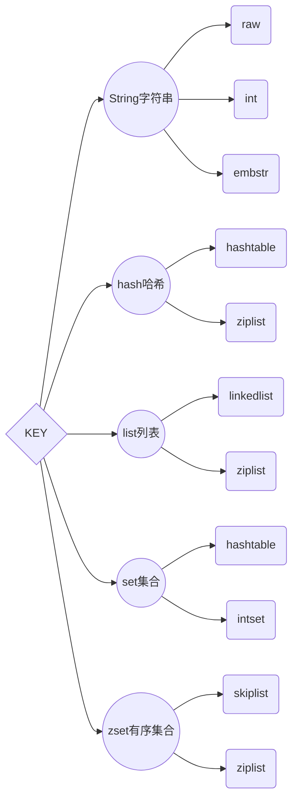

# 第四章 Redis命令

## 4.1 Redis数据类型



## 4.2 Key（键）

### :dash:Keys

```sh
KEYS pattern
```

- **说明 :** 查找所有符合给定模式 `pattern` 的 `key` 。可以使用正则表达式
- **返回值 : ** 符合给定模式的 `key` 列表。

### :dash: Del

```sh
DEL key [key ...]
```

- **说明 :** 删除给定的一个或多个 `key` 。不存在的 `key` 会被忽略。
- **返回值 : ** 被删除 `key` 的数量。

### :dash: Dump

```sh
DUMP key
```

- **说明 :** 序列化给定 `key` ；值的编码格式和 RDB 文件保持一致；使用`RESTORE`命令可以将这个值反序列化为 Redis 键。
- **返回值 : ** 如果 `key` 不存在，那么返回 `nil` 。否则，返回序列化之后的值。

### :dash: Exists

```sh
EXISTS key
```

- **说明 : ** 检查给定 `key` 是否存在。
- **返回值 : ** 若 `key` 存在，返回 `1` ，否则返回 `0` 。

### :dash: Expire

```sh
EXPIRE key seconds
```

- **说明 : ** 为给定 `key` 设置生存时间，当 `key` 过期时(生存时间为 `0` )，它会被自动删除。
- **返回值 : ** 设置成功返回 `1` 。当 `key` 不存在或者不能为 `key` 设置生存时间时，返回 `0` 。

### :dash: Persist

```sh
PERSIST key
```

- **说明 : ** 移除给定 `key` 的生存时间
- **返回值 : **当生存时间移除成功时，返回 `1` .如果 `key` 不存在或 `key` 没有设置生存时间，返回 `0`

### :dash: Pexpire

```sh
PEXPIRE key milliseconds
```

- **说明 : **以毫秒为单位设置 `key` 的生存时间，而不像 [*EXPIRE*](http://doc.redisfans.com/key/expire.html) 命令那样，以秒为单位。
- **返回值 : **设置成功，返回 `1`。key` 不存在或设置失败，返回 `0

### :dash: ExpireAt

```sh
EXPIREAT key timestamp
```

- **说明 : ** EXPIREAT 的作用和 EXPIRE 类似，都用于为 key 设置生存时间。 EXPIREAT 命令接受的时间参数是 UNIX 时间戳(unix timestamp)，在指定时间过期。
- **返回值 : **如果生存时间设置成功，返回 `1` 。当 `key` 不存在或没办法设置生存时间，返回 `0` 。

### :dash:PexpireAt

```sh
PEXPIREAT key milliseconds-timestamp
```

- **说明 : ** 这个命令和 `EXPIREAT`命令类似，但它以毫秒为单位设置 `key` 的过期 unix 时间戳
- **返回值 : **如果生存时间设置成功，返回 `1` 。当 `key` 不存在或没办法设置生存时间时，返回 `0` 。

### :dash: Ttl

```sh
TTL key
```

- **说明 : ** 以秒为单位，返回给定 `key` 的剩余生存时间(TTL, time to live)。

- **返回值 : **当 `key` 不存在时，返回 `-2` 。

    当 `key` 存在但没有设置剩余生存时间时，返回 `-1` 。

    否则，以秒为单位，返回 `key` 的剩余生存时间。

### :dash: Pttl

```sh
PTTL key
```

- **说明 : ** 这个命令类似于 [*TTL*](http://doc.redisfans.com/key/ttl.html#ttl) 命令，但它以毫秒为单位返回 `key` 的剩余生存时间
- **返回值 : **当 key 不存在时，返回 -2 。当 key 存在但没有设置剩余生存时间时，返回 -1 。否则，以毫秒为单位，返回 key 的剩余生存时间。

### :dash:Migrate

```sh
MIGRATE host port key destination-db timeout [COPY] [REPLACE]
```

- **说明 : **将 `key` 原子性地从当前实例传送到目标实例的指定数据库上，一旦传送成功， `key` 保证会出现在目标实例上，而当前实例上的 `key` 会被删除。
    - `COPY` ：不移除源实例上的 `key` 。
    - `REPLACE` ：替换目标实例上已存在的 `key` 。
- **返回值 : **迁移成功时返回 `OK` ，否则返回相应的错误

### :dash: Move

```sh
MOVE key db
```

- **说明 : ** 将当前数据库的 `key` 移动到给定的数据库 `db` 当中。
- **返回值 : **移动成功返回 `1` ，失败则返回 `0` 。

### :dash: RandomKey

```sh
RANDOMKEY
```

- **说明 : ** 从当前数据库中随机返回(不删除)一个 `key`
- **返回值 : **当数据库不为空时，返回一个 key 。当数据库为空时，返回 nil 

### :dash: Rename

```sh
RENAME key newkey
```

- **说明 : ** 将 `key` 改名为 `newkey` 。

    当 `key` 和 `newkey` 相同，或者 `key` 不存在时，返回一个错误。

    当 `newkey` 已经存在时， `RENAME`命令将覆盖旧值。

- **返回值 : **改名成功时提示 `OK` ，失败时候返回一个错误。

### :dash: RenameNx

```sh
RENAMENX key newkey
```

- **说明 : ** 当且仅当 `newkey` 不存在时，将 `key` 改名为 `newkey` 。当 `key` 不存在时，返回一个错误。
- **返回值 : **当且仅当 `newkey` 不存在时，将 `key` 改名为 `newkey` 。当 `key` 不存在时，返回一个错误。

### :dash: Type

```sh
TYPE key
```

- **说明 : ** 返回 `key` 所储存的值的类型
- **返回值 : **`none` (key不存在)、`string` (字符串)、`list` (列表)、`set` (集合)、`zset` (有序集)、`hash` (哈希表)

### :dash: Sort

```sh
SORT key [BY pattern] [LIMIT offset count] [GET pattern [GET pattern ...]] [ASC | DESC] [ALPHA] [STORE destination]
```

- **说明 : ** 返回或保存给定列表、集合、有序集合 `key` 中经过排序的元素。

### :dash: Restore

```sh
RESTORE key ttl serialized-value
```

- **说明 : ** 反序列化给定的序列化值，并将它和给定的 `key` 关联。
- **返回值 : **如果反序列化成功那么返回 `OK` ，否则返回一个错误。

### :dash: Scan

```sh
SCAN cursor [MATCH pattern] [COUNT count]
```

- **说明 : ** [*SCAN*](http://doc.redisfans.com/key/scan.html#scan) 命令及其相关的 [*SSCAN*](http://doc.redisfans.com/set/sscan.html#sscan) 命令、 [*HSCAN*](http://doc.redisfans.com/hash/hscan.html#hscan) 命令和 [*ZSCAN*](http://doc.redisfans.com/sorted_set/zscan.html#zscan) 命令都用于增量地迭代（incrementally iterate）一集元素

### :dash: Object

```sh
OBJECT subcommand [arguments [arguments]]
```

- **说明 : ** 从内部察看给定 key 的 Redis 对象
    - `OBJECT REFCOUNT <key>` 返回给定 `key` 引用所储存的值的次数。此命令主要用于除错。
    - `OBJECT ENCODING <key>` 返回给定 `key` 锁储存的值所使用的内部表示(representation)。
    - `OBJECT IDLETIME <key>` 返回给定 `key` 自储存以来的空转时间(idle， 没有被读取也没有被写入)，以秒为单位。
- **返回值 : **`REFCOUNT` 和 `IDLETIME` 返回数字。`ENCODING` 返回相应的编码类型。

## 4.3 字符串

### :dash:

```sh

```

- **说明 : ** 
- **返回 : ** 


- 字符串结构

    - key是字符串类型,值可以是字符串、数字、二进制（最大不可大512M）

- 常用命令

    | 命令                         | 说明                                     |
    | ---------------------------- | ---------------------------------------- |
    | get key                      | 获取指定key的值                          |
    | set key value                | 设置指定key指定值(不管key存不存在都设置) |
    | setnx key value              | key不存在才设置                          |
    | set key value xx             | 可以存在才设置                           |
    | del key                      | 删除指定key                              |
    | incr key                     | 数值类型 自增1                           |
    | decr key                     | key自减1                                 |
    | incrby key 值                | key自增指定值                            |
    | decrby key 值                | key自减指定值                            |
    | mget key ...                 | 批量获取key                              |
    | mset key value key value ... | 批量设置key                              |
    | getset key value             | 设置新值并且返回原来的值                 |
    | append key value             | 给指定key追加值                          |
    | strlen key                   | 查看指定key的长度(字节),一个汉字2个字节  |
    | incrbyfloat key 数值         | 值浮点数增加指定值                       |
    | getrange key start end       | 获取字符串指定下标所有值                 |
    | setrange key index 值        | 设置指定下标所对应的值                   |

## 4.4 hash哈希

### :dash:

```sh

```

- **说明 : ** 
- **返回 : ** 


- 特点

    - 哈希值结构:{key:{字段:值}} - 字段是不可以重复

- 命令

    | 命令                             | 说明                            |
    | -------------------------------- | ------------------------------- |
    | hget key 字段                    | 获取key中指定字段的值           |
    | hset key 字段 值                 | 给指定key添加字段和值           |
    | hdel key 字段                    | 删除指定key中的指定字段         |
    | hexists key 字段                 | 判断是否存在指定字段            |
    | hlen key                         | 获取指定key中字段的数量         |
    | hmget key 字段1 字段2 ...        | 获取指定key的多个字段           |
    | hmset key 字段1 值1 字段2 值2... | 设置指定key多个字段值           |
    | hgetall key                      | 返回hash中key对应的所有字段和值 |
    | hvals key                        | 返回hash中key对应的所有值       |
    | hkeys key                        | 返回hash key对应的所有的字段    |
    | hsetnx key 字段 值               | 已存在则不设置                  |
    | hincrby key 字段 值              | 指定key的指定字段自增指定值     |
    | 好incrbyfloat key 字段 值        | 指定key的指定字段自增指定值     |

## 4.5 list列表

### :dash:

```sh

```

- **说明 : ** 
- **返回 : ** 


- 特点

    - 列表数据结构 : key : 元素1 元素2 ...
    - 有序可以重复的

- 列表API

    | 命令                                | 说明                                                         |
    | ----------------------------------- | ------------------------------------------------------------ |
    | rpush key value1 ...                | 在列表右边追加多个元素                                       |
    | lpush key value1...                 | 在列表左边追加多个元素                                       |
    | linsert key before\|after value1... | 在指定值前后插入                                             |
    | lpop key                            | 从左边弹出一个元素                                           |
    | rpop key                            | 从右边弹出一个元素                                           |
    | lrem key count value                | 根据count值删除所有value相同的值<br />count>0 从左到右,最多删除count个<br />count<0 从右向左,最多删除count个<br />count=0 删除所有value |
    | ltrim key 开始 结束                 | 安装索引范围修剪列表                                         |
    | lrange key 开始 结束                | 获取列表指定范围内的所有item 包含end                         |
    | lindex key 索引                     | 获取指引索引的值                                             |
    | llen key                            | 获取列表中的元素个数                                         |
    | lset key index 新值                 | 设置指定索引指定值                                           |
    |                                     |                                                              |

## 4.6 set集合

### :dash:

```sh

```

- **说明 : ** 
- **返回 : ** 


## 4.7 zset有序集合

### :dash: Zadd

```sh
ZADD key score member [score member] [score member] ...
```

- **说明 : ** 将一个或多个 `member` 元素及其 `score` 值加入到有序集 `key` 当中；如果某个 `member` 已经是有序集的成员，那么更新这个 `member` 的 `score` 值
- **返回值 : **被成功添加的新成员的数量，不包括那些被更新的、已经存在的成员。

### :dash: Zcard

```sh
ZCARD key
```

- **说明 : ** 返回有序集 `key` 的基数。
- **返回值 : **当 `key` 存在且是有序集类型时，返回有序集的基数；当 `key` 不存在时，返回 `0` 。

### :dash: Zcount

```sh
ZCOUNT key min max
```

- **说明 : ** 返回有序集 `key` 中， `score` 值在 `min` 和 `max` 之间(默认 `score` 值等于 `min` 或 `max` )的成员的数量
- **返回值 : **`score` 值在 `min` 和 `max` 之间的成员的数量

### :dash: ZincrBy

```sh
ZINCRBY key increment member
```

- **说明 : ** 为有序集 `key` 的成员 `member` 的 `score` 值加上增量 `increment`
- **返回值 : **`member` 成员的新 `score` 值，以字符串形式表示

### :dash: Zrange

```sh
ZRANGE key start stop [WITHSCORES]
```

- **说明 : ** 返回有序集 `key` 中，指定区间内的成员；可以通过使用 `WITHSCORES` 选项，来让成员和它的 `score` 值一并返回
- **返回值 : **指定区间内，带有 `score` 值(可选)的有序集成员的列表

### :dash: ZrangeByScore

```sh
ZRANGEBYSCORE key min max [WITHSCORES] [LIMIT offset count]
```

- **说明 : ** 返回有序集 `key` 中，所有 `score` 值介于 `min` 和 `max` 之间(包括等于 `min` 或 `max` )的成员。有序集成员按 `score` 值递增(从小到大)次序排列
- **返回值 : **指定区间内，带有 `score` 值(可选)的有序集成员的列表

### :dash: Zrank

```sh
ZRANK key member
```

- **说明 : ** 返回有序集 `key` 中成员 `member` 的排名。其中有序集成员按 `score` 值递增(从小到大)顺序排列
- **返回值 : **如果 `member` 是有序集 `key` 的成员，返回 `member` 的排名；如果 `member` 不是有序集 `key` 的成员，返回 `nil` 。

### :dash: Zrem

```sh
ZREM key member [member ...]
```

- **说明 : ** 移除有序集 `key` 中的一个或多个成员，不存在的成员将被忽略
- **返回值 : **被成功移除的成员的数量，不包括被忽略的成员

### :dash: ZremRangeByRank

```sh
ZREMRANGEBYRANK key start stop
```

- **说明 : ** 移除有序集 `key` 中，指定排名(rank)区间内的所有成员
- **返回值 : **被移除成员的数量

### :dash: ZRemRangeByScore

```sh
ZREMRANGEBYSCORE key min max
```

- **说明 : ** 移除有序集 key 中，所有 score 值介于 min 和 max 之间(包括等于 min 或 max )的成员
- **返回值 : **被移除成员的数量

### :dash: ZrevrAnge

```sh
ZREVRANGE key start stop [WITHSCORES]
```

- **说明 : ** 返回有序集 `key` 中，指定区间内的成员
- **返回值 : **指定区间内，带有 `score` 值(可选)的有序集成员的列表

### :dash: ZrevrAngeByScore

```sh
ZREVRANGEBYSCORE key max min [WITHSCORES] [LIMIT offset count]
```

- **说明 : ** 返回有序集 key 中， score 值介于 max 和 min 之间(默认包括等于 max 或 min )的所有的成员。有序集成员按 score 值递减(从大到小)的次序排列
- **返回值 : **指定区间内，带有 `score` 值(可选)的有序集成员的列表

### :dash: ZrevrAnge

```sh
ZREVRANGE key start stop [WITHSCORES]
```

- **说明 : ** 返回有序集 `key` 中，指定区间内的成员
- **返回值 : 指定区间内，带有 `score` 值(可选)的有序集成员的列表**

### :dash: Zscore

```sh
ZSCORE key member
```

- **说明 : ** 返回有序集 `key` 中，成员 `member` 的 `score` 值
- **返回值 : **member 成员的 score 值，以字符串形式表示

### :dash: ZUNIONSTORE

```sh
ZUNIONSTORE destination numkeys key [key ...] [WEIGHTS weight [weight ...]] [AGGREGATE SUM|MIN|MAX]
```

- **说明 : ** 计算给定的一个或多个有序集的并集，其中给定 `key` 的数量必须以 `numkeys` 参数指定，并将该并集(结果集)储存到 `destination`
- **返回值 : **保存到 `destination` 的结果集的基数

### :dash: ZINTERSTORE

```sh
ZINTERSTORE destination numkeys key [key ...] [WEIGHTS weight [weight ...]] [AGGREGATE SUM|MIN|MAX]
```

- **说明 : ** 计算给定的一个或多个有序集的交集，其中给定 `key` 的数量必须以 `numkeys` 参数指定，并将该交集(结果集)储存到 `destination`
- **返回值 : **保存到 `destination` 的结果集的基数。

### :dash: Zscan

```sh
ZSCAN key cursor [MATCH pattern] [COUNT count]
```

- **说明 : ** 用于迭代有序集合中的元素（包括元素成员和元素分值）