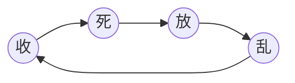

- [part01_产品基础](/class04_产品开发/part01_产品基础/part01_产品基础.md)
- [part02_产品设计](/class04_产品开发/part02_产品设计/part02_产品设计.md)

名词解释

- **宏观**是指从大的方面去观察
- **微观**是指从小的方面去观察

# 思维模型

1. 定义：思维模型是人类独有的思维的`象形文字`，为什么是象形文字呢？象形文字是古人将所见到的事务符号化的表示，而思维模型的象形文字是为了将大脑中的想法进行符号化，具体化，可视化；是承载系统性信息的高级符号：思维模型 是为了解决某个特定领域中的问题而积累出来的一套完整的、系统的解决方案，所以思维模型是对这套成系统方案的一种对外的表现符号
2. 思维模型是能够承载负载信息和逻辑关系的一种系统性的框架，其核心功能是用这个模型映射大脑中 的抽象的想法；
3. 对思维模型的不断优化正是将大脑中的想法由繁到简的输出为文字、符号的过程，是将抽象的逻辑进行具体化、可视化；
4. 从编程的角度解释思维模型：大多数编程语言都有面向对象的特性，啥意思呢，就是实现一个功能会有很多步骤来完成，面向对象的意思就是实现这个功能（或者解决这个问题）由对象完成，对象是从哪里来的呢，对象就是为了解决这个问题而将原本不相关的元素整合成的一个整体，举个类似：把大象装冰箱分几步？首先这个问题会由一个对象完成（这个就是思维的系统化），那么这个对象要完成整个动作要什么呢：①得有个大象②得有个冰箱③得有个关打开、关闭冰箱的人；到这个一步，可以理解为新出现了关冰箱思维，而这个思维需要考虑的关键变量有三个，有这些变量，再根据这些变量的变化做出一些应对的方案，一个思维模型中这些方案越多，这个思维模型就越成熟；一些优秀的方案会需要使用到各种各样的工具，比如编程的最起码需要流畅的开发环境，一个CEO要有优秀的领导能力

# 前言 中国经济变革

## :anchor: 怎么看中国经历

​	​**:dash: 微观**

​		现代中国的经济是以市场化为导向的改革开放，同时计划经济的产物国营企业也冲到市场经济中，国营企业扮演者与民争利的角色，国营企业通过价格调控市场经济的走向。

​	**:dash: 宏观**

​		从历史中发展变迁中，中国经历中的文明特质是什么？

​		把中国经济的发展看做是一条大河，那么河床就是**统一**，古代中国发展到现代中国整体趋势是统一，统一也是发展至今的共识，正如民间民间俗语：宁做太平犬，不做乱世人；大河的河岸引用邓小平的两句话，一条岸是：发展才是硬道理，另一条岸：稳定压倒一切。

## :anchor: 中国经济的发展历程

> 简单描述就是：一收就死，一死就放，一放就乱，乱了再收
>
> - 收：表示国营企业作为市场主导
> - 放：表示放权给地方，让利于民

:arrow_forward: 在战国时代，由齐国的管仲设计了国家经济发展的雏形

| 朝代               | 政策                                                         | 结果                                   |
| ------------------ | ------------------------------------------------------------ | -------------------------------------- |
| 战国时代到大秦统一 | 收：官山海                                                   | 国富民穷，农民起义，国灭               |
| 西汉初             | 放：文景之治                                                 | 地方挑战中央，七国之乱                 |
| 东汉               | 收：汉武帝用桑弘羊                                           | 国富北击匈奴》天下疲敝》轮台罪己诏     |
| 唐代               | 放：太平盛世                                                 | 地方挑战中央》安史之乱                 |
| 宋代               | 放》收：王安石变法                                           | 既得利益势力太大，收的政策等等导致失败 |
| 明清               | 收：朱元璋闭国，明朝灭 放：清朝末年抵御太平天国洋务运动 | 洋务运动加之外来思想，封建被灭         |
| 民国               | 国民党上台前：放                                             | 地方军人，各自一方                     |
|                    | 蒋介石上台：收                                               | 国富民穷，殖民威胁，人民放弃了这个政权 |
| 中国               | 建国初期：放                                                 | 地方财政比中央财政富：中央收不上税     |
|                    | 1992年左右：朱镕基的分税制度                                 | 国税与地税》地方财政又没有钱了         |
|                    | 1994年国家开发土地财政                                       | 地方通过发展房地产，导致2010年的天价房 |
|                    | 习近平：收                                                   |                                        |

​		

