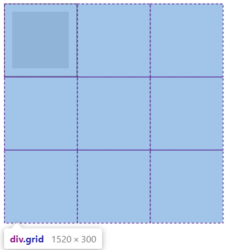

# 前言

01_混乱的结构和样式

&nbsp;&nbsp;&nbsp;&nbsp;&nbsp;&nbsp;&nbsp;&nbsp;从HTML发明开始，样式的以各种形式存在，导致HTML结构越来越混乱，为解决这个问题，CSS才诞生，因为之前HTML的各种样式形式，导致现在CSS任然存在兼容性

02_css的作用

- 将HTML的的结构和样式想分离

# 第一部分 CSS基础

## 第一章 CSS基础语法

### 1.1 CSS样式规则

1. <font size=4 color=blue>**行内样式**</font>：

   ```css
   style="属性名: 属性值; 属性名: 属性值; ... ..."
   ```

2. <font size=4 color=blue>**文档样式**</font>：

   ```css
   选择器{
       属性名: 属性值;
       属性名: 属性值;
       ... ...
   }
   ```

3. <font size=4 color=blue>**CSS脚本文件**</font>：

   - 使用html内嵌样式时候，css的编码格式和html的编码格式相同

   - 使用css外链引入css样式时候，需要单独为CSS文件指定编码格式，@charset指定样式表中使用的字符编码。它必须是样式表中的第一个元素，而前面不得有任何字符。因为它不是一个嵌套语句，所以不能在@规则条件组中使用。如果有多个 **`@charset `**@规则被声明，只有第一个会被使用，而且不能在HTML元素或HTML页面的字符集相关`<style>`元素内的样式属性内使用。

     ```css
     @charset "utf-8";
     选择器{
         属性名: 属性值;
         属性名: 属性值;
         ... ...
     }
     ```

### 1.2 CSS引用规则

1. <font size=4 color=blue>**行内样式：**</font>样式定义在html标签的style属性上

   ```html
   <div style="background-color: red;">
       行内样式,
   </div>
   ```
   
2. <font size=4 color=blue>**嵌入样式：**</font>样式写在 `<style>`标签内，`<style>`标签定义在html文件的`<head>`标签内

   ```html
   <style rel="stylesheet" type="text/css">
       .app2{
           background-color: red;
       }
   </style>
   ```
   
   - 属性`rel`：不能省略，是用来指定文档和链接资源的关系
   - 属性`type`：rel指定后，type也会被确定，所有type是可以省略的
   
3. <font size=4 color=blue>**外部样式**</font>

   ```html
   <link rel="stylesheet"  type="text/css" href="./css/01_外部css.css">
   ```
   
4. **<font size=4 color=blue>引入样式</font>**：可以同时使用多个@import，而且在单独的css文件中也可以使用@import引如其他的css文件

   ```html
   <style rel="stylesheet" type="text/css">
       @import "./css/02_导入css.css";
       或者
       @import url("./css/02_导入css.css");
   </style>
   ```

### 1.3 CSS样式优先级

- **<font size=4 color=blue>行内样式 > 嵌入样式 > 外部样式</font>**

### 1.4 注释

```html
<style rel="stylesheet" type="text/css">
    /*
    注释描述
    */
</style>
```

### 1.5 CSS命名规范

1. 命名要求
   - css命令建议用中横线字符；
   - 建议使用纯文英文字符，不建议使用中文和拼音；
   - 长名称或多个英文词组使用中横线分隔；
   - 不可以使用纯数字或数字开头命名
2. WEB前端命名规范

- **❤ 主体**

  　　**头部：header**

    　　**内容：content/container**

    　　**尾部：footer**

    　　**导航：nav**

    　　**侧栏：sidebar**

    　　**栏目：column**

    　　**整体布局：wrapper**

    　　**左右中：left / right / center**

    　　**登录条：loginbar**

    　　**标志：logo**

    　　**广告：banner**

    　　**页面主体：main**

    　　**热点：hot**

    　　**新闻：news**

    　　**下载：download**

    　　**子导航：subnav**

    　　**菜单：menu**

    　　**子菜单：submenu**

    　　**搜索：search**

    　　**友情链接：friendlink**

    　　**页脚：footer**

    　　**版权：copyright**

    　　**滚动：scroll**

    　　**标签页：tab**

    　　**文章列表：list**

    　　**提示信息：msg**

    　　**小技巧：tips**

    　　**栏目标题：title**

    　　**加入：join**

    　　**指南：guild**

    　　**服务：service**

    　　**注册：regsiter**

    　　**状态：status**

    　　**投票：vote**

    　　**合作伙伴：partner**

   

  **❤ id的命名规范**

  　　**(1)页面结构**

  　　　　**容器: container**

  　　　　**页头：header**

  　　　　**内容：content/container**

  　　　　**页面主体：main**

  　　　　**页尾：footer**

  　　　　**导航：nav**

  　　　　**侧栏：sidebar**

  　　　　**栏目：column**

  　　　　**页面外围控制整体布局宽度：wrapper**

  　　　　**左右中：left right center**

  　　**(2)导航**

  　　　　**导航：nav**

  　　　　**主导航：mainnav**

  　　　　**子导航：subnav**

  　　　　**顶导航：topnav**

  　　　　**边导航：sidebar**

  　　　　**左导航：leftsidebar**

  　　　　**右导航：rightsidebar**

  　　　　**菜单：menu**

  　　　　**子菜单：submenu**

  　　　　**标题: title**

  　　　　**摘要: summary**

  　　**(3)功能**

  　　　　**标志：logo**

  　　　　**广告：banner**

  　　　　**登陆：login**

  　　　　**登录条：loginbar**

  　　　　**注册：regsiter**

  　　　　**搜索：search**

  　　　　**功能区：shop**

  　　　　**标题：title**

  　　　　**加入：joinus**

  　　　　**状态：status**

  　　　　**按钮：btn**

  　　　　**滚动：scroll**

  　　　　**标签页：tab**

  　　　　**文章列表：list**

  　　　　**提示信息：msg**

  　　　　**当前的: current**

  　　　　**小技巧：tips**

  　　　　**图标: icon**

  　　　　**注释：note**

  　　　　**指南：guild**

  　　　　**服务：service**

  　　　　**热点：hot**

  　　　　**新闻：news**

  　　　　**下载：download**

  　　　　**投票：vote**

  　　　　**合作伙伴：partner**

  　　　　**友情链接：link**

  　　　　**版权：copyright**

  **❤ class的命名:**

  　　**(1)颜色：使用颜色的名称或者16进制代码，如：**

  　　　　**.red { color: red; } .f60 { color: #f60; } .ff8600 { color: #ff8600; }**

  　　**(2)字体大小，直接使用“font+字体大小”作为名称，如：**

  　　　　**.font12px { font-size: 12px; } .font9pt {font-size: 9pt; }**

  　　**(3)对齐样式，使用对齐目标的英文名称，如：**

  　　　　**.left { float:left; } .bottom { float:bottom; }**

  　　**(4)标题栏样式，使用“类别+功能”的方式命名，如：**

  　　　　**.barnews { } .barproduct { }**

  **❤！注意事项：**

  　　**1.一律小写；**

  　　**2.尽量用英文；**

  　　**3.尽量不加中杠和下划线；**

  　　**4.尽量不缩写，除非一看就明白的单词，如：wrapper可以写成wrap。**

  　　**5.css文件命名规范：**

  　　　　**主要的 master.css；**

  　　　　**模块 module.css；**

  　　　　**基本共用 base.css；**

  　　　　**布局，版面layout.css；**

  　　　　**主题 themes.css；**

  　　　　**专栏 columns.css；**

  　　　　**文字 font.css；**

  　　　　**表单 forms.css；**

  　　　　**补丁 mend.css；**

  　　　　**打印print.css**

## 第二章 CSS模型

### 2.1 CSS元素显示模式

| 元素格式                             | 特点                                                         |
| ------------------------------------ | ------------------------------------------------------------ |
| <font color=blue>▲ 块级元素</font>   | 独占一行； <br />如果没有设置宽度默认和父元素宽度相同； <br />可以为元素设置宽和高； |
| <font color=blue>▲ 行内元素</font>   | 不会独占一行； <br />如果没有设置宽度默认和内容一样宽<br />为元素设置宽和高无效； |
| <font color=blue>▲ 行内块元素</font> | 为了让元素既不会独占一行，又可以设置宽度和高度；             |

### 2.2 CSS三大特性

| 特性                             | 说明                                                         |
| -------------------------------- | ------------------------------------------------------------ |
| <font color=blue>▲ 继承性</font> | 只有color、font-、text-开头的属性才会被继承，<br />只要是被嵌套的后代就会被继承；<br /> a标签的中文字的颜色和下划线不能被继承； <br />标题标签的文字大小不能被继承； |
| <font color=blue>▲ 层叠性</font> | 是CSS处理样式设置冲突的能力：层叠样式表；                    |
| <font color=blue>▲ 优先级</font> | ID > class > 标签 > 通配符 > 继承 > 默认<br />行内样式        --->    权重：1000<br />id                    --->    权重：0100<br />class/伪类      --->    权重：0010<br />标签                --->    权重：0001<br />*                      --->    权重：0000 |

- **!import**：官方认为!import和优先级没一点关系。不建议使用!import：Never绝不要在全站使用!import。要优先考虑使用样式规则的优先级来解决问题而不是 `!important`

1. **层叠性**：是指多种CSS样式的叠加，如果是一个属性通过不同的选择器作用到了同一个元素上，这时候其中的一个属性会被另一个属性层叠掉；**属性层叠基本的规则：就近原则**
2. **继承性**：子标签会继承父标签的**某些**样式，可以继承是样式如上表格中的说明；
3. **优先级**：五大基本选择器有各自的权重，根据选择器权重相加，权重大的优先级高；
   - 级别之间的权重不可跨越：0010的权重永远大于000n的权重
   - 继承的权重为0

# 第二部分 CSS选择器

## 第一章 基本选择器

| 选择器     | 示例      | 描述                                                         |
| :--------- | --------- | :----------------------------------------------------------- |
| 通用选择器 | *         | 匹配所有选择器                                               |
| 标签选择器 | 标签名称  | 根据HTML标签名称匹配元素                                     |
| 类选择器   | .类名     | 匹配标签class属性值的所有元素，<br />一个元素可以定义多个类，用空格分隔 |
| ID选择器   | #id属性值 | 匹配标签id属性值的一个元素                                   |

## 第二章 结构选择器

| 选择器         | 示例              | 描述                                                         |
| :------------- | ----------------- | :----------------------------------------------------------- |
| 后代选择器     | 选择器A  选择器B  | 匹配是选择器A内部的所有**选择器B**                           |
| 儿子选择器     | 选择器A > 选择器B | 匹配是选择器A儿子元素为**选择器B**的                         |
| 交集选择器     | 选择器A选择器B    | 第一个为标签选择器，第二个为class选择器<br />将匹配是**选择器A**并且并且是**选择器B**元素 |
| 并集选择器     | 选择器A , 选择器B | 匹配**所有选择器**选中的元素                                 |
| 相邻兄弟选择器 | 选择器A + 选择器B | 匹配选择器A**平级的相邻的选择器B**                           |
| 通用兄弟选择器 | 选择器A ~ 选择器B | 匹配选择器A**平级的选择器B**                                 |

## 第三章 属性选择器

| 选择器               | 示例            | 描述                                        |
| :------------------- | --------------- | :------------------------------------------ |
| 属性名称选择器       | [target]        | 选择带有 target 属性所有元素                |
| 属性值选择器         | [target=_blank] | 选择 title 属性包含单词 "flower" 的所有元素 |
| 属性值子串包含选择器 | a[src*="abc"]   | 选择其 src 属性中包含 "abc" 子串的每个 元素 |
| 属性值前缀选择器     | a[src^="https"] | 选择其 src 属性值以 "https" 开头的每个 元素 |
| 属性值后缀选择器     | a[src$=".pdf"]  | 选择其 src 属性以 ".pdf" 结尾的所有 元素    |

## 第四章 伪类选择器

| 状态                 | 示例                  | 说明                                       |
| -------------------- | --------------------- | ------------------------------------------ |
| :link                | a:link                | 选择所有未被访问的链接                     |
| :visited             | a:visited             | 选择所有已被访问的链接                     |
| :hover               | a:hover               | 鼠标移动到元素上时                         |
| :active              | a:active              | 点击正在发生时                             |
| :focus               | input::focus          | 选择获得焦点的 input 元素                  |
| :root                | :root                 | 选择文档的根元素即html。                   |
| :empty               | p:empty               | 选择没有子元素的每个元素（包括文本节点）。 |
| **同级别**           |                       |                                            |
| :first-child         | p:first-child         | 选择属于父元素的第一个子元素的每个元素     |
| :last-child          | p:last-child          | 选择属于其父元素最后一个子元素每个元素。   |
| :nth-child(n)        | p:nth-child(2)        | 选择属于其父元素的第二个子元素的每个元素。 |
|                      | p:nth-child(odd)      | 选择属于其父元素的奇数元素。               |
|                      | p:nth-child(even)     | 选择属于其父元素的偶数元素。               |
| :nth-last-child(n)   | p:nth-last-child(2)   | 从最后一个子元素开始计数。                 |
| :only-child          | p:only-child          | 选择属于其父元素的唯一子元素的每个元素。   |
| **同类型**           |                       |                                            |
| :first-of-type       | p:first-of-type       | 选择属于其父元素的首个元素的每个元素       |
| :last-of-type        | p:last-of-type        | 选择属于其父元素的最后元素的每个元素。     |
| :only-of-type        | p:only-of-type        | 选择属于其父元素唯一的元素的每个元素。     |
| :nth-of-type(n)      | p:nth-of-type(2)      | 选择属于其父元素第二个元素的每个元素。     |
| :nth-last-of-type(n) | p:nth-last-of-type(2) | 是从最后一个子元素开始计数。               |
| :not(selector)       | :not(p)               | 选择非元素的每个元素                       |

## 第五章 表单伪类

| 选择器    | 示例           | 说明                        |
| --------- | -------------- | --------------------------- |
| :enabled  | input:enabled  | 选择每个启用的 input 元素   |
| :disabled | input:disabled | 选择每个禁用的 input 元素   |
| :checked  | input:checked  | 选择每个被选中的 input 元素 |
| :required | input:required | 包含`required`属性的元素    |
| :optional | input:optional | 不包含`required`属性的元素  |
| :valid    | input:valid    | 验证通过的表单元素          |
| :invalid  | input:invalid  | 验证不通过的表单            |

## 第六章 字符伪类

| 状态           | 示例           | 说明                         |
| -------------- | -------------- | ---------------------------- |
| ::first-letter | p:first-letter | 选择每个元素的首字母         |
| ::first-line   | p:first-line   | 选择每个元素的首行           |
| ::before       | p:before       | 在每个元素的内容之前插入内容 |
| ::after        | p:after        | 在每个元素的内容之后插入内容 |

# 第三部分 CSS属性

## 第一章 文字属性

### 1. 文字样式：font-style

| 值      | 描述                                   |
| :------ | :------------------------------------- |
| normal  | 默认值。浏览器显示一个标准的字体样式。 |
| italic  | 浏览器会显示一个斜体的字体样式。       |
| oblique | 浏览器会显示一个倾斜的字体样式。       |
| inherit | 规定应该从父元素继承字体样式。         |

### 2. 文字粗细：font-weight

| 值        | 描述                                                        |
| :-------- | :---------------------------------------------------------- |
| normal    | 默认值。定义标准的字符。                                    |
| bold      | 定义粗体字符。                                              |
| bolder    | 定义更粗的字符。                                            |
| lighter   | 定义更细的字符。                                            |
| 100 ~ 900 | 定义由粗到细的字符。400 等同于 normal，而 700 等同于 bold。 |
| inherit   | 规定应该从父元素继承字体的粗细。                            |

### 3. 文字大小：font-size

| 值                                                           | 描述                                                         |
| :----------------------------------------------------------- | :----------------------------------------------------------- |
| **px**                                                       | 把 font-size 设置为一个固定的像素值。                        |
| xx-small<br />x-small<br />small<br />medium<br />large<br />x-large<br />xx-large | 把字体的尺寸设置为不同的尺寸，从 xx-small 到 xx-large。<br />默认值：medium。 |
| smaller                                                      | 把 font-size 设置为比父元素更小的尺寸。                      |
| larger                                                       | 把 font-size 设置为比父元素更大的尺寸。                      |
| %                                                            | 把 font-size 设置为基于父元素的一个百分比值。                |
| inherit                                                      | 规定应该从父元素继承字体尺寸。                               |

### 4. 文字字体：font-family

| 值      | 描述                           |
| :------ | :----------------------------- |
| inherit | 规定应该从父元素继承字体系列。 |

- 可以使用字体对应的Unicode的值；
- 通常会设置多个字体，用逗号分隔，如果前面的字体不匹配会使用后面设置的字体；
- 英文字体无法解析中文，中文字体可以解析英文；
- 设置字体必须是系统已安装字体，否则会显示系统默认字体；

### 5. 文字属性缩写：font 

```css
font: 样式 粗细 大小/行高 字体;
```

- 注意事项
  1. 样式属性和粗细属性可以省略，也可以相互交互位置，因为文字样式默认为系统样式，文档粗细默认为细线问题；
  2. 大小属性和字体属性**必须设置**；
  3. 大小属性和字体属性**必须放在属性最后**；
  4. 大小属性和字体属性**不可以交换**位置。

## 第二章 文本属性

### 2. 文本装饰：text-decoration

| 值           | 描述                                          |
| :----------- | :-------------------------------------------- |
| none         | 默认。定义标准的文本。                        |
| underline    | 定义文本下的一条线。                          |
| overline     | 定义文本上的一条线。                          |
| line-through | 定义穿过文本下的一条线。                      |
| blink        | 定义闪烁的文本。                              |
| inherit      | 规定应该从父元素继承 text-decoration 属性的值 |

### 3. 文本对齐：text-align

| 值      | 描述                                       |
| :------ | :----------------------------------------- |
| left    | 把文本排列到左边。默认值：由浏览器决定。   |
| right   | 把文本排列到右边。                         |
| center  | 把文本排列到中间。                         |
| justify | 实现两端对齐文本效果。                     |
| inherit | 规定应该从父元素继承 text-align 属性的值。 |

### 4. 文本缩进：text-indent

| 值      | 描述                                        |
| :------ | :------------------------------------------ |
| px      | 默认值：0。                                 |
| *%*     | 定义基于父元素宽度的百分比的缩进。          |
| inherit | 规定应该从父元素继承 text-indent 属性的值。 |

### 5. 字母文本：text-transform

| 值         | 描述                                           |
| :--------- | :--------------------------------------------- |
| none       | 默认。定义带有小写字母和大写字母的标准的文本。 |
| capitalize | 文本中的每个单词以大写字母开头。               |
| uppercase  | 定义仅有大写字母。                             |
| lowercase  | 定义无大写字母，仅有小写字母。                 |
| inherit    | 规定应该从父元素继承 text-transform 属性的值。 |

### 6. 行高：line-height

- 如果没有给盒子设置高度，默认行高和内容高度相同；
- 如果行高和盒子高度相同，则文本等内容在盒子中会垂直居中；
- 如果需要多行文字居中，需要给盒子添加padding实现文字居中；

### 7. 超出模式：overflow

| 值      | 描述                                                     |
| :------ | :------------------------------------------------------- |
| visible | 默认值。内容不会被修剪，会呈现在元素框之外。             |
| hidden  | 内容会被修剪，并且其余内容是不可见的。                   |
| scroll  | 内容会被修剪，但是浏览器会显示滚动条以便查看其余的内容。 |
| auto    | 如果内容被修剪，则浏览器会显示滚动条以便查看其余的内容。 |
| inherit | 规定应该从父元素继承 overflow 属性的值。                 |

## 第三章 颜色属性

### 1. 文本颜色：color

| 值                    | 描述                                                         |
| :-------------------- | :----------------------------------------------------------- |
| color_name            | 规定颜色值为颜色名称的颜色                                   |
| #ff0000               | 规定颜色值为十六进制值的颜色或使用十六进制的缩写             |
| rgb(255,0,0)          | 规定颜色值为 rgb 代码的颜色：三原色色域0~255                 |
| rgba(255,0,0,0)       | 规定颜色值为 rgb 代码的颜色与透明：三原色色域`0~255`，透明度：`0~1` |
| hsl(色相,亮度,饱和度) |                                                              |
| inherit               | 规定应该从父元素继承颜色。                                   |

## 第四章 背景属性

### 1. 背景颜色：background-color

- 颜色取值和颜色属性相同

### 2. 背景图片：background-image

```css
background-image:url('图片链接');
```

- 背景图片和插入图片的区别
  - 背景图片不占页面空间；
  - 背景图片的位置等属性容易控制；

### 3. 背景平铺：background-repeat

| 值        | 说明                                         |
| :-------- | :------------------------------------------- |
| repeat    | 背景图像将向垂直和水平方向重复。这是默认     |
| repeat-x  | 只有水平位置会重复背景图像                   |
| repeat-y  | 只有垂直位置会重复背景图像                   |
| no-repeat | background-image不会重复                     |
| inherit   | 指定background-repea属性设置应该从父元素继承 |

### 4. 背景定位：background-position

| 值                                               | 描述                                                         |
| :----------------------------------------------- | :----------------------------------------------------------- |
| left  <br/>right<br/>center<br/>top  <br/>bottom | 如果仅指定一个关键字，其他值将会是"center"                   |
| *x% y%*                                          | 第一个值是水平位置，第二个值是垂直。左上角是0％0％。右下角是100％100％。如果仅指定了一个值，其他值将是50％。 。默认值为：0％0％ |
| *xpos ypos*                                      | 第一个值是水平位置，第二个值是垂直。左上角是0。单位可以是像素（0px0px）或任何其他 CSS单位。如果仅指定了一个值，其他值将是50％。你可以混合使用％和positions |
| inherit                                          | 指定background-position属性设置应该从父元素继承              |

### 5. 背景关联：background-attachment 

| 值      | 描述                                              |
| :------ | :------------------------------------------------ |
| scroll  | 背景图片随着页面的滚动而滚动，这是默认的。        |
| fixed   | 背景图片不会随着页面的滚动而滚动。                |
| local   | 背景图片会随着元素内容的滚动而滚动。              |
| inherit | 指定 background-attachment 的设置应该从父元素继承 |

### 6. 背景属性：background

```css
background: 颜色 图片 平铺 关联 定位;
```

- 任意一个属性都可以省略

### 7. 指定背景绘制区域：background-clip

| 值          | 说明                                             |
| :---------- | :----------------------------------------------- |
| border-box  | 默认值。背景绘制在边框方框内（剪切成边框方框）。 |
| padding-box | 背景绘制在衬距方框内（剪切成衬距方框）。         |
| content-box | 背景绘制在内容方框内（剪切成内容方框）。         |

## 第五章 盒子模型

&nbsp;&nbsp;&nbsp;&nbsp;&nbsp;&nbsp;&nbsp;&nbsp;所有的文档标签都是一个矩形框，被称为元素框（element box）：主要是描述了这个文档元素在浏览器中所占的位置大小；**所以每个盒子除了有自己的大小和位置外，还会影响到其他盒子的位置。**


### <font color=blue size=4>▲ 内容宽度：width</font>

### <font color=blue size=4>▲ 内容高度：height</font>

### <font color=blue size=4>▲ 边框：border</font>

#### 1. 边框要素属性

> 边框要素的设置顺序是上、右、下、左，如果要省略属性，则省略的属性和对边相同；如果只设置一个属性则四个边框通用这个属性；

- **边框圆角：border-redius**：圆角单位是值边框圆角半径，单位是像素（px）

  ```css
  border-redius: 上 右 下 左;
  ```

  > 如果值设置一个圆角，则四个圆的属性都有效；
  >
  > 如果对应位置缺省设置圆角，则该位置的圆角和对角的角度相同

- **边框样式：border-style**

  ```css
  border-style: 上 右 下 左;
  ```

  | 常用边框样式值 | 描述                                                         |
  | :------------- | :----------------------------------------------------------- |
  | **none**       | 定义无边框。                                                 |
  | **solid**      | 定义实线。                                                   |
  | **dashed**     | 定义虚线。在大多数浏览器中呈现为实线。                       |
  | hidden         | 与 "none" 相同。不过应用于表时除外，对于表，hidden 用于解决边框冲突。 |
  | dotted         | 定义点状边框。在大多数浏览器中呈现为实线。                   |
  | double         | 定义双线。双线的宽度等于 border-width 的值。                 |
  | groove         | 定义 3D 凹槽边框。其效果取决于 border-color 的值。           |
  | ridge          | 定义 3D 垄状边框。其效果取决于 border-color 的值。           |
  | inset          | 定义 3D inset 边框。其效果取决于 border-color 的值。         |
  | outset         | 定义 3D outset 边框。其效果取决于 border-color 的值。        |
  | inherit        | 规定应该从父元素继承边框样式。                               |

- **边框颜色：border-color**

  ```css
  border-color: 上 右 下 左;
  ```

- **边框宽度：border-width**：宽度单位像素（px）

  ```css
  border-width: 上 右 下 左;
  ```


#### 2. 边框综合属性

- **边框综合：border**：边框的样式不可以省略

  ```css
  border: 宽度 样式 颜色;
  ```

#### 3. 边框方位属性

| 边框方位属性            | 属性扩展                                                     |
| ----------------------- | ------------------------------------------------------------ |
| 顶部边框：border-top    | border-top-color<br />border-top-style<br />border-top-width |
| 底部边框：border-bottom | border-bottom-color<br />border-bottom-style<br />border-bottom-width |
| 左边框：border-left     | border-left-color<br />border-left-style<br />border-left-width |
| 右边框：border-right    | border-right-color<br />border-right-style<br />border-right-width |

### <font color=blue size=4>▲ 内边距：padding</font>

- **内边距是指元素内容到边框的距离**；
- 内边距首先会考虑到父元素的边界，所以会有垂直方向内边距塌陷现象；
- 内边距会修改盒子模型的大小
- 内边距会有背景属性

```css
padding: 上 右 下 左;
```

1. padding-bottom
2. padding-left
3. padding-right
4. padding-top

### <font color=blue size=4>▲ 外边距：margin</font>

- **外边距是指元素与元素之间的距离**；

  ```css
  margin: 上 右 下 左;
  ```

  1. margin-bottom
  2. margin-left
  3. margin-right
  4. margin-top

- **外边距合并现象**

  - **平级盒子**：在默认布局的垂直方向的外边距，默认情况下外边距是不会叠加，会出现合并现象，哪个盒子的外边距大以哪个为主；尽量避免：在垂直方向只给一个盒子设置外边距；
  - **嵌套盒子**：嵌套盒子在垂直方式同时设置外边距会出现外边距塌陷现象：子盒子的外边距会影响到父盒子的位置；
    - 给父盒子设置边框或者内边距进行限制子元素；
    - 根据BFC机制：为父盒子设置溢出隐藏（overflow:hidden）属性；

- **盒子水平居中**：设置左右方向为auto：`margin 垂直距离 auto`

  ```css
  margin: 0 auto;
  ```

### <font color=blue size=4>▲ 容器最终尺寸：box-sizing</font>

- 默认的盒子尺寸计算方式是外盒尺寸：即修改盒子模型的属性会改变盒子的大小，box-sizing用于修改容器的最终尺寸计算模式为内盒尺寸（根据width和height属性确定尺寸）
  - 外盒尺寸：空间宽高 = 内容 + padding + border + margin
  - 内盒尺寸：width/height = 内容 + padding + border

| 值          | 说明                                                         |
| :---------- | :----------------------------------------------------------- |
| content-box | 这是 CSS2.1 指定的宽度和高度的行为。指定元素的宽度和高度（最小/最大属性）适用于box的宽度和高度。元素的填充和边框布局和绘制指定宽度和高度除外 |
| border-box  | 指定宽度和高度（最小/最大属性）确定元素边框。也就是说，对元素指定宽度和高度包括了 padding 和 border 。通过从已设定的宽度和高度分别减去边框和内边距才能得到内容的宽度和高度。 |
| inherit     | 指定 box-sizing 属性的值，应该从父元素继承                   |

### <font color=blue size=4>▲ 显示隐藏：visibility</font>

| 值       | 描述                                                         |
| :------- | ------------------------------------------------------------ |
| visible  | 默认值。元素是可见的。                                       |
| hidden   | 元素是不可见的。但是位置会保留                               |
| collapse | 当在表格元素中使用时，此值可删除一行或一列，但是它不会影响表格的布局。被行或列占据的空间会留给其他内容使用。如果此值被用在其他的元素上，会呈现为 "hidden"。 |
| inherit  | 规定应该从父元素继承 visibility 属性的值。                   |

### <font color=blue>▲ 元素显示模式转换：display</font>

| 值                 | 描述                                                         |
| :----------------- | :----------------------------------------------------------- |
| **none**           | 此元素不会被显示。隐藏后不保留位置                           |
| **block**          | 此元素将显示为块级元素，此元素前后会带有换行符。             |
| **inline**         | 默认。此元素会被显示为内联元素，元素前后没有换行符。         |
| **inline-block**   | 行内块元素。（CSS2.1 新增的值）                              |
| list-item          | 此元素会作为列表显示。                                       |
| run-in             | 此元素会根据上下文作为块级元素或内联元素显示。               |
| table              | 此元素会作为块级表格来显示（类似 `<table>`），表格前后带有换行符。 |
| inline-table       | 此元素会作为内联表格来显示（类似 `<table>`），表格前后没有换行符。 |
| table-row-group    | 此元素会作为一个或多个行的分组来显示（类似 `<tbody>`）。     |
| table-header-group | 此元素会作为一个或多个行的分组来显示（类似 `<thead>`）。     |
| table-footer-group | 此元素会作为一个或多个行的分组来显示（类似 `<tfoot>`）。     |
| table-row          | 此元素会作为一个表格行显示（类似 `<tr>`）。                  |
| table-column-group | 此元素会作为一个或多个列的分组来显示（类似 `<colgroup>`）。  |
| table-column       | 此元素会作为一个单元格列显示（类似 `<col>`）                 |
| table-cell         | 此元素会作为一个表格单元格显示（类似 `<td>` 和 `<th>`）      |
| table-caption      | 此元素会作为一个表格标题显示（类似 `<caption>`）             |
| inherit            | 规定应该从父元素继承 display 属性的值。                      |

## 第六章 浮动属性

### 1. 浮动元素：float

> 将标准流中元素转换为浮动流

| 值      | 描述                                                 |
| :------ | :--------------------------------------------------- |
| left    | 元素向左浮动。                                       |
| right   | 元素向右浮动。                                       |
| none    | 默认值。元素不浮动，并会显示在其在文本中出现的位置。 |
| inherit | 规定应该从父元素继承 float 属性的值。                |

### 2. 清除浮动：clear

| 值      | 描述                                  |
| :------ | :------------------------------------ |
| left    | 在左侧不允许浮动元素。                |
| right   | 在右侧不允许浮动元素。                |
| both    | 在左右两侧均不允许浮动元素。          |
| none    | 默认值。允许浮动元素出现在两侧。      |
| inherit | 规定应该从父元素继承 clear 属性的值。 |

# 第四部分 CSS布局

&nbsp;&nbsp;&nbsp;&nbsp;&nbsp;&nbsp;&nbsp;&nbsp;网页布局值的是浏览器对HTML元素的排版方式，浏览器的排版方式主要由：①标准流排版；②浮动流排版；③定位流排版；④栅格布局；

&nbsp;&nbsp;&nbsp;&nbsp;&nbsp;&nbsp;&nbsp;&nbsp;网页中展示的元素是文字、图片、音频、视频；网页布局就是要合理的分配这样网页元素，网页布局的本质就是将页面元素放置在不同的盒子里，通过CSS对盒子的排列布局从而实现网页的搭建；

## 第一章 标准流

&nbsp;&nbsp;&nbsp;&nbsp;&nbsp;&nbsp;&nbsp;&nbsp;浏览器默认的排版方式就是标准流，也称普通流、文档流；在标准流中块级元素垂直排版（独占一行），具有width和height属性；行内块元素水平排版，并且具有width和height属性；行内元素水平排版，但是width和height无效；

## 第二章 浮动布局

### <font color=blue size=4>1、浮动流概述</font>

- 为元素添加`float:left | right`属性就可以将标准流元素转换为浮动流，元素浮动后会基于父元素的位置进行左右排版
  - 相同方向的浮动元素：先浮动的元素会显示在前面，后浮动的元素会显示在后面；
  - 不同方向的浮动元素：左浮动会找左浮动，右浮动会找右浮动；
  - 浮动元素浮动后的位置：右浮动元素在浮动之前在标准流中的位置确定，只在原来所在行浮动；
- 浮动流是一种“半脱离标准流”的排版方式，浮动后会移动到父元素中指定的位置；
  - 元素浮动后，原来的位置会被释，浮动区域会覆盖掉标准元素，但是浮动的区域不会覆盖对应位置标准流元素中的文本内容
  - 元素浮动不会超越父元素的padding区域和margin区域；
- 浮动元素是不能撑起父元素的高度；
- 浮动元素是不可以设置`margin 0 auto`的；
- 浮动流是不区分行内元素、块级元素或行内块元素：浮动所有元素都可以设置宽和高；

### <font color=blue size=4>2、版心和布局流程</font>

&nbsp;&nbsp;&nbsp;&nbsp;&nbsp;&nbsp;&nbsp;&nbsp;网页布局是根据网页中元素中内容特点进行排版，其中版心布局的基础，版心是指网页中主题内容所在的区域，一般在浏览器窗口中水平居中显示；主要的布局流程：

1. 确定页面版心
2. 分析页面中的模块：分别列出页面中模块中的行模块和列模块
3. 制作HTML结构
4. CSS初始化，根据盒子模型和各种布局模式，使用DIV+CSS布局控制网页中的各个模块；

### <font color=blue size=4>3、浮动元素贴靠现象</font>

- 当父元素的宽度足够放置浮动元素时，浮动元素会按顺序贴靠；
- 当父元素宽度不够时，浮动元素会找现在贴靠元素的上一个浮动元素，直到贴靠在父元素；

### <font color=blue size=4>4、消除浮动</font>

&nbsp;&nbsp;&nbsp;&nbsp;&nbsp;&nbsp;&nbsp;浮动造成的影响：浮动不占有原文档流中的位置，所以会对后面的元素排版产生影响，为了解决这些问题，所以要为该元素清除浮动后造成的影响：元素浮动后不会撑开父元素的高度，父元素的高度为0的问题；

- **清除浮动方式一**：给父元素设置高度：企业开发中一般盒子的高度是由内容决定，所以不推荐使用盒子高度；
- **清除浮动方式二**：为浮动元素添加clear属性：添加了clear属性的元素margin属性会失效；解决浮动的本质是把浮动的盒子圈到里面，让父盒子闭合出口和入口不让他们出来影响其他元素；
- **清除浮动方式三**：隔墙法清除浮动
  
  - 外墙法：在浮动的元素之间添加一个块级元素，并且为该元素设置属性`clear: both`属性，外墙法的第一个浮动元素不要使用`margin-buttom`属性，外墙法的第二个浮动元素不要使用`margin-top`属性，直接为外墙设置高度属性即可；
  
  - 内墙法：在第一个浮动元素的所有子元素之后添加一个块级元素，并且为该元素设置属性`clear: both`属性，内墙法可以让浮动元素使用margin属性；
  
  - 使用伪元素选择器为元素前后添加块级元素：`::before` 或`::after`伪元素的content属性，并且设置`height`属性设置为0，`visibility`属性设置为hidden，`clear`属性设置为both；
  
    ```css
    .clear-fix:after{
        content:"不建议填空";
        height:0px;
        visibality:hidden;
        display:block;
        clear:both;
    }
    
    /** 伪元素有兼容问题:添加兼容处理方式 */
    .clear-fix{
        *zoom:1;
    }
    ```
  
  - 双伪元素清除浮动：触发bfc，防止外边距合并
  
    ```css
    .clear-fix:after,.clear-fix:before{
        content:"";
        display:block;
    }
    .clear-fix{
        clear:both;
    }
    /** 伪元素有兼容问题:添加兼容处理方式 */
    .clear-fix{
        *zoom:1;
    }
    ```
- **清除浮动方式四**：使用`overflow: hidden`属性：在IE6中无效，需要添加兼容属性`*zoom:1`值；缺点子元素中过多的内容被隐藏；

##  第三章 定位布局

1. 定义边便宜属性
   - left
   - right
   - top
   - bottom
2. 定义模式：position
   - static：元素默认的定位方式，将元素定位于静态位置：指元素在HTML文档中的静态位置，无法使用边便宜属性，一般用来清除定位属性；
   - relative：相对定位，相对于自己在原文档流中的位置，通过边便宜属性定位，但是原来占有的位置任然占有
   - absolute：绝对定位，绝对定位可以通过边偏移属性移动位置，边偏移基础位置是父级的有定位属性的元素，如果父级定义都没有定位属性则会根据浏览器的原点为基准点对齐；绝对定位完全脱标
   - fix：固定定位的一种特殊的绝对定位，总是以浏览器为基础点的元素定位，特点是完全脱标，并且不随着滚动条滚动
3. 层叠次序属性：z-index：取值越大，层叠次序越高，位置越上

## 第四章 弹性布局

## 第五章 栅格系统

### 5.1 栅格系统概述

<font size=4 color=blue>▲ 栅格系统的介绍</font>

​		CSS 网格布局(Grid Layout) 是CSS中最强大的布局系统。 这是一个二维系统，可以同时处理列和行，它将网页划分成一个个网格，可以任意组合不同的网格，做出各种各样的布局。

​		栅格系统与FLEX弹性布局有相似之处理，都是由父容器包含多个项目元素的使用。Flex 布局是轴线布局，只能指定"项目"针对轴线的位置，可以看作是**一维布局**。Grid 布局则是将容器划分成"行"和"列"，产生单元格，然后指定"项目所在"的单元格，可以看作是**二维布局**。Grid 布局远比 Flex 布局强大。

​		在CSS早期的布局设计中，使用table标签作为布局元素，后来被div取代，随着移动互联网的快速发展，div布局兼容性不足，栅格布局采用类似表格的单元格的方式，并且拥有div的灵活特点。栅格布局的整体是一个容器，用纵横的栅格线分隔为一个个的单元格，布局原理是将元素填充到栅格容器的单元格中。

<font size=4 color=blue>▲ 栅格容器中相关术语</font>

- **容器（container）**：采用网格布局的区域；
- **项目（item）**：容器内部采用网格定位的子元素，  **项目只能是容器的顶层子元素**
- **行（row）**：容器里面的水平区域
- **列（column）**：容器里面的垂直区域  
- **单元格**：行和列的交叉区域
- **网格线（grid line）**：划分网格的线，
  - 水平网格线划分出行：水平网格线的编号从1开始，从上到下；
  - 垂直网格线划分出列：垂直网格线的编号从1开始，从左到右；
- 单元格的边：单元格必须是个矩形，所以是由四条边围成的，每个单元格的每条表都有编号和名称；
  - 行起始边 和 行结束边
  - 列起始边 和 列结束边
- 偏移：指单元格的偏移，单元格偏移后会占用被偏移单元格的从而形成一个新是栅格
  - 行偏移：指单元格列起始线到下一个单元格列起始线为一个偏移；
  - 列偏移：指单元格行起始线到下一个单元格行起始线为一个偏移；
- **Grid 布局的属性分成两类：**
  - 一类定义在容器上面，称为容器属性；
  - 另一类定义在项目上面，称为项目属性。

### 5.2 栅格的声明

####  <font size=4 color=blue>▲ 块级容器声明栅格</font>

- 定义一个简答的容器级html元素

  ```html
  <div class="grid">
      <div class="item01"></div>
  </div>
  ```

- 将定义好的容器级元素声明为一个栅格系统

  ```css
  <style>
      .grid{
          display: grid;
          grid-template-rows: 100px 100px 100px;
          grid-template-columns:  100px 100px 100px;
      }
      .item01{
          width: 100px;
          height: 100px;
          background-color: #cccccc;
          border: 1px saddlebrown solid;
          padding: 10px;
          background-clip: content-box;
          box-sizing: border-box;
      }
  </style>
  ```

  > - 栅格的三要素：
  >   - ① 有一个容器级标签并且设置显示属性为：display: grid;
  >   - ② 需要指定栅格容器的行数和每一行的高度：grid-template-rows: 100px 100px 100px;
  >   - ③ 需要指定栅格容器中的列和每一列的宽度：grid-template-columns:  100px 100px 100px;

- 显示效果

  

  

### 5.3 栅格系统的元素填充

# 第五部分 CSS新特性

## 第一章 变形动画

## 第二章 过渡延迟


## 第三章 帧动画

## 第四章 媒体查询
