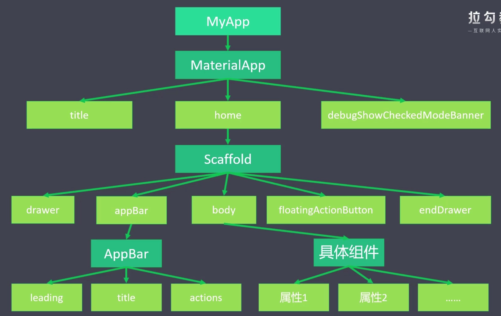
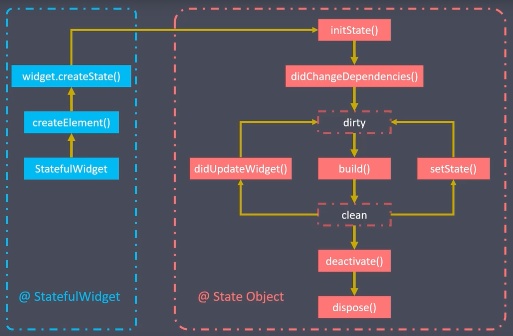

# 第一章 初始化项目

## 1.1 项目目录

1. 创建项目：Android Studio创建项目

2. 目录结构

   ```text
   flutter-app
   |--android				# 安装目录
   |--build					# 构建目录
   |--ios						# IOS目录
   |--lib						# 开发目录,java中的src
   |----main.dart		# 入口文件
   |--test						# 测试目录
   |--pubspec.yaml		# 项目依赖信息管理文件
   |--pubspec.lock		# 项目依赖锁定信息文件
   ```

3. Flutter项目概述

   - Material Design：Google推出的前端UI解决方案，Flutter的UI组件库
     - 官网：https://material.io/
     - 中文网：https://www.mdui.org/design/
   - Flutter中一切内容都是组件：Widget
     - 无状态组件
     - 有状态组件

4. Hello Flutter

   ```dart
   import 'package:flutter/material.dart';
   
   void main(){
     runApp(const MyApp());
   }
   
   class MyApp extends StatelessWidget {
     const MyApp({Key? key}) : super(key: key);
   
     @override
     Widget build(BuildContext context) {
       return const Center(
         child: Text(
           "Hello Flutter",
           textDirection: TextDirection.ltr
         ),
       );
     }
   }
   ```
   
   - 实例化对象可以省略new关键字

## 1.2 App结构

> MaterialDesign是Google推出的全新设计语言，这种设计语言为了给手机、平板等平台提供一致的外观体验，



1. MaterialApp：由Material提供，包含了App的基本骨架

   - title：任务管理器中的标题
   - home：主内容
   - routs：路由表
   - initialRoute：初始路由名称
   - onGenerateRoute：通过pushNamed跳转路由页面时在routes中查不到时回调
   - onUnknownPage：onGenerateRoute无法生成路由时候的页面，指404
   - debugShowCheckedModeBanner：是否显示左上角的调试标记

2. Scaffold：是脚手架

   - appBar：指应用头部
   - body：应用主体
   - floattingActionButton：浮动按钮
   - drawer：左侧抽屉菜单
   - endDrawer：右侧抽屉菜单

3. App结构代码案例

   ```dart
   import 'package:flutter/material.dart';
   // 入口函数加载我自己的App
   void main(){
     runApp(const MyApp());
   }
   
   // 根据App结构: 先定义自己的App 返回的是MaterialApp
   // MaterialApp 包含Home
   class MyApp extends StatelessWidget {
     const MyApp({Key? key}) : super(key: key);
   
     @override
     Widget build(BuildContext context) {
       return const MaterialApp(
         title: "Home",
         home: Home(),
         debugShowCheckedModeBanner: false
       );
     }
   }
   // 定义自己的Home组件: 包含AppBar和Body
   class Home extends StatelessWidget {
     const Home({Key? key}) : super(key: key);
   
     @override
     Widget build(BuildContext context) {
       return Scaffold(
         appBar: AppBar(
           title: const Text("首页")
         ),
         body: const Body()
       );
     }
   }
   
   // 定义自己的Body
   class Body extends StatelessWidget {
     const Body({Key? key}) : super(key: key);
   
     @override
     Widget build(BuildContext context) {
       return const Center(
         child: Text(
           "Hello Flutter",
           textDirection: TextDirection.ltr
         ),
       );
     }
   }
   ```

# 第二章 基础组件

## 2.1 常用 

1. Text：文本组件

   - 组件属性

     | 属性                                                         | 说明                                                        |
     | ------------------------------------------------------------ | ----------------------------------------------------------- |
     | TextStyle style<br /> - Color color<br /> - FontWeight fontWeight<br /> - FontStyle fontStyle | 文本样式<br /> - 字体颜色<br /> - 字体粗细<br /> - 字体样式 |
     | TextAlign textAlign                                          | 文本对齐                                                    |
     | TextDirection textDirection                                  | 文本方向                                                    |
     | TextOverflow overflow                                        | 文本溢出                                                    |
     | int maxLines                                                 | 文本最多行数                                                |

2. RichText & TextSpan：组合使用，给一段文件显示不同样式

3. 自定义字体

   - 下载字体：https://fonts.google.com/

   - 解压保存到项目中

   - 配置yaml字体配置

     ```yaml
     flutter:
       fonts:
         - family: Shizuo
           fonts:
             - asset: resources/fonts/Shizuru/Shizuru-Regular.ttf
               weight: 700
     ```

   - 给组件添加自定义字体

     ```dart
     class MyApp extends StatelessWidget {
       const MyApp({Key? key}) : super(key: key);
     
       @override
       Widget build(BuildContext context) {
         return  MaterialApp(
           title: "Home",
           home: const Home(),
           // 给MyApp添加全局字体
           theme: ThemeData(fontFamily: 'Shizuo'),
           debugShowCheckedModeBanner: false
         );
       }
     }
     ```

4. Icons

   - Flutter中的图标库：Icons.图标名称

     ```dart
     class Home extends StatelessWidget {
       const Home({Key? key}) : super(key: key);
       @override
       Widget build(BuildContext context) {
         return Scaffold(
           appBar: AppBar(
             title: const Text("图标"),
             leading: IconButton(
                 onPressed: (){},
                 icon: const Icon(Icons.four_g_plus_mobiledata_rounded)
             )
           ),
           body: const Body(),
         );
       }
     }
     ```

5. Color颜色

   - Dart中颜色表示方式：通过ARGB声明颜色

     - const Color(0xFF43A5F5)：十六进制的ARGB=透明度+六位十六进制的颜色
     - const ColorFormARGB(0xFF,0x43,0xF5,0xF5)：Color的命名构造函数，分开十六进制参数
     - const ColorFormARGB(255,54,242,155)：Color的命名构造函数，分开十进制参数
     - const ColorFormRGBO(255,54,242,0.5)：Color的命名构造函数，O表示透明度

   - 设置文字的颜色

     ```dart
     class Body extends StatelessWidget {
       const Body({Key? key}) : super(key: key);
     
       @override
       Widget build(BuildContext context) {
         return Column(
           children: [
             RichText(text: const TextSpan(
                 text: "Hello Red",
                 style: TextStyle(color: Colors.amberAccent)
               )),
             RichText(text: const TextSpan(
               text: "十进制",
               style: TextStyle(color: Color.fromRGBO(155, 100, 255, 0.5))
             ))
           ],
         );
       }
     }
     ```

## 2.2 布局 

1. Container：属于Flutter中的盒子模式：设置盒子的大小、边框、边距、颜色等等属性；每个属性都会对应不同的组件实现相应的功能；

   | Container属性             | 说明                               |
   | ------------------------- | ---------------------------------- |
   | child                     | 声明子组件                         |
   | EdgeInsets padding/margin | 内边距/外边距                      |
   | BoxDecoration decoration  | 盒子样式：边框、背景、阴影         |
   | Alignment alignment       | 对Container中的元素对齐            |
   | Matrix4 transform         | 对盒子变形：平移、旋转、缩放、斜切 |

   ```dart
   class Body extends StatelessWidget {
     const Body({Key? key}) : super(key: key);
   
     @override
     Widget build(BuildContext context) {
       return Container(
         child: const Text(
           "Container：属于Flutter中的盒子模式：设置盒子的大小、边框、颜色等等属性；每个属性都会对应不同的组件实现相应的功能；",
           style: TextStyle(
             fontSize: 20
           ),
         ),
         width: double.infinity,
         height: double.infinity,
         padding: const EdgeInsets.all(10.0),
         margin: const EdgeInsets.fromLTRB(10, 20, 30, 40),
         decoration: BoxDecoration(
           // border: Border(
           //   top: BorderSide(width: 5,color: Colors.red),
           //   left: BorderSide(width: 5,color: Colors.red),
           //   bottom: BorderSide(width: 5,color: Colors.red),
           //   right: BorderSide(width: 5,color: Colors.red)
           // ),
           border: Border.all(width: 10.0,color: Colors.red),
           borderRadius: const BorderRadius.all(Radius.circular(30.0)),
           color: Colors.lightGreen[100]
         ),
         alignment: Alignment.center,
         transform: Matrix4.rotationZ(0.2),
       );
     }
   }
   ```

2. 线性布局：Column & Row

   > - Column中的主轴方向是垂直方向
   > - Row中的主轴方向是水平方向
   
   - Column&Row布局属性
   
     | 布局属性           | 说明           |
     | ------------------ | -------------- |
     | mainAxisAlignment  | 主轴的对齐方式 |
     | crossAxisAlignment | 交叉轴对齐方式 |
   
   - 案例代码
   
     ```dart
     class Body extends StatelessWidget {
       const Body({Key? key}) : super(key: key);
     
       @override
       Widget build(BuildContext context) {
         return Container(
           color: Colors.lightBlue,
           width: double.infinity,
           child: Column(
             mainAxisAlignment: MainAxisAlignment.spaceEvenly,
             children: [
               const Icon(Icons.eleven_mp_rounded,size: 60),
               const Icon(Icons.four_g_plus_mobiledata_rounded,size: 60),
               const Icon(Icons.eighteen_mp_rounded,size: 60),
               const Icon(Icons.five_g,size: 60),
               Row(
                 mainAxisAlignment: MainAxisAlignment.spaceAround,
                 children: const [
                     Icon(Icons.eleven_mp_rounded,size: 60),
                     Icon(Icons.four_g_plus_mobiledata_rounded,size: 60),
                     Icon(Icons.eighteen_mp_rounded,size: 60),
                     Icon(Icons.five_g,size: 60),
                 ],
               )
             ],
           ),
         );
       }
     }
     ```
   
3. 弹性布局（Flex）

   - Flex布局属性：Column和Row也是Flex的子类，Column和Row不能指定主轴方向，Flex布局个功能更多

     | Flex布局属性       | 说明                   |
     | ------------------ | ---------------------- |
     | direction          | 声明主轴的方向         |
     | mainAxisAlignment  | 声明主轴对齐方式       |
     | crossAxisAlignment | 声明交叉轴对齐方式     |
     | textDirection      | 声明水平方向的排列顺序 |
     | verticalDirection  | 声明垂直方向的排列顺序 |
     | children           | 声明子组件             |

   - 可伸缩布局（Expanded）：Container必须声明宽度，因为默认宽度是0；而Expanded是自由伸缩的，默认占有所有可用宽度；

     | Expanded属性 | 说明                   |
     | ------------ | ---------------------- |
     | flex         | 声明弹性布局所占的比例 |
     | child        | 声明子组件             |

   - 案例代码

     ```dart
     class Body extends StatelessWidget {
       const Body({ Key? key }) : super(key: key);
     
       @override
       Widget build(BuildContext context) {
         return Column(
           children: [
             Row(
               children: [
                 Container(color: Colors.lightGreen,height: 50,width: 50,),
                 Expanded(child: Container(color: Colors.lightBlue,height: 50,))
               ],
             ),
             Flex(
               direction: Axis.horizontal,
               mainAxisAlignment: MainAxisAlignment.spaceBetween,
               textDirection: TextDirection.rtl ,
               children: const[
                 Icon(Icons.ac_unit,size: 50,),
                 Icon(Icons.access_alarm_rounded,size: 50,),
                 Icon(Icons.ac_unit,size: 50,),
                 Icon(Icons.fiber_dvr,size: 50,)
               ],
             ),
             Flex(
               direction: Axis.horizontal,
               // width属性无效
               children: [
                 Expanded(child: Container(color: Colors.brown,height: 50,width: 100,),flex: 3,),
                 Expanded(child: Container(color: Colors.black12,height: 50,width: 100,),flex: 1)
               ],
             )
           ],
         );
       }
     }
     ```

4. 流式布局：在Flutter中声明在组件的内容溢出了不会流式排版，而是会报错，需要使用到流式布局组件Wrap组件

   - 流式布局属性

     | 布局属性     | 说明                 |
     | ------------ | -------------------- |
     | spacing      | 主轴方向子组件的间距 |
     | alignment    | 主轴方向的对齐方式   |
     | runSpacing   | 纵轴方向子组件的间距 |
     | runAlignment | 纵轴方向的对齐方式   |

   - Chip：标签

   - Circle：原型头像

   - 案例代码

     ```dart
     class Body extends StatelessWidget {
       Body({Key? key}) : super(key: key);
       final List<String> _name = ["刘备", "诸葛亮", "曹操", "夏侯渊", "小乔", "虞姬"];
     
       List<Widget> _buildChap() {
         return _name
             .map((item) => Chip(
                   avatar: const CircleAvatar(backgroundColor: Colors.blue,child: Text("国")),
                   label: Text(item),
                 )).toList();
       }
     
       @override
       Widget build(BuildContext context) {
         return Column(
           children: [
             // Row会报错
             Row(children: _buildChap()),
             // Wrap会流式布局
             Wrap(spacing: 20,children: _buildChap())
           ],
         );
       }
     }
     ```

5. 层叠布局：类似CSS中的z-index，组件之间的位置关系

   - Stack层级属性

     | Stack属性     | 说明                           |
     | ------------- | ------------------------------ |
     | alignment     | 声明未定义位置子组件的对齐方式 |
     | textDirection | 声明未定义位置子组件的排列顺序 |

   - Position位置属性

     | Position属性             | 说明       |
     | ------------------------ | ---------- |
     | child                    | 声明子组件 |
     | left、top、right、bottom | 位置       |
     | width、height            | 宽高       |

   - NetWorkImage：加载网络图片

     | NewWorkImage属性             | 说明 |
     | ---------------------------- | ---- |
     | NetWorkImage("网络图片地址") |      |

   - 案例代码

     ```dart
     class Body extends StatelessWidget {
       const Body({Key? key}) : super(key: key);
     
       @override
       Widget build(BuildContext context) {
         return Container(
           child: Stack(
             // 未定义位置子组件的排列顺序
             textDirection: TextDirection.rtl,
             // 未定义位置子组件的对齐方式
             alignment: Alignment.center,
             children: const [
               CircleAvatar(
                 backgroundImage: NetworkImage(
                     'https://i0.hdslb.com/bfs/feed-admin/1306d57b6ddbe67e77f0e542bbf0926df5fd5513.png@880w_388h_1c_95q'),
                 radius: 200,
               ),
               Positioned(
                 child: Text(
                   "热买",
                   style: TextStyle(fontSize: 30,color: Colors.white,backgroundColor: Colors.redAccent),
                 ),
                 top: 30,
                 right: 20,
               ),
               Text(
                   "Hello",
                   style: TextStyle(fontSize: 30,color: Colors.white,backgroundColor: Colors.redAccent),
                 ),
             ],
           )
         );
       }
     }
     
     ```

6. Card：

   - card属性

     | 属性        | 说明     |
     | ----------- | -------- |
     | child       | 子组件   |
     | color       | 背景色   |
     | shadowColor | 阴影色   |
     | elevation   | 阴影高度 |
     | shape       | 边框样式 |
     | margin      | 外边距   |

   - ListTile：列表瓦片

     | 属性     | 说明     |
     | -------- | -------- |
     | leading  | 头部组件 |
     | title    | 标题     |
     | subtitle | 子标题   |

   - 案例代码

     ```dart
     class Body extends StatelessWidget {
       const Body({ Key? key }) : super(key: key);
     
       @override
       Widget build(BuildContext context) {
         return Column(
           children: [
             Card(
               margin: const EdgeInsets.all(20.0),
               color: Colors.white60,
               shadowColor: Colors.white,
               elevation: 20,
               child: Column(
                 children: const [
                   ListTile(
                     leading: Icon(Icons.supervised_user_circle,size: 50,),
                     title: Text("张三",style: TextStyle(fontSize: 30),),
                     subtitle: Text("董事长",style: TextStyle(fontSize: 15),),
                   ),
                   ListTile(
                     title: Text("电话: 18700136671",style: TextStyle(fontSize: 15),)
                   ),
                   ListTile(
                     title: Text("地址: 陕西省西安市雁塔区",style: TextStyle(fontSize: 15),),
                   ),
                 ],
               ),
             ),
             Card(
               child: Column(
                 children: const [
                   ListTile(
                     leading: Icon(Icons.supervised_user_circle,size: 50,),
                     title: Text("张三",style: TextStyle(fontSize: 30),),
                     subtitle: Text("董事长",style: TextStyle(fontSize: 15),),
                   ),
                   ListTile(
                     title: Text("电话: 18700136671",style: TextStyle(fontSize: 15),)
                   ),
                   ListTile(
                     title: Text("地址: 陕西省西安市雁塔区",style: TextStyle(fontSize: 15),),
                   ),
                 ],
               ),
             )
           ],
         );
       }
     }
     ```

## 2.3 按钮 

1. 按钮概述：在Flutter中有两套按钮，在Flutter的1.22之后出的按钮替换之前的按钮；之前的按钮调整统一的外观比较麻烦，进程自定义大量的按钮样式，新按钮将外观属性集合为一个ButtonStyle，方便统一控制；

   - 按钮组件

     | 按钮名称 | Flutter 1.22 之前 | Flutter 1.22 （替换1.22版本的按钮）                          |
     | -------- | ----------------- | ------------------------------------------------------------ |
     | 扁平按钮 | FlatButton        | TextButton                                                   |
     | 凸起按钮 | RaiseButton       | ElevatedButton                                               |
     | 轮廓按钮 | OutlineButton     | OutlinedButton                                               |
     | 图标按钮 |                   | IconButton<br /> - TextButton.icon()<br /> - ElevatedButton.icon()<br /> - OutlinedButton.icon() |
     | 按钮组   |                   | ButtonBar                                                    |
     | 浮动按钮 |                   | FloatingActionButton                                         |
     | 回退按钮 |                   | BackButton                                                   |
     | 关闭按钮 |                   | CloseButton                                                  |

   - 按钮案例

     ```dart
     class Body extends StatelessWidget {
       const Body({Key? key}) : super(key: key);
     
       @override
       Widget build(BuildContext context) {
         return Container(
           child: Wrap(
             children: [
               TextButton(
                   onPressed: () {
                     print("单击TextButton");
                   },
                   onLongPress: () {
                     print("长按TextButton");
                   },
                   child: const Text("TextButton")),
               ElevatedButton(
                   onPressed: () {
                     print("单击 ElevatedButton");
                   },
                   onLongPress: () {
                     print("长按 ElevatedButton");
                   },
                   child: const Text("ElevatedButton")),
               OutlinedButton(
                   onPressed: () {
                     print("单击TextButton");
                   },
                   onLongPress: () {
                     print("长按 OutlinedButton");
                   },
                   child: Text("OutlinedButton"))
             ],
           ),
         );
       }
     }
     
     ```

2. 按钮样式：style

   - 样式属性

     | 属性 | 说明 |
     | ---- | ---- |
     |      |      |

   - 案例代码

     ```dart
     class Body extends StatelessWidget {
       const Body({Key? key}) : super(key: key);
     
       @override
       Widget build(BuildContext context) {
         return Container(
           child: Wrap(
             children: [
               OutlinedButton(
                   style: ButtonStyle(
                       textStyle:
                           MaterialStateProperty.all(const TextStyle(fontSize: 30)),
                       foregroundColor: MaterialStateProperty.resolveWith((state) {
                         if (state.contains(MaterialState.pressed)) {
                           // 按下按钮时候前景色
                           return Colors.red;
                         }
                         return Colors.yellow;
                       }),
                       backgroundColor: MaterialStateProperty.resolveWith((state) {
                         if (state.contains(MaterialState.pressed)) {
                           // 按下按钮时候背景色
                           return Colors.blue;
                         }
                       }),
                       shadowColor: MaterialStateProperty.all(Colors.yellow),
                       side: MaterialStateProperty.all(
                           const BorderSide(color: Colors.black, width: 3)),
                       shape: MaterialStateProperty.all(const StadiumBorder(
                           side: BorderSide(color: Colors.green, width: 5)))),
                   onPressed: () {
                     print("单击TextButton");
                   },
                   onLongPress: () {
                     print("长按 OutlinedButton");
                   },
                   child: Text("OutlinedButton")),
             ],
           ),
         );
       }
     }
     
     ```

3. 按钮主题

   - 主题属性

     | 主题属性 | 说明 |
     | -------- | ---- |
     |          |      |

   - 案例代码

     ```dart
     import 'package:flutter/material.dart';
     
     class Home extends StatelessWidget {
       const Home({Key? key}) : super(key: key);
     
       @override
       Widget build(BuildContext context) {
         return Scaffold(
           appBar: AppBar(
             title: const Text("Flex"),
           ),
           body: const Body(),
           floatingActionButton: FloatingActionButton(
               onPressed: () {},
               tooltip: "incream",
               child: const Icon(Icons.add),
               backgroundColor: Colors.red),
         );
       }
     }
     
     class Body extends StatelessWidget {
       const Body({Key? key}) : super(key: key);
     
       @override
       Widget build(BuildContext context) {
         return Container(
           child: Wrap(
             children: [
               OutlinedButtonTheme(
                   data: OutlinedButtonThemeData(
                     style: ButtonStyle(
                         overlayColor: MaterialStateProperty.all(Colors.blue)),
                   ),
                   child: OutlinedButton(
                       // 如果声明style theme就会失效
                       onPressed: () {
                         print("单击TextButton");
                       },
                       onLongPress: () {
                         print("长按 OutlinedButton");
                       },
                       child: Text("OutlinedButton"))),
               IconButton(
                 onPressed: () {},
                 icon: const Icon(Icons.ac_unit_sharp),
                 highlightColor: Colors.purple,
               ),
               TextButton.icon(
                 onPressed: () {},
                 icon: const Icon(Icons.collections_bookmark),
                 label: const Text("文本图标按钮"),
               ),
               Container(
                 color: Colors.pink,
                 width: double.infinity,
                 child: ButtonBar(
                   children: [
                     ElevatedButton(onPressed: () {}, child: const Text("按钮1")),
                     TextButton(onPressed: () {}, child: const Text("按钮2")),
                     ElevatedButton(onPressed: () {}, child: const Text("按钮1")),
                     ElevatedButton(onPressed: () {}, child: const Text("按钮1")),
                     ElevatedButton(onPressed: () {}, child: const Text("按钮1")),
                     ElevatedButton(onPressed: () {}, child: const Text("按钮1")),
                     ElevatedButton(onPressed: () {}, child: const Text("按钮1")),
                   ],
                 ),
               ),
               const BackButton(),
               const CloseButton(),
             ],
           ),
         );
       }
     }
     ```

## 2.4 图片 

1. Image.asset：加载本地图片

   - 操作步骤：①在Flutter项目下创建图片目录②在pubspec.yaml添加配置③在代码中添加图片路径

   - 按钮代码

     ```dart
     
     ```

2. Image.network：加载网络图片

   - 操作步骤：①网络通②设置网络访问权限③运行http协议访问

   - 案例代码

     ```dart
     
     ```

## 2.5 列表

1. SingleChildScrollView：只能添加一个子组件

   - 属性说明

     | 属性            | 说明                                 |
     | --------------- | ------------------------------------ |
     | child           | 子组件                               |
     | padding         | 内边距                               |
     | scrollDirection | 滚动方向                             |
     | reverse         | 初始滚动位置是否从尾部开始           |
     | physics         | 设置滚动视图的物理特征：如弹性、微光 |

   - 案例代码

     ```dart
     class Body extends StatelessWidget {
       const Body({Key? key}) : super(key: key);
     
       @override
       Widget build(BuildContext context) {
         return Stack(
           children: [
             // 水平滚动
             SingleChildScrollView(
               // 设置滚动方向 否则超出报错
               scrollDirection: Axis.horizontal,
               padding: const EdgeInsets.all(10),
               child: Row(
                 children: [
                   OutlinedButton(
                       onPressed: () {}, child: const Text("按钮1按钮1按钮1按钮1按钮1按钮1")),
                   OutlinedButton(
                       onPressed: () {}, child: const Text("按钮1按钮1按钮1按钮1按钮1按钮1")),
                   OutlinedButton(
                       onPressed: () {}, child: const Text("按钮1按钮1按钮1按钮1按钮1按钮1"))
                 ],
               ),
             ),
             SingleChildScrollView(
               scrollDirection: Axis.vertical,
               physics: const BouncingScrollPhysics(),
               child: Column(
                 children: List.generate(
                     100,
                     (index) => OutlinedButton(
                         onPressed: () {}, child: const Text("按钮1按钮1按钮1按钮1按钮1"))),
               ),
             )
           ],
         );
       }
     }
     ```

2. LIstView&ListTile：加载列表组件，适用于Weight比较少的

   - 命令构造函数

     - ListView.builder：按需加载Weight，新能比默认构造函数的好，并且适用于Weight比较多的场景
     - ListView.separated：比ListView.builder多了分割线

   - 案例代码

     ```dart
     final List<Widget> userList = List.generate(
         20, (index) => OutlinedButton(onPressed: () {}, child: Text("姓名$index")));
     final List<Widget> productList = List.generate(
         20,
         (index) => ListTile(
               leading: const Icon(Icons.ac_unit),
               title: Text("标题$index"),
               subtitle: Text("标题$index"),
             ));
     
     class ListViewSepreadTest extends StatelessWidget {
       const ListViewSepreadTest({Key? key}) : super(key: key);
     
       @override
       Widget build(BuildContext context) {
         return Container(
             height: 150,
             child: ListView.separated(
               itemCount: productList.length,
               itemBuilder: (context, index) => productList[index],
               separatorBuilder: (context, index) {
                 return Divider(
                   color: Colors.blue,
                   thickness: 3,
                 );
               },
             ));
       }
     }
     
     class ListViewBuilderTest extends StatelessWidget {
       const ListViewBuilderTest({Key? key}) : super(key: key);
     
       @override
       Widget build(BuildContext context) {
         return Container(
           height: 150,
           child: ListView.builder(
               itemCount: userList.length,
               itemExtent: 30,
               itemBuilder: (context, index) {
                 return userList[index];
               }),
         );
       }
     }
     
     class ListViewVertical extends StatelessWidget {
       const ListViewVertical({Key? key}) : super(key: key);
     
       @override
       Widget build(BuildContext context) {
         return Container(
             height: 100,
             child: ListView(scrollDirection: Axis.horizontal, children: [
               Container(color: Colors.blue, width: 100, child: const Text("test")),
               Container(color: Colors.green, width: 100, child: const Text("test")),
               Container(color: Colors.red, width: 100, child: const Text("test")),
               Container(
                   color: Colors.yellow, width: 100, child: const Text("test")),
               Container(
                   color: Colors.redAccent, width: 100, child: const Text("test")),
             ]));
       }
     }
     
     class ListViewBasic extends StatelessWidget {
       const ListViewBasic({Key? key}) : super(key: key);
     
       @override
       Widget build(BuildContext context) {
         return Container(
           height: 200,
           child: ListView(
             children: const [
               ListTile(
                 leading: Icon(Icons.class__rounded),
                 title: Text("class__rounded"),
                 subtitle: Text("class__rounded"),
               ),
               ListTile(
                   leading: Icon(Icons.face_retouching_natural_outlined),
                   title: Text("face_retouching_natural_outlined"),
                   subtitle: Text("class__rounded"),
                   selected: true,
                   selectedTileColor: Colors.red),
               ListTile(
                 leading: Icon(Icons.access_alarm),
                 title: Text("access_alarm"),
                 subtitle: Text("class__rounded"),
               ),
               ListTile(
                 leading: Icon(Icons.safety_divider),
                 title: Text("safety_divider"),
                 subtitle: Text("class__rounded"),
               ),
             ],
           ),
         );
       }
     }
     ```

3. GridView：用来做网格布局，和ListView一样继承自同一个类；

   - 属性说明

     | 属性                                                         | 说明                                                         |
     | ------------------------------------------------------------ | ------------------------------------------------------------ |
     | child                                                        | 子组件                                                       |
     | scrollDirection                                              | 滚动方向                                                     |
     | gridDelegate<br /> - GridView.count<br /> - GridView.extend<br /> - GridView.builder | 网格代理：网格显示方式<br /> - 指定列数 -> 子组件宽度自适应<br /> - 指定子组件宽度 -> 列数自适应<br /> - 动态网格布局 |
     | mainAxisSpacing                                              | 主轴方向间距                                                 |
     | crossAxisSpacing                                             | 交叉轴方向间距                                               |
     | childWidth                                                   | 子组件宽度                                                   |
     | childHeight                                                  | 子组件高度                                                   |
     | childAspectRadio                                             | 子组件宽高比                                                 |
     | crossAxisCount                                               | 固定列数                                                     |

   - 案例代码

     ```dart
     
     ```

## 2.6 其他

# 第三章 第三方组件

## 3.1 dio

1. 概述：发送Http请求，类似Axios。

2. 在pubspec.yaml添加依赖，自动下载

   ```yaml
   dependencies:
     dio: ^4.0.4
   ```

3. 使用案例

   

## 3.2 flutter_swiper

1. 概述：轮播组件

2. 在pubspec.yaml添加依赖，自动下载

   ```yaml
   dependencies:
     flutter_swiper: ^1.1.6
   ```

3. 使用案例

## 3.3 shared_preferences

1. 概述：数据的本地存储

## 3.4 fluro

1. 安装fluro

   ```yaml
   dependencies:
   	fluro: ^1.5.1
   ```

2. 使用flutter安装fluro

   ```sh
   flutter pub add fluro
   ```

3. 配置fluro

   - 定义路由配置文件

4. 使用

   ```dart
   ```

   

# 第四章 状态管理

## 4.1 StatefulWidget

1. 组件概述

   - 在Flutter中格局组件是否有状态分为两种
     - 无状态组件StatelessWidget
     - 有状态组件StatefullWidget：根据状态作用域分为三种
       - 组件内私有状态：StatefullWidget
       - 跨组件状态共享：InheritedWidget、Provider
       - 全局状态：Redux | fish-redux、Mobx

2. 有状态组件的组成

   - StatefullWidget：组件本身不可变，需要创建一个State的类
   - State：将变化的状态信息保存到State对象中

3. 案例代码

   ```dart
   class Body extends StatefulWidget {
     const Body({Key? key}) : super(key: key);
   
     @override
     _BodyState createState() => _BodyState();
   }
   
   class _BodyState extends State<Body> {
     int _num = 0;
     @override
     Widget build(BuildContext context) {
       return Center(
           child: Column(
             children: [
               Text("$_num"),
               ElevatedButton(onPressed: (){
                 setState(() {
                   _num++;
                 });
               }, child: const Icon(Icons.add))
             ],
           ),
       );
     }
   }
   ```

## 4.2 DataTable

1. 表格属性

   | 属性       | 说明               |
   | ---------- | ------------------ |
   | columns    | 表头               |
   | dataColumn | 表头单元格         |
   | rows       | 声明数据列表       |
   | dataRow    | 数据单元格行       |
   | DataCell   | 一行单元格中的一列 |

2. 案例说明

   ```dart
   // 选择和排序
   ```

## 4.3 InheritedWidget

1. 完成跨组件状态分享：提供沿树向下，共享数据的功能；Flutter的组件结构是树结构，沿树向下意思是子组件可以获取父组件中的状态值；

2. InheritedWidget

   ```dart
   
   ```

## 4.4 生命周期

1. 概述：主要是指状态组件的声明周期

2. 生命周期函数

   

   - initState：组件对象插入到元素树时调用
   - didChangeDependencies：当前状态对象的依赖改变的时候调用
   - build：组件渲染时候调用
   - setState：组件对象内部状态变更时候调用
   - didUpdateWidget：组件配置更新时候调用
   - deactivite：组件对象在元素树中暂时移除时调用
   - dispose：组件对象在元素树中永远移除时调用

## 4.5 Provider

1. 概述：是对InheritedWidget的封装，是由第三方库提供，作用是对状态进行懒加载，提高效率。

2. 下载Provider

   ```dart
   ```

3. Provider原理

   - 创建数据模型：T extends ChangeNotifier
   - 创建Provider：注册数据模型
     - Provider：不会要求随着变动而变动
     - ChangeNotifierProvider：随着某些数据改变而被通知更新
   - 获取数据模型并更新UI
     - 通过上下文获取：BuildContext
     - 通过静态方法：Provider.of

4. 案例代码

   ```dart
   
   ```

# 第五章 路由导航

## 5.1 路由简介 

1. 概述：有两个概念

   - Route：一个路由是对一个屏幕或者页面的抽象

   - Navigator：管理路由的组件，Navigator可以通过路由入栈和和出栈来实现页面之间的跳转；

     | 属性             | 说明                   |
     | ---------------- | ---------------------- |
     | initialRouter    | 初始路由               |
     | onGenerateRouter | 动态路由，根据规则匹配 |
     | onUnknownRoute   | 未知路由404            |
     | routes           | 路由集合               |

## 5.2 匿名路由 

1. 概述：匿名路由是指没有路由名称，是通过Navigator中的push跳转到指定组件；pop进行回退

2. 案例代码

   ```dart
   class Body extends StatelessWidget {
     const Body({Key? key}) : super(key: key);
   
     @override
     Widget build(BuildContext context) {
       return Center(
         child: ElevatedButton(
           onPressed: (){
             Navigator.push(
               context,
               MaterialPageRoute(builder: (context) => const Product())
             );
           },
           child: const Text("跳转商品页面"),
         ),
       );
     }
   }
   
   class Product extends StatelessWidget {
     const Product({Key? key}) : super(key: key);
   
     @override
     Widget build(BuildContext context) {
       return Scaffold(
         appBar: AppBar(
           title: const Text("demo01_router"),
         ),
         body: Center(
           child: ElevatedButton(
             onPressed: (){
               Navigator.pop(context);
             },
             child: const Text("回退"),
           ),
         )
       );
     }
   }
   ```

## 5.3 命名路由 

1. 命名路由：在使用路由之前需要先声明路由，然后根据路由名称跳转。

   - routes：路由表-Map类型
   - initialRoute：初始路由
   - unUnknownRoute：未知路由

2. 跳转到命名路由

   - Navigator.pushNamed(context,路由名称);

3. 案例代码

   ```dart
   void main() {
     runApp(const NameRoute());
   }
   // 在MaterialApp中定义命名路由 并且指定初始路由
   class NameRoute extends StatelessWidget {
     const NameRoute({Key? key}) : super(key: key);
   
     @override
     Widget build(BuildContext context) {
       return MaterialApp(
         title: "NameRoute",
         initialRoute: "home",
         routes: {
           'home': (context) => const Home(),
           'product': (context) => const Product(),
           'unknown': (context) => const UnknownPage(),
         },
         onUnknownRoute: (RouteSettings setting) =>
             MaterialPageRoute(builder: (context) => const UnknownPage()),
         debugShowCheckedModeBanner: false,
       );
     }
   }
   
   // 跳转路由
   class Home extends StatelessWidget {
     const Home({Key? key}) : super(key: key);
   
     @override
     Widget build(BuildContext context) {
       return Scaffold(
         appBar: AppBar(
           title: const Text("demo02_name_router"),
         ),
         body: Center(
           child: Column(
             children: [
               ElevatedButton(
                 onPressed: (){
                   Navigator.pushNamed(context, "product");
                 },
                 child: const Text("商品列表"),
               ),
               ElevatedButton(
                 onPressed: (){
                   Navigator.pushNamed(context, "user");
                 },
                 child: const Text("位置路由"),
               ),
             ],
           )
         )
       );
     }
   }
   
   class Product extends StatelessWidget {
     const Product({Key? key}) : super(key: key);
   
     @override
     Widget build(BuildContext context) {
       return Scaffold(
           appBar: AppBar(
             title: const Text("商品列表"),
           ),
           body: Center(
               child: Column(
                 children: [
                   ElevatedButton(
                     onPressed: (){
                       Navigator.pop(context);
                     },
                     child: const Text("返回"),
                   )
                 ],
               )
           )
       );
     }
   }
   
   
   class UnknownPage extends StatelessWidget {
     const UnknownPage({Key? key}) : super(key: key);
   
     @override
     Widget build(BuildContext context) {
       return Scaffold(
           appBar: AppBar(
             title: const Text("404"),
           ),
           body: Center(
               child: Column(
                 children: [
                   ElevatedButton(
                     onPressed: (){
                       Navigator.pop(context);
                     },
                     child: const Text("返回"),
                   )
                 ],
               )
           )
       );
     }
   }
   ```

## 5.4 动态路由 

1. 概述：是指通过onGenerateRout特属性指定的路由，根据请求路径跳转路由

2. 案例

   ```dart
   class DynamicRoute extends StatelessWidget {
     const DynamicRoute({Key? key}) : super(key: key);
   
     @override
     Widget build(BuildContext context) {
       return MaterialApp(
           title: "MyApp",
           onGenerateRoute: (RouteSettings setting) {
             if(setting.name == '/'){
               return MaterialPageRoute(builder: (context) => const Home());
             }
             if(setting.name == '/product'){
               return MaterialPageRoute(builder: (context) => const Product());
             }
             return MaterialPageRoute(builder: (context) => const UnknownPage());
           },
           debugShowCheckedModeBanner: false);
     }
   }
   ```

## 5.5 路由传参

1. 匿名路由传参的方式
   - 在路由中声明参数：引用组件时候给构造函数指定参数
   - 在组件中接收参数：
2. 命名路由定义参数
   - 路由中声明参数：Navigator.pushNamed(context,路由,{arguments})
   - 组件中接收参数：Map args = Modal.route.of(context).settings.arguments

## 5.6 Drawer导航 

1. drawer导航概述：Scaffold

   - drawer：左侧抽屉菜单
   - endDrawer：右侧抽屉菜单

2. UserAccountsDrawerHeader：抽屉菜单的头部

3. AboutListTitle：关于抽屉的弹窗

   ```dart
   import 'package:flutter/material.dart';
   
   class Home extends StatelessWidget {
     const Home({Key? key}) : super(key: key);
   
     @override
     Widget build(BuildContext context) {
       return Scaffold(
         appBar: AppBar(
           title: const Text("demo01_draw"),
         ),
         body: const Body(),
         drawer: const DrawList(),
         endDrawer: const DrawList(),
       );
     }
   }
   class Body extends StatelessWidget {
     const Body({Key? key}) : super(key: key);
   
     @override
     Widget build(BuildContext context) {
       return Container(
         child: const Text("Draw"),
       );
     }
   }
   
   
   class DrawList extends StatelessWidget {
     const DrawList({Key? key}) : super(key: key);
   
     @override
     Widget build(BuildContext context) {
       return Drawer(
         child: ListView(
           padding: const EdgeInsets.all(0),
           children: const [
             UserAccountsDrawerHeader(
               accountName: Text("小留学生"),
               accountEmail: Text("945036446@qq.com"),
               decoration: BoxDecoration(
                 image: DecorationImage(
                   image: NetworkImage("https://img0.baidu.com/it/u=3392221806,1085679158&fm=253&fmt=auto&app=138&f=JPEG?w=500&h=500"),
                   fit: BoxFit.cover
                 )
               ),
               currentAccountPicture: CircleAvatar(
                 backgroundImage: NetworkImage("https://img2.baidu.com/it/u=3443472813,3866086691&fm=26&fmt=auto"),
               ),
             ),
             ListTile(
               title: Text("设置"),
               leading: Icon(Icons.eleven_mp_rounded),
               trailing: Icon(Icons.access_alarm_outlined),
             ),
             AboutListTile(
               child: Text("关于"),
               applicationIcon: Text("应用名称"),
               applicationVersion: '1.0.0',
               icon: Text("aaa"),
               applicationLegalese: '法律条款',
               aboutBoxChildren: [
                 Text("条例一：")
               ],
             )
           ],
         ),
       );
     }
   }
   ```

## 5.7 ButtonNavigationBar导航 

1. 底部导航

   - items：包含导航ButtonNavigationBarItem的列表
   - currentIndex：标识当前菜单
   - type：导航样式
   - onTap：单击事件

2. 案例代码

   ```dart
   class Home extends StatefulWidget {
     const Home({Key? key}) : super(key: key);
   
     @override
     _HomeState createState() => _HomeState();
   }
   
   class _HomeState extends State<Home> {
     final List<BottomNavigationBarItem> barItems = [
       const BottomNavigationBarItem(
         backgroundColor: Colors.blue,
         icon: Icon(Icons.ten_k_sharp),
         label: "首页"
       ),
       const BottomNavigationBarItem(
           backgroundColor: Colors.blue,
           icon: Icon(Icons.ten_k_sharp),
           label: "收藏"
       ),
       const BottomNavigationBarItem(
           backgroundColor: Colors.blue,
           icon: Icon(Icons.ten_k_sharp),
           label: "购物车"
       ),
       const BottomNavigationBarItem(
           backgroundColor: Colors.blue,
           icon: Icon(Icons.ten_k_sharp),
           label: "我的"
       ),
     ];
   
     late int _currentIndex;
   
     @override
     void initState() {
       // TODO: implement initState
       super.initState();
       _currentIndex = 0;
     }
   
   
     final List<Widget> pages = [
       const Center(child: Text("首页")),
       const Center(child: Text("收藏")),
       const Center(child: Text("购物车")),
       const Center(child: Text("我的")),
     ];
   
     @override
     Widget build(BuildContext context) {
       return Scaffold(
         appBar: AppBar(
           title: const Text("底部导航"),
           leading: const Icon(Icons.five_k),
           actions: const [
             Icon(Icons.two_k_outlined)
           ],
           elevation: 0.0,
           centerTitle: true,
         ),
         bottomNavigationBar: BottomNavigationBar(
           items: barItems,
           currentIndex: _currentIndex,
           type: BottomNavigationBarType.fixed,
           onTap: (index){
             _changeIndex(index);
           },
         ),
         body: pages[_currentIndex],
       );
     }
     void _changeIndex(int index){
       if(index != _currentIndex){
         setState(() {
           _currentIndex = index;
         });
       }
     }
   }
   ```

## 5.8 TabBar

1. DefaultTabController：整个Tab导航容器

   - length：声明导航数量
   - child：指定子组件

2. TabBar：导航菜单

   - tabs：导航菜单数组

3. TabBarView：导航页面

   - children：多个导航页面

4. 案例代码

   ```dart
   List<Widget> _listMenu = [
     const Tab(text: "首页",icon: Icon(Icons.home),),
     const Tab(text: "收藏",icon: Icon(Icons.eight_k_plus_rounded),),
     const Tab(text: "购物车",icon: Icon(Icons.add),),
     const Tab(text: "我的",icon: Icon(Icons.search),),
   ];
   
   List<Widget> _listPage = [
     const Icon(Icons.home,size: 120,color: Colors.red,),
     const Icon(Icons.eight_k_plus_rounded,size: 120,color: Colors.blue),
     const Icon(Icons.add,size: 120,color: Colors.green,),
     const Icon(Icons.search,size: 120,color: Colors.amber,),
   ];
   
   class Home extends StatelessWidget {
     const Home({Key? key}) : super(key: key);
   
   
   
     @override
     Widget build(BuildContext context) {
       return DefaultTabController(
           length: _listMenu.length,
           child: Scaffold(
             appBar: AppBar(
               title: const Text("demo01_draw"),
               bottom: TabBar(
                 tabs: _listMenu,
                 labelColor: Colors.red,
                 unselectedLabelColor: Colors.black,
                 indicatorSize: TabBarIndicatorSize.label,
               ),
             ),
             body: TabBarView(
               children: _listPage,
             ),
             bottomNavigationBar: TabBar(tabs: _listMenu,labelColor: Colors.blue,unselectedLabelColor: Colors.black,)
           ),
       );
     }
   }
   ```

# 第六章 表单

## 6.1 Switch 

1. 属性

   | 属性               | 说明                 |
   | ------------------ | -------------------- |
   | value              | 开关的值             |
   | onChange           | 开关状态变更时调用   |
   | activeColor        | 开关开启时候圆圈颜色 |
   | inactiveThumbColor | 开关关闭时圆圈颜色   |
   | activeTrackColor   | 开关开启时轨道颜色   |
   | inactiveTrackColor | 开关关闭时轨道颜色   |

2. IOS风格开关：CupertinosSwitch

3. 

## 6.2 CheckBox 

1. CheckBox属性

   | 属性        | 说明                 |
   | ----------- | -------------------- |
   | value       | 开关的值             |
   | onChange    | 开关状态变更时调用   |
   | activeColor | 开关开启时候圆圈颜色 |
   | changeColor | 选中时颜色           |

2. CheckboxListTile：可选中的列表

   | 属性     | 说明 |
   | -------- | ---- |
   | title    |      |
   | subTitle |      |

3. 案例

   ```dart
   
   ```

## 6.3 Radio 

## 6.4 TextField 

## 6.5 日历 

## 6.6 Form

第七章 其他

