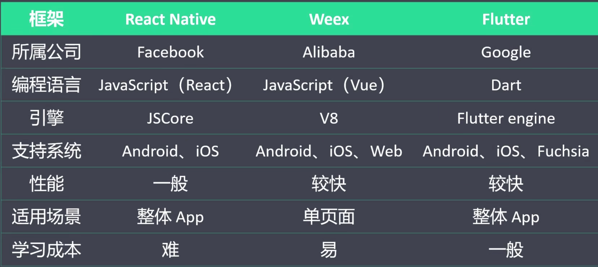

1. 简介

   - Google开发的跨平台UI框架：支持IOS、Android、WEB、桌面端、嵌入式

   - 发展历程
     - 2015年：Flutter（当时叫sky）在Dart峰会上亮相
     - 2017-5：发布第一个版本
     - 2018-6：发布第一个预览版本 
     - 2018-12：发布第一个稳定版本
     - 2019-9：Flutter发布1.9版本，支持了web端支持
     - 2020-9：Flutter发布1.22，带来对IOS14和Android 11的支持
     
   - 高性能
     
     - Flutter应用性能接近原生App
     - Flutter才用呢GPU（图形显示）渲染技术
     - Flutter应用刷新频率最高可达到120fps（帧每秒）
     
   - 移动应原生开发：

     - 原生开发 -> 原生App -> Android、IOS、Windows（已经淘汰）

     - 混合开发 -> 混合App -> React Native、Weex、Flutter

       | 框架     | ReactNative | Weex            | Flutter             |
       | -------- | ----------- | --------------- | ------------------- |
       | 公司     | FaceBook    | Alibaba         | Google              |
       | 语言     | React       | Vue             | Dart                |
       | 引擎     | JSCore      | V8              | Flutter engine      |
       | 支持系统 | Android+IOS | Android+IOS+WEB | Android+IOS+Fuchsia |
       | 性能     | 一般        | 较快            | 较快                |
       | 使用场景 | 整体App     | 单页面          | 整体App             |
       | 学习成本 | 难          | 易              | 一般                |

       

   - 技术核心点：采用虚拟DOM技术：三个层次的树结构
     - ①Widget树（UI控件）
     - ②Element树（渲染树）
     - ③RenderObject树（渲染上下文）

   - flutter架构图：
     - Framework：框架层
     - Engine：引擎层
     - Embedder：嵌入层

2. Win安装

   - 网络配置：需要将网络配置到Win环境变量中

     ```sh
     PUB_HOSTED_URL=https://pub.flutter-io.cn
     FLUTTER_STORAGE_BASE_URL=https://storage.flutter-io.cn
     ```

   - 安装GIT

   - 安装Gradle

   - 下载Flutter SDK：[WIN]([Flutter SDK releases - Flutter](https://flutter.dev/docs/development/tools/sdk/releases#windows))

     - 配置Fluuter环境变量

       ```sh
       FLUUTER_HOME=
       Path=%FLUUTER_HOME%/bin
       ```

   - 安装AndroidStudio

     - 下载
     - 安装
     - 配置AndroidSDK
       - 检查工具网站：http://ping.chinaz.com/dl.google.com
       - 配置host：180.163.151.33 dl.google.com

   - 配置AndroidSDK

     - 

3. Dart概述

   - Dart是Google2011年推出
   - Dart属于应用层编程语言，有自己的DartVM，但是也可以编译成Native Code运行在硬件上
   - 比Java简单，易于理解；比JavaScript更加规范，工程化；

4. Dart SDK安装

   - 官网：https://dart.dev/get-dart

   - win环境检查

     ```sh
     Get-ExecutionPolicy
     > Restricted
     Set-ExecutionPolicy AllSigned
     or
     Set-ExecutionPolicy Bypass -Scope Process.
     ```

   - Powershell

     ```sh
     Set-ExecutionPolicy Bypass -Scope Process -Force; [System.Net.ServicePointManager]::SecurityProtocol = [System.Net.ServicePointManager]::SecurityProtocol -bor 3072; iex ((New-Object System.Net.WebClient).DownloadString('https://community.chocolatey.org/install.ps1'))
     ```
   
   - 安装Dart

     ```sh
     choco install dart-sdk
     ```
   
5. Dart语言风格

   - 所有能够使用变量引用的都是对象；
   - 下划线开头表示私有属性
   - 程序执行入口是main函数

6. 变量和常量

   - 使用var关键字声明变量：可以赋予不同类型的值

   - 未初始化时，默认值是null

   - 变量使用final声明只能赋值一次

   - dynamic 声明的变量是

   - const声明常量：同时也是final，比final更加严格，final的值可以在编译时候赋值，

     ```dart
     final a = getNum()
     ```

7. 内置数据类型
   1. numbers：变量关键字（int、double、num）：强类型声明变量
   
   2. strings：变量关键字（String）：
      1. 可以使用单引号、双引号、三单引号（多行字符串）
      2. 双引号中使用·`$变量`引用变量
      3. 字符前添加`r`表示原始字符串：不转义特殊字符
      
   3. booleans：变量关键字（bool）：
   
   4. lists：使用变量字面量（`[]`）、List、
      1. 定义方式：①[]、②List 变量、③var 变量 = new List()
      2. 操作下标：
      3. const[]：表示不可变数组，不可变
      
   5. maps：
      1. 定义Map：使用Map字面量{}
      2. 使用Map关键字：Map 变量 = {}
      3. 使用new Map()：定义字典
      
   6. runes：在Dart中，Runes代表字符串的UTF32字符集，
      1. Dart中字符串是UTF-16的字符序列，
      2. 定义一个Runter：使用\uXXXX或\u{XXXXX}表示
      3. 强类型声明：Runter r = new Runter("\uXXX")
      4. Runter转字符串：new String.formatCharCodes(runter)
      
   7. sysbols：Dart语言的标识符，在反射中使用很普及
   
      1. 一个Symbol对象代表Dart程序中声明的操作符或标识符
   
      2. 作用：混淆后的代码，标识符名称别混淆了，但是Symbol的名字不会变，使用Symbol字面量来获取标识符的symble对象，在标识符签名添加一个#号
   
         ```dart
         var sm2 = #name;
         var sm1 = Symbol("name");
         ```
   
8. 运算符：可以创建表达式，可以重新表达式

   | 运算符   | 符号                                               |
   | -------- | -------------------------------------------------- |
   | 一元后缀 | expr++、expr--、()、[]、？、.                      |
   | 一元前缀 | ++expr、--expr、!expr、~expr、-expr                |
   | 乘法     | *、/、%、~/                                        |
   | 加法     | +、-                                               |
   | 移位     | <<、>>                                             |
   | 与       | &                                                  |
   | 或       | \|                                                 |
   | 关系类型 | \>=、、<=、>、<、as、is、is！                      |
   | 等式     | ==、!=                                             |
   | 逻辑与   | &&                                                 |
   | 逻辑或   | \|\|                                               |
   | 三元     | bool ？ true : false                               |
   | 级联     | ..                                                 |
   | 赋值     | +=、-=、*=、/=、~=、%=、>>=、<<=、&=、\|=、^=、??= |

9. 流程控制：同JavaScript

10. 方法定义：在Dart中方法（函数）也是对象，其类型是Function，所以方法可以赋值给变量也可以当做其他方法的参数；同时Dart中的函数对象也是方法；

    - 函数定义：标准定义，同java

    - dynamic返回值类型推断的方式

    - 使用箭头函数：=>：表示{return }

      ```dart
      String getName(String name) => name;
      ```

    - 必传参数：默认在方法上声明的参数就是必传参数；

    - 可选参数：位置参数：将参数定义在[]中，参数传递时是根据参数的位置赋值，如果不传也要赋值null；

    - 可选参数：命名参数：将参数定义在字典中：{k，v}；参数传递时候需要指定名称（key:v）

    - 参数默认值：定义参数参数时候给参数赋值称为默认值

    - 匿名方法：是匿名或者闭包

11. 变量作用域：指定义在代码块中的变量在代码块内有效

12. 函数闭包：是一个方法的对象，不论改对象子啊何处被调用，该对象都能访问自己作用域内的变量；

    ```dart
    count(){
      int n = 0;
      return (){
        return n++;
      };
    }
    ```

13. 面向对象

    - 定义类关键字：class：包含构造方法、成员变量、成员方法、类变量（静态变量）、类方法（静态方法）
    - 实例化对象：new 类名()；
      - 一个类只有一个构造方法
      - 类中的构造方法不支持重载
      - 使用命名的构造方法来实现构造方法的重载；
    - 常量构造方法：创建对象后不允许被修改
    - 常量私有属性设置：变量名称使用下划线开头；

14. 对象的仿真函数：如果类实现的call方法，则该类的对象可以作为方法使用

    ```dart
    
    ```

15. 类的基础与构造方法的继承：单继承：extends，与方法的重写，构造方法的重写；

16. 抽象类：abstract

17. 接口定义：可以使用implements关键字，可以把需要继承的类当做一个接口用；接口中的属性或方法子类都需要实现，可以使用多继承

18. 混合：minx：实现类的多继承 with关键字

19. 枚举：class关键字是enum关键字

20. 泛型：是指类型的参数化；泛型类，泛型方法

21. 异步编程：Dart是单线程语言，异步代码主要是用async  await实现；类似JavaScript

    - Future类型Promise：为了解决异步回调，方法内使用await关键字，当前方法必须是async方法

22. dart库

    1. 自定义库：使用import as指定库名关键字引入库,使用下划线就不会被导出
    2. 内置库：dart SDK内置的库，默认导入dart.core库：
    3. 第三方库：管理在pub包,依赖配置文件:pubspec.yaml

# Dart

1. Flutter简介

   - Google开发的开源的基于Dart语言的UI框架，可以快速在iOS和Android尚构建高质量的原生应用，他最大特点就是跨平台和高性能
   - Dart语言是由Google在2011年开发的计算机编程语言，他可以被用于WEB、服务器、移动应用和物联网应用等多个领域，号称要取代JavaScript
   - 跨平台：移动端、iOS、WEB端、桌面端
   - 高性能：
     - 采用GPU图形渲染技术
     - Flutter应用的刷新率最高能打到120fsp（可以用来开发游戏）

2. Flutter发展历史

3. 跨平台框架比较

   

4. Flutter环境搭建

   - 提前安装配置
     - JDK
     - 安装AndroidStudio并安装SDK

   - Windows系统
     - 只能搭建Android环境
     - 下载Flutter并配置环境变量
     - 登陆Flutter官网配置镜像
   - Mac系统
     - 可以搭建Android和iOS环境
     - 下载XCode
     - 下载Flutter并配置 环境变量
     - 登陆Flutter官网配置镜像

5. VSCode安装Flutter插件

   - flutter
   - dart

# Dart

> 大纲：
>
> - 概述
> - 语法基础
> - 数据类型
> - 运算符
> - 流程控制语句：同JavaScript
> - 函数
> - 面向对象
> - 库与生态

1.1 Dart概述


第一章 Dart概述

1.1 Dart介绍

Dart是google于2011发布的计算机语言，其志向是为了改变web开发的现状，主要是fix javascript的问题。随着时间的发展，Dart自身也经历了无数次的颠覆性迭代，几乎现代语言该有的特征，Dart都有，比如async/await异步模式编程、完全内存隔离的isolate多线程编程范式、函数编程范式、面向对象编程范式、静态数据类型、JIT+AOT的编译优化等等。而Dart的生态，已经逐渐成型。虽然还不敢说超越Javascript，但是后起之势非常迅猛。首先就是，flutter框架横扫APP，Android和iOS平台日臻完善。Flutter for web也已经合并到稳定版本，桌面版Flutter的应用最早从MacOS开始，Linux平台的桌面版Fluuter应用也已官宣，windows版的桌面应用也正在加紧开发。Dart从没放弃server端的开发，Dart-Native是一个制霸后端的一个神器， Aqueduct已经在发力。

1.2 Dart特点

- Dart的金主，背靠Google，用于Dart统一前端，GO统一后端的野心。
- Dart的编程范式：是目前编程范式和语言覆盖面最广的语言，比Java更面向对象的一种编程语言。
- Dart的生态：目前，能够和FLutter比生态的，几乎没有。假以时日，Aqueduct的生态蓬勃而起，Dart的全栈时代就真的到来了。

1.3 Dart安装配置

- 安装方式：从 Flutter 1.21 版本开始，Flutter SDK 会同时包含完整的 Dart SDK

  - Flutter SDK：https://docs.flutter.dev/get-started/install

- 配置Flutter和Dart环境变量

  ```sh
  ```

- Flutter 开发依赖于 SDK 的升级 和 Dart Package 生态，需要将开发设备的如下两个环境变量设置指向 TUNA 镜像站：

  - `PUB_HOSTED_URL`

  - `FLUTTER_STORAGE_BASE_URL`

    ```sh
    export FLUTTER_STORAGE_BASE_URL="https://mirrors.tuna.tsinghua.edu.cn/flutter"
    export PUB_HOSTED_URL="https://mirrors.tuna.tsinghua.edu.cn/dart-pub"
    ```

- 在编译android项目时，需要设置Gradle仓库源，修改配置文件build.gradle 

  ```groovy
  allprojects {
      repositories {
          google()
          jcenter()
          maven { url 'https://mirrors.tuna.tsinghua.edu.cn/flutter/download.flutter.io' }
      }
  }
  ```

第二章 Dart基础

2.1 注释

- 单行注释：以//开头

  ```dart
  // 单行注释
  ```

- 多行注释：以 /* 开头， 以*/结束

  ```dart
  /*
  多行注释
  */
  ```

- 文档注释：以/**  */或者 ///开头。/// 是 Dart 推荐使用的文档注释语法

  ```dart
  /// Feeds your llama [Food].
  ///
  /// The typical llama eats one bale of hay per week.
  void feed(Food food) {
  }
  ```

2.2 变量

1. 定义变量规则

   - 标识符不能是关键字。
   - 标识符可以包含字母和数字。
   - 标识符不能包含空格和特殊字符，但下划线(`_`)和美元(`$`)符号除外。
   - 变量名称不能以数字开头。

2. 变量语法

   - 使用`var`关键字来标识一个变量：是通过在变量名前加上数据类型前缀来支持类型检查

     ```dart
     var name = 'smith';
     ```

   - 使用数据类型加变量名：支持类型检查

     ```dart
     String name = 'Maxsu'; 
     int number = 99;
     ```

   - 变量初始值：未初始化的变量的初始值为`null`

     ```dart
     int num; 
     print(num);
     // 输出结果：Null
     ```

   - dynamic：声明没有未指定静态类型的变量则会隐式声明为 `dynamic` 

     ```dart
     void main() { 
        dynamic x = "tom"; 
        print(x);  
     }
     ```

   - final和const：`final`和`const`关键字用于声明常量

     ```dart
     const pi = 3.14; 
     final f = fun();
     ```

     > - `const`关键字用于表示编译时常量
     > - `final`关键字用于表示运行时常量

2.3 数据类型

1. Number

   - 数据类型

     - num：数值类型

     - int：是num的亚类型，整数值不大于64位

     - double：是num的亚类型，值是64位（双精度）浮点数

   - API

     | 常用API | 说明 |
     | ------- | ---- |
     |         |      |

2. String

   - 数据类型：String是一组 UTF-16 单元序列。 字符串通过单引号或者双引号创建。使用连续三个单引号或者三个双引号实现多行字符串对象的创建。字符串可以通过 ${expression} 的方式内嵌表达式

     > == 运算符用来测试两个对象是否相等
     >
     > 用 + 运算符来把多个字符串连接为一个

   - API

     | 常用API | 说明 |
     | ------- | ---- |
     |         |      |

3. Boolean

   - 数据类型：bool 类型。只有字面量 true and false 是布尔类型

   - API

     | 常用API | 说明 |
     | ------- | ---- |
     |         |      |

4. List (也被称为 Array)

   - 数据类型：Array就是list对象

     ```dart
     var list = [1, 2, 3];
     
     ```

   - 常用API 

     | 常用API | 说明 |
     | ------- | ---- |
     |         |      |

5. Map

   - 数据类型:

   - API

     | 常用API | 说明 |
     | ------- | ---- |
     |         |      |

6. Set

   - 数据类型:

   - API

     | 常用API | 说明 |
     | ------- | ---- |
     |         |      |

7. Rune (用于在字符串中表示 Unicode 字符)

   - 数据类型:

   - API

     | 常用API | 说明 |
     | ------- | ---- |
     |         |      |

8. Symbol

   - 数据类型:

   - API

     | 常用API | 说明 |
     | ------- | ---- |
     |         |      |

2.4 运算符

2.5 流程控制

第三章 Dart函数

第四章 Dart面向对象

