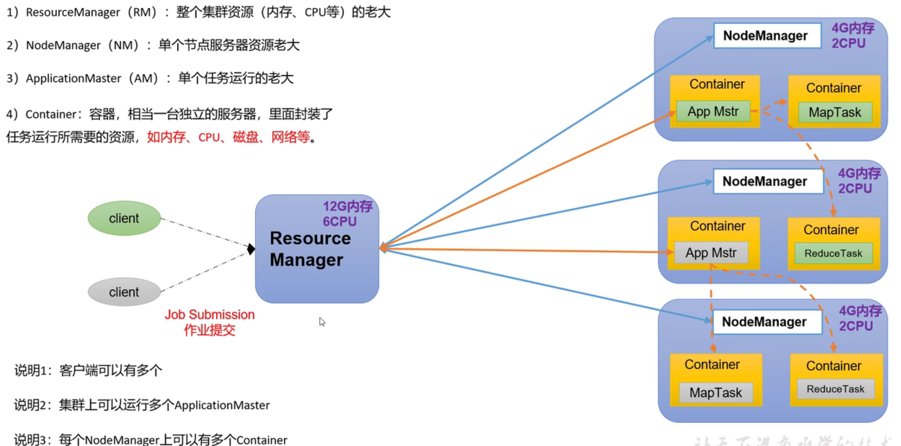
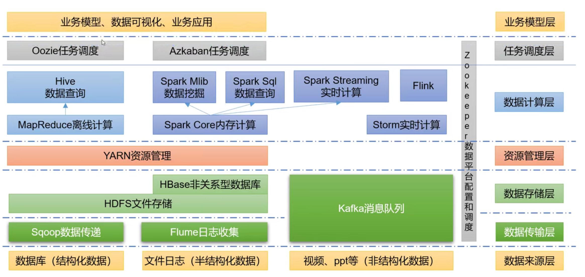
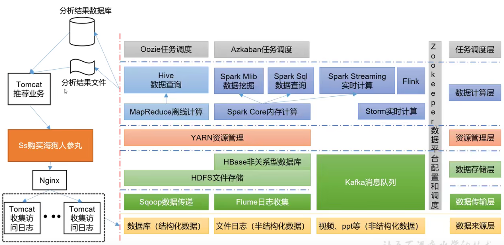

001-课程介绍

1. 课程大纲
   - 第一章 入门
     - 1.1 基本概念
     - 1.2 运行环境配置
     - 1.3 Hadoop运行模式
     - 1.4 
   - 第二章 HDFS
   - 第三章 MapReduce
   - 第四章 Yarn
   - 第五章 生产调优
   - 第六章 源码解析

002-大数据概念

1. 大数据概念：百科定义概念解释；指TB/PB/EB级别的数据；大数据技术指的是存储/管理/分析的数据；

003-大数据特点

1. 大数据特点：
   - Volume（大量）
   - Velocity（高速）：海量数据实时分析/计算
   - Variety（多样）：结构化数据（数据库）和非结构化数据（日志等等）
   - Value（低价值密度）：

004-大数据应用场景

1. 应用场景
   - 如：抖音推荐
   - 如：电商商品推荐
   - 如：零售运营分析
   -  如：仓储物流成本分析
   -  如：保险/金融/房产
   -  人工智能发展。物联网技术落地

005-大数据发展前景

1. 发展前景
   - 国家发展方向：互联网。大数据。人工智能与实体经济融合；新基建投资
   - 5G技术发展：为6G做铺垫
   - 大数据在2017开设大数据课程，落地技术成熟，人才紧缺

006-未来工作内容

1. 大数据部门业务流程
   - 产品人员需要对生产数据进行分析
   - 运营人员对市场分析
2. 大数据部门内部组织
   - 平台组：负责整个集群的搭建，监控，性能控制
     - Hadoop、Flume、Kafka、HBase、Spark等框架平台搭建
     - 集群性能监控
     - 集群性能调优
   - 数据仓库组：
     - ETL工程师：数据清洗
     - 数据分析、数据仓库建设
   - 实施组：
     - 实时指标分析：性能调优
   - 数据挖掘组：
     - 算法工程师
     - 推荐系统工程师
     - 用户画像工程师
   - 报表开发组：
     - JavaEE工程师
     - 前端工程师

007-Hadoop入门-概述

1. Hadoop入口
   - 概念
     - 是什么
     - 发展历史
     - 三大发行版本
     - 优势
     - 组成
     - 大数据生态
     - 大数据系统架构
   - 环境准备
     - 模版虚拟机准备、机器克隆
     - 安装JDK
   - Hadoop生产集群
     - 本地模式
     - 生产集群
   - 常见错误

008-Hadoop是什么

1. Hadoop是什么
   - Apache基金会分布式基础架构：Hadoop主要解决海量数据的存储和海量数据的分析计算
   - Hadoop通常是指Hadoop生态圈：ZooKeeper、Hive、Habase等等

009-Hadoop发展历史

1. 发展历史
   - 为了实现与谷歌类似的全文检索功能，在Luence基础上优化升级
   - 2001年低Lucene成为Apache子项目：对于海量数据，面对和Google同样的困难：海量数据存储和检索；
   - 学习和模仿Google解决办法：微型版 Nutch（Google大数据论文：GFS-》HDFS、MapReduce-》MR、BigTable-》HBase）
   - 2003-2004 Google公开了GFS和MapReduce细节：Doug以此为基础实现了DFS和MapReduce机制，Nutch性能飙升
   - 2005年Hadoop作为Lucene的子项目引入Apache基金会
   - 2006年3月：MapReduce和Nutch Distributed File System分别被纳入到Hadoop项目中，Hadoop项目诞生，标志着大数据时代来临

010-Hadoop发布版本

1. 发布版本
   - Apache：最原始，最基础的版本，适用于入门学习
     - 2021年以后所有版本都需要收费
   - Cloudera：内部集成了很对大数据框架，对应产品是CDH
     - 2008年这个公司在Apache基础上对Hadoop进行封装，整合管理界面，做到配置可视化，并集成大数据框架
   - Hortonworks：文档好，对应产品HDP，现已被Cloudera公司收购推出新的品牌CDP
     - 2011年这个公司也开始做同样的产品，后来强强合作

011-Hadoop优势

1. 优势
   - 高可靠性：Hadoop底层维护多个数据副本，数据不回丢失
   - 高扩展性：在集群分配任务数据，可方便扩展节点
   - 高效性：Hadoop并行工作，加快任务处理
   - 高容错性：可以将失败的任务重写分配

012-Hadoop1，2，3区别

1. 区别
   - 1.x：Common（辅助工具）、HDFS（数据存储）、MapReduce（计算+资源调度）
   - 2.x：Common（辅助工具）、HDFS（数据存储）、MapReduce（计算）、Yarn（资源调度）
   - 3.x：在组成方面和2.x没有区别，在2.0基础上做优化

013-HDFS概述

1. Hadoop Distributed File System：HDFS是一个分布式文件系统

   - NameNode（nn）：存储文件的元数据，如文件名，文件目录，文件属性，以及每个文件的块列表和块所在的DataNode

   - DataNode（dn）：在本地文件系统存储文件的块数据。以及块数据的校验和

   - Secondary NameNode（2nn）：每隔一段时间对NameNode元数据备份

     

014-yarn概述

1. Yarn：Yet Another Resource Negotiator是一种资源协调者
   - Resources Manager（RM）：所有集群的服务器中资源的管理者
   - Node Manager（NM）：单节点的资源管理者
   - Application Master（AM）：单个任务的老大，可以向RM申请资源，
   - Container：容器，相当于一台独立的服务器，任务运行在容器中；容器中任务可以夸节点执行； 每个NM上可以有多个Container，并且Container资源之和不能大于NodeManager所拥有的资源 
   - Client：作业提交任务，运行在Container容器中，每个容器中的任务都由该容器中的Application Manager管理，



015-MapReduce

1. MapReduce架构概述：将计算过程分为两个阶段：Map和Reduce
   - Map阶段：并行处理输入数据
   - Reduce阶段：对Map结果进行汇总
2. 任务案例：100T的资源存储在分布式的文件服务器中，资源管理器告诉每个服务器要找的资源，每个服务器把检索结果返回给资源管理器，完成资源的检索；

016-HDFS-YARN-MapReduce三者关系

1. 基本运行流程

   - Client发出请求：要求在集群服务器中查询服务器中的指定资源
   - ResourcesManager：收到请求，RM找一台节点，该节点Container中的APPMaster开启一个任务
   - APPMaster向RM进行资源申请，RM把有资源的节点进行分配，节点中的Container开启MapTask
   - 查询出结果汇总写入到HDFS，

   

   

017-大数据技术生态体系

1. 大数据技术生态体系

   - 数据来源层：三种数据来源
   - 数据传输层：大数据框架处理数据的框架
   - 数据存储层：数据接受完成后进行数据的存储
   - 资源管理层：资源调度
   - 数据计算层：实时计算和离线计算，并且可以数据查询
   - 任务调度层：定时执行
   - Zookeeper：整个数据平台的配置和调度
   - 业务模型层：业务模型的课可视化

   

2. 框架概述

3. 推荐系统架构图

   

018-Vmware安装

1. 基本搭建逻辑
   - 安装虚拟机软件，搭建一台模版虚拟机，然后根据模版虚拟机克隆出集群机器
   - 虚拟机基本环境：硬盘=50G、内存4G、IP=静态、主机名称
   - 安装环境：VMware+CentOS+SSH工具

019-安装CentOS

1. 安装注意事项
   - 安装硬件：处理器不能大于宿主机（处理器=2、内核数分配）、内存=2G、NAT网络模式、硬盘=50G
   - 安装软件：中文、日期和时间、软件选择（桌面安装可以切换到窗口版）、安装位置分配分区、不启用kdump、开启网络、主机名称修改、root密码=root、
     - /boot=1G + est4
     - swap=4G
     - /=45G

020-配置IP

1. 配置IP

   - VM  IP配置：子网IP=192.168.10.0、子网掩码=255.255.255.0、网关=192.168.10.2

   - 宿主机IP配置VmNet8：子网IP=192.168.10.1、子网掩码=255.255.255.0、网关=192.168.10.2、DNS=192.168.10.2、备用DNS=8.8.8.8

   - 虚拟机静态IP：su root

     - vim /etc/sysconfig/network-scripts/ifcfg-ens33
       - BOOTRPROTO=“static”
       - 文件尾部
         - IPADDR=192.168.10.100
         - GATEWAY=192.168.10.2
         - DNS1=192.168.10.2
     - 主机名称：vim /etc/hostname
       - hadoop100

   - 主机名称映射：宿主机和虚拟机修改host：linux=/etc/hosts

     ```txt
     10.211.55.100 hadoop100
     10.211.55.201 hadoop201
     10.211.55.202 hadoop202
     10.211.55.203 hadoop203
     10.211.55.204 hadoop204
     10.211.55.205 hadoop205
     10.211.55.206 hadoop206
     10.211.55.207 hadoop207
     10.211.55.208 hadoop208
     ```

021-远程访问工具

022-模版虚拟机环境配置

1. 红帽系列软件包

   ```sh
   yum install -y epel-release
   ```

2. Linux工具包

   ```sh
   yum install -y net-tools
   yum install -y vim
   ```

3. 关闭防火墙

   ```sh
   systemctl stop firewalld
   systemctl disable firewalld.service
   ```

4. 切换root免密

   ```sh
     vim /etc/sudoers
   
   
   %wheel  ALL=(ALL)       ALL
   # 在这行后面添加一行
   panda   ALL=(ALL)       NOPASSWD: ALL
   ```

5. 目录初始化：

   ```sh
   # 切换用户到panda
   su panda
   
   # 新建目录
   sudo mkdir module
   sudo mkdir software
   # 更改目录所属用户
   sudo chown panda:panda module/ software/
   ```

6. 卸载内置的JDK

   ```sh
   rpm -qa | grep i java | xargs -n1 rpm -e --nodeps
   ```

7. 重启虚拟机：

023-克隆虚拟机

1. 虚拟机克隆：hadoop201，hadoop202，hadoop203（修改主机名称和IP）

024-安装JDK

1. 目录说明：modules上软件安装目录、software上软件包保存目录

2. 解压并移动到module中

3. 配置环境变量：一切配置环境变量是/etc/profile文件中，该目录中可以读取/etc/profile.d/*.sh文件，所以自定义变量都保存到这里

   ```sh
   sudo vim /etc/profile.d/panda_env.sh
   
   export JAVA_HOME=/opt/module/jdk8
   export PATH=$PATH:$JAVA_HOME/bin
   export CLASSPATH=.:$JAVA_HOME/lib/dt.jar:$JAVA_HOME/lib/tools.jar
   ```

025-hadoop安装

1. 安装目录解压

2. 环境变量配置

   ```sh
   export HADOOP_HOME=/opt/module/hadoop3
   export PATH=$PATH:$HADOOP_HOME/bin
   export PATH=$PATH:$HADOOP_HOME/sbin
   ```

3. Hadoop软件目录

   - bin
     - hdfs
     - yarn
     - mapped
   - etc
     - hdfs-site.xml
     - mapped-site.xml
     - yarn-site.xml
     - workers
   - sbin
     - start-dfs
     - start-yarn
     - mr-jobhistory-daemond
   - share：官方提供案例

   026-Hadoop运行模式

   1. 运行模式：
      - 本地模式：指单台服务器上搭建的单机版Hadoop，但是数据存储在Linux本地
      - 伪分布式模式：是在单单服务器，数据存储在H DFS上
      - 完全分布式模式：多台主机组成的服务器集群 
   2. 单机模式演示

   027-完全分布式搭建

   1. 环境搭建步骤

      - 3台虚拟机
      - 安装JDK，配置环境变量
      - 安装Hadoop，配置环境变量
      - 配置集群
      - 单点启动
      - 配置ssh
      - 群起并测试集群

   2. 编写集群分发脚本

      - scp：实现服务器与服务器之间的数据拷贝

        ```sh
        scp -r $parent_dir/$file_name $user@$host:$parent_dir/$file
        
        # 案例
        scp -r /opt/module/jdk8 panda@hadoop202:/opt/module/jdk8
        scp -r panda@hadoop201:/opt/module/jdk8 /opt/module/jdk8
        ```

        > - -r：递归
        > - 源文件
        > - 目标服务器文件目录

      - rsync：远程同步工具，用户备份和镜像。特点是速度快，避免复制相同内容和支持符号链接的 特点，与scp比较同步只对有差异的文件做更性，cp是全量拷贝；

        ```sh
        rsync -av $parent_dir/$file_name $user@$host:$parent_dir/$file
        ```

        > -a：归档拷贝
        >
        > -v：显示复制过程

   028-自定义分发脚本

   1. 自定义分发脚本：同步文件定义在目录中：/home/panda/bin/

      ```sh
      #/bin/bash
      # 1. 判断参数个数
      if [ $# -lt 1 ]
      then 
      	echo '参数错误！'
      	exit；
      fi
      
      # 2. 遍历集群所有机器
      for host in hadoop201 hadoop202 hadoop203
      do
      	echo ======同步主机名=$host
      	# 3.遍历所有目录，挨个发送
      	for file in $@
      	do
      		# 4. 判断文件是否存在
      		if [ -e $file ]
      			then
      				# 5. 父目录 
      				pdir=$(cd -P $(dirname $file); pwd)
      				
      				# 6. 文件名称
      				fname=$(basename $file)
      				ssh $host "mkdir -p $pdir"
      				rsync -av $pdir/$fname $host:$pidr
      			else
      				echo ======$file 不存在！
      		fi
      	done
      done
      ```

   2. sudo执行需要使用命令文件的绝对路径

029-ssh免密登陆

1. 现在A服务器生成公钥和私钥，然后将公钥保存到B服务器中授权的目录中，然后通过ssh访问B服务器用私钥加密，B服务器用公钥进行解密

2. 服务器A生成公钥对

   ```sh
   ssh-keygen -t rsa
   ```

3. 将公钥拷贝到B服务器

   ```sh
   ssh-copy-id 主机名
   ```

4. 每个用户都需要配置免密登陆

030-集群配置

1. 集群配置基本规划：NameNode和ResourcesManager和SecondaryManager不要放到一个服务器中

   |      | hadoop201                  | hadoop202                            | hadoop203                          |
   | :--: | -------------------------- | ------------------------------------ | ---------------------------------- |
   | HDFS | **NodeName**<br />DataNode | DataNode                             | **SecondaryManager**<br />DataNode |
   | YARN | NodeManager                | **ResourceManager**<br />NodeManager | NodeManager                        |

2. 配置文件说明：Hadoop配置文件分两类：默认配置文件和自定义配置文件，只有用户想修改某一默认配置值时，才需要修改自定义配置文件，更改相应属性

   | 默认配置文件       | 目录                  |
   | ------------------ | --------------------- |
   | core-default.xml   |                       |
   | hdfs-default-xml   |                       |
   | yarn-default.xml   |                       |
   | mapred-default.xml |                       |
   | **自定义配置文件** | **目录：/etc/hadoop** |
   | core-site.xml      |                       |
   | Hfs-site.xml       |                       |
   | yarn-site.xml      |                       |
   | mapred-site.xml    |                       |

3. 配置集群：根据集群规划配置对应的各种节点和管理器

   - core-site.xml：NameNode

     ```xml
     <?xml version="1.0" encoding="UTF-8"?>
     <?xml-stylesheet type="text/xsl" href="configuration.xsl"?>
     <configuration>
       <!-- hadoop201: NameNode -->
       <property>
         <name>fs.defaultFS</name>
         <value>hdfs://hadoop201:8020</value>
       </property>
     
       <!-- hadoop201: 数据存储目录 -->
       <property>
         <name>hadoop.tem.dir</name>
         <value>/opt/module/hadoop3/data</value>
       </property>
     
       <!-- 配置HDFS网页登陆使用的静态用户为panda -->
       <property>
         <name>hadoop.http.staticuser.user</name>
         <value>panda</value>
       </property>
     </configuration>
     
     ```

   - hdfs配置文件：hfs-site.xml

     ```xml
     <?xml version="1.0" encoding="UTF-8"?>
     <?xml-stylesheet type="text/xsl" href="configuration.xsl"?>
     <configuration>
       <!-- NameNode web访问地址 -->
       <property>
         <name>dfs.namenode.http-address</name>
         <value>hadoop201:9870</value>
       </property>
     
       <!-- 2nn web端口访问 -->
       <property>
         <name>dfs.namenode.secondary.http-address</name>
         <value>hadoop203:9868</value>
       </property>
     </configuration>
     
     ```

   - yarn-site.xml

     ```xml
     <?xml version="1.0"?>
     <configuration>
     
       <!-- 指定MR 走shuffle -->
       <property>
         <name>yarn.nodemanager.aux-services</name>
         <value>mapreduce_shuffle</value>
       </property>
     
       <!-- 指定resourcesManger地址 -->
       <property>
         <name>yarn.resourcemanager.hostname</name>
         <value>hadoop202</value>
       </property>
     
       <!-- 环境变量继承 -->
         <property>
           <name>yarn.nodemanager.evn-whitelist</name>
           <value>JAVA_HOME,HADOOP_COMMON_HOME,HADOOP_HDFS_HOME,HADOOP_CONF_DIR,CLASSPATH_PREPEND_DISTCACHE,HADOOP_YARN_HOME,HADOOP_MAPRED_HOME</value>
         </property>
       -->
     </configuration>
     ```

   - mapred-site.xml

     ```xml
     <?xml version="1.0"?>
     <?xml-stylesheet type="text/xsl" href="configuration.xsl"?>
     <configuration>
       <!-- 指定MapRed运行在Yarn上 -->
       <property>
         <name>mapreduce.framework.name</name>
         <value>yarn</value>
       </property>
     </configuration>
     
     ```

   031-集群启动

   1. 配置workers：文件中不允许有空格和空行

   2. 并同步到其他服务器

   3. 启动集群：需要在Hadoop第一个节点格式化Name Node，格式化NameNode回产生新的集群ID，导致NameNode和DataNode集群ID不一致，集群找不到自己的数据，如果集群在运行过程中报错，需要重新格式化Name的话，一定要先停止namenode和datanode的进程，冰山删除机器所有的data和logs目录，再进行格式化

      ```sh
      # 格式化
      hdfs namenode -format
      
      # 启动hefs
      /sbin/start-dfs.sh
      
      # 配置RM节点的启动yarn
      /sbin/start-yarn.sh
      ```

   4. WEB查看HSFS：http://hadoop201:9870

   5. WEB查看YARN：http://hadoop202:8088


   032-集群崩溃处理

   033-历史服务器配置

   1. 添加历史服务配置

      ```xml
        <!-- 历史服务器地址 -->
        <property>
          <name>mapreduce.jobhistory.address</name>
          <value>hadoop201:10020</value>
        </property>
        <!-- 历史服务器WEB地址 -->
        <property>
          <name>mapreduce.jobhistory.webapp.address</name>
          <value>hadoop201:19888</value>
        </property>
      ```

   2. 启动

      ```sh
      mr-jobhistory-daemon.sh start historyserver
      ```

   034-日志聚集

   1. 配置yarn-site

      ```xml
      <!-- 开启日志聚集功能 -->
      <property>
        <name>yarn.log-aggregation-enable</name>
        <value>true</value>
      </property>
      <!-- 设置日志聚集服务地址 -->
      <property>
        <name>yarn.log.server.url</name>
        <value>http://hadoop102:19888/jobhistory/logs</value>
      </property>
      <!-- 设置日志保留7天 -->
      <property>
        <name>yarn.log-aggregation.retain-seconds</name>
        <value>604800</value>
      </property> 
      ```

   2. 分发配置

   3. 关闭：NameNode、ResourceManager、historyserver

   035-两个常用脚本

   1. 各个模块分开启动停止

      ```sh
      # HDFS
      start-dfs.sh
      stop-dfs.sj
      ```

   2. 各个服务组件逐一启动停止

      ```sh
      # 分别启动停止HDFS
      hdfs --daemon start|stop namenode/datanode/secondarynamenode
      # 启动停止yarn
      yarn --daemon start|stop resourcesmanagere/nodemanager
      ```

   3. hadoop常用脚本

      ```sh
      #!/bin/bash
      if [ $# -lt 1]
      then
      	echo "ERROR:no args"
      	exit ;
      fi
      
      case $1 in
      "start")
      	echo "=============== 启动Hadoop集群 ==============="
      	echo "==== 启动 hdfs"
      	ssh hadoop201 "/opt/module/hadoop3/sbin/start-dfs.sh"
        echo "==== 启动 yarn"
      	ssh hadoop202 "/opt/module/hadoop3/sbin/start-yarn.sh"
        echo "==== 启动 historyserver"
      	ssh hadoop201 "/opt/module/hadoop3/sbin/mr-jobhistory-daemon.sh start historyserver"
      ;;
      "stop")
      	echo "=============== 关闭Hadoop集群 ==============="
        echo "==== 关闭 historyserver"
      	ssh hadoop201 "/opt/module/hadoop3/sbin/mr-jobhistory-daemon.sh stop historyserver"
        echo "==== 关闭 yarn"
      	ssh hadoop202 "/opt/module/hadoop3/sbin/stop-yarn.sh"
      	echo "==== 关闭 hdfs"
      	ssh hadoop201 "/opt/module/hadoop3/sbin/stop-dfs.sh"
      ;;
      "status")
      	for host in hadoop201 hadoop202 hadoop203
      	do
      		echo =============== $host ===============
      		ssh $host jps
      	done
      ;;
      "*")
      	echo "ERROR:input error args"
      ;;
      esac
      ```

   036-面试题

   1. 常用端口号

      | 服务名            | Hadoop2.x端口号 | Hadoop3.x      |
      | ----------------- | --------------- | -------------- |
      | NameNodeServer    | 8020/9000       | 8020/9000/9820 |
      | NameNodeWeb       | 50070           | 9870           |
      | MapReduce任务查看 | 8088            | 8088           |
      | 历史服务器通信    | 19888           | 19888          |

   037-集群时间同步

   1. 查看所有ntpd服务状态和开机自启动状态

      ```sh
      systemctl status ntpd
      systemctl start ntpd
      systemctl is-enabled ntpd
      ```

   2. 修改ntp.conf：/etc/ntp.conf

      ```sh
      
      ```

   038-常见问题

   1. 防火墙关闭
   2. 主机名称修改
   3. ssh免密配置
   4. 用户系统统一
   5. 检查配置文件
   6. 主机名称映射配置

   # HDFS

   039-HDFS课程介绍

   1. 课程大纲
      - 第一章 HDFS概述
      - 第二章 HDFS的shell操作
      - 第三章 HDFS的API操作
      - 第四章 HDFS的读写流程
      - 第五章 NameNode和SecondaryNameNode
      - 第六章 DataNode

   040-hdfs产生背景

   1. 背景：数据量越来越大，单个操作服务器无法保存，需要分配到其他的服务器管理的磁盘中，但是又要求可以做到方便管理多台服务器种的文件（分布式文件管理系统），HDFS就是分布式文件挂历系统种的一种；
   2. HDFS定义：是一个文件系统，用于存储文件，通过目录树定位文件，并且是分布式的，可以实现多台服务器中的文件定位和管理；

   041-HDFS优缺点

   1. 优点
      - 高容错性：数据自动保存其他副本
      - 适合处理大数据：数据规模很大、文件规模很多都可以处理
      - 可以构建在廉价的机器
   2. 缺点
      - 不适合低延时数据访问
      - 无法高效的对大量小文件存储：小文件存储的寻址时间超过读取时间
      - 不支持并发写入、文件所及修改

   042-HDFS组成

   1. NameNode
      - 管理HDFS的名称空间
      - 配置副本策略
      - 挂历数据块的映射信息
      - 处理客户端读写请求
   2. DataNode
      - 存储实际数据的数据块
      - 执行数据块的读写操作
   3. Client
      - 文件切分：文件上传HDFS的时候，Client将文件切分为一个个的Block然后上传
      - 与NameNode交互获取文件的位置信息
      - 与DataNode交互读取或写入数据
      - Client提供一些命令管理HDFS
      - 可以通过命令访问HDFS
   4. SecondaryNameNode：并非NameNode的热备，当NameNode挂掉时候不能马上替换NameNode
      - 辅助NameNode，分担工作量
      - 在紧急情况下可以恢复NameNode

   043-文件块大小

   1. HDFS在物理上是分块存储，块的大小可以根据参数配置（dfs.blocksize），默认是128MB
      - 寻址时间-建议是传输时间的1%
      - 传输时间
      - 传输时间*传输速率=文件块大小
   2. 块太小会增加寻址时间
   3. 块太大会增加传输时间

044-045-shell命令

1. 基本语法：命令分三大类①上传②下载③hdfs操作指令

   ```sh
   hadoop fs <具体命令>
   hadoop dfs <具体命令>
   ```

2. -help

3. -ls

4. -cat

5. -mkdir

6. -mv

7. -cp

8. -rm

9. -rmdir

10. -chgrp

11. -chmod

12. -chown

13. -copyFromLocal

14. -copyToLocal

15. -moveFromLocal

16. -moveToLocal

17. -count

18. -put

19. -df

20. -du

21. -get

22. -setrep

23. -stat

24. 案例演示

    - 上传

    - 创建一个三国的文件，

      ```sh
      hadoop fs -mkdir /sanguo
      ```

    - 在hadoop根目录新增一个演示目录/sanguo,并进入目录新增一个shuguo.txt并添加内容蜀国

      ```sh
      cd $HADOOP_HOME
      mkdir sanguo
      cd sanguo
      echo "shuguo" >> shuguo.txt
      ```

    - 将本地文件剪切粘贴到hdfs

      ```sh
      hadoop fs -moveFromLocal ./shuguo.txt /sanguo
      ```

    - 将本地文件复制到hdfs

      ```sh
      echo "weiguo" >> weiguo.txt
      hadoop fs -copyFromLocal ./weiguo.txt /sanguo
      ```

    - 将本地文件上传到hdfs

      ```sh
      echo "wuguo" >> wuguo.txt
      hadoop fs -put ./wuguo.txt /sanguo
      ```

    - 追加一个文件追加到已存在的文件的末尾

      ```sh
      echo "liubei" >> liubei.txt
      hadoop fs -appendToFile liubei.txt /sanguo/shuguo.txt
      ```

    - 下载

    - 从hdfs拷贝到本地

      ```sh
      hadoop fs -copyToLocal /sanguo/shuguo.txt ./
      ```

    - -get

      ```sh
      hadoop fs -get /sanguo/shuguo.txt ./
      ```

    - hdfs操作

      ```sh
      # 显示目录信息
      hadoop fs -ls /sanguo
      # 显示文件内容
      hadoop fs -cat /sanguo/wuguo.txt
      # 修改文件所属 -chmod | -chown | -chgrp
      hadoop fs -chown panda:panda /sanguo/shuguo.txt
      # 创建文件路径
      hadoop fs -mkdir /jinguo
      # 从一个 目录拷贝到另一个目录
      hadoop fs -cp /sanguo/shuguo.txt /jinguo
      # 从hdfs目录移动文件
      hadoop fs -mv /sanguo/wuguo.txt /jinguo
      # 显示一个文件末尾的数据
      hadoop fs -tail /jinguo/wuguo.txt
      # 删除文件或文件夹
      hadoop fs rm /jinguo/wuguo.txt
      # 递归删除目录及内容
      hadoop fs -rm -r /jinguo
      # 统计文件大小
      hadoop fs -du -s -h /sanguo
      hadoop fs -du -h /sanguo
      ```

    - 设置HDFS中文件副本数量：这里设置的副本数量只会记录在元数据中，具体副本需要根据DateNode的数量

      ```sh
       hadoop fs -setrep 10 /sanguo/wuguo.txt
      ```

046-Haoop API环境准备

1. 宿主机添加Haoop在本地添加到环境变量

2. 创建Maven项目

   ```xml
   <dependency>
     <groupId>org.apache.hadoop</groupId>
     <artifactId>hadoop-client</artifactId>
     <version>3.1.3</version>
   </dependency>
   <dependency>
     <groupId>org.slf4j</groupId>
     <artifactId>slf4j-log4j12</artifactId>
   </dependency>
   ```

3. 日志配置文件

   ```properties
   log4j.rootLogger=INFO, stdout
   log4j.appender.stdout=org.apache.log4j.ConsoleAppender
   log4j.appender.stdout.layout=org.apache.log4j.PatternLayout
   log4j.appender.stdout.layout.ConversionPattern=%d %p [%c] - %m%n
   log4j.appender.logfile=org.apache.log4j.FileAppender
   log4j.appender.logfile.File=target/spring.log
   log4j.appender.logfile.layout=org.apache.log4j.PatternLayout
   log4j.appender.logfile.layout.ConversionPattern=%d %p [%c] - %m%n
   ```

047-新建目录

1. 新建目录

   ```java
   public class ClientHdfs {
   
       FileSystem fileSystem;
   
       @Before
       public void testBefore() throws Exception{
           URI uri = new URI("hdfs://hadoop201:8020");
           Configuration configuration = new Configuration();
           fileSystem = FileSystem.get(uri,configuration);
       }
       @After
       public void testAfter() throws Exception{
           if (null != fileSystem){
               fileSystem.close();
           }
       }
   
       @Test
       public void testCreate() throws Exception{
           boolean mkdirs = fileSystem.mkdirs(new Path("/xiyou/huaguoshan"));
           System.out.println("mkdirs = " + mkdirs);
       }
   }
   ```

048-Hadoop上传操作

1. 上传

   ```java
   @Test
   public void testPut() throws Exception{
     Path src = new Path("/Users/panda/Desktop/行业分类.xmind");
     Path dist = new Path("/xiyou/huaguoshan");
     fileSystem.copyFromLocalFile(false,false,src,dist);
   }
   ```

049-Hadoop API 参数优先级

1. 参数优先级
   - dfs-site.xml中优先级高于默认的
   - Configuration中优先级高于xlm中配置

050-Hadoop API文件下载

1. 文件下载

   ```java
   ```

051-API 文件山催促

1. 文件删除

   ```java
   ```

052-文件更新和文件移动

1. 文件更新

   ```java
   ```

2. 文件移动

   ```java
   ```

053-API文件详情查看

1. 文件详情查看

   ```java
   ```

054-文件判断

1. 文件判断

   ```java
   ```

2. 文件夹判断

   ```java
   ```

055-写数据流程

056-节点距离计算

057-机架感知

058-读数据流程

059-NN和2NN

060-FsImage镜像文件

061-Edits编辑日志

062-检查点时间设置

063-DN工作机制

064-数据完整性

065-掉线时限参数设置

066-总结

   # MapReduce

   # Yarn

   # 生产调优

   # 源码解析

   

   


