# 01-理论概念

001-课程内容

1. 课程内容
   - 数据仓库基础理论
   - Apache Hive 入门
   - Apache Hive 安装
   - Hive初体验
2. 学习目的
   - 掌握数据仓库概念、起源
   - 数据仓库主要特征
   - 数据仓库分层架构
   - Hive架构、组件、数据模型
   - Hive元数据
   - Hive安装部署方式
   - Hive客户端使用
   - Hive软件定位

002-数仓概念

1. 数仓概念
   - 数据仓库（Data Warehouse）：DW用于存储、分析、报告的数据系统；
   - 主要目的：构建面向缝隙的集成化数据环境，分析结果为企业提供决策支持
2. 数据仓库特点
   - 数仓本身不生产任何数据：其数据来源于外部系统
   - 数仓自身不需要消费任何数据：其结果开放为外部系统

003-数仓为何而来

1. 数据仓库为何而来：是为了分析数据而来，分析结果给企业提供支持；在企业中，信息的作用两个目的：

   - 操作型记录的保存：
     - 联机事务处理系统OLTP：为了满足企业正常业务开展，主要任务是执行联机事务处理，即将业务相关联的数据持久化到关系型数据库中，如MySQL、Oracle、SQLserver

   - 分析型决策的制定：通过获取到大量的相关数据,通过数据分析,然后基于数据分析作为决策支持

2. 从哪里可以做数据分析?：数据分析需要海量的数据并且需要频繁的数据读操作,所以需要构建一个统一的数据分析平台,数仓的制定形成

   - 将RDBMS中的数据通过抽取转换到数据仓库,然后通过可视化界面展示为决策层

004-数据仓库主要特征

1. 数仓体系
   - 面向主题:是一个抽象的概念,即为了某个特定的领域而针对性的数据收集
   - 集成性:一个领域的数据往往分散在多个应用系统中,并且彼此分散.独立,异构,需要集中到数仓中
   - 非易失性:是分析数据的平台,而不是创造数据的平台
   - 时变性:数据容易过期,分析多余数据,影响决策

005-OLTP、OLAP系统

1. OLTP
   - 操作型处理:称为联机事务处理,主要做数据处理,是针对具体业务在数据库联机的日常操作
   - 处理数据的核心是:数据响应时间,数据的安全性,完整性和并发支持性
   - 处理主要手段的依赖关系型数据的事务特性对数据的增删改查
2. OLAP:
   - 分析型处理,称为联系分析处理,主要是对数据分析

006-数据仓库和数据块区别

- OLTP典型应用是RDBMS，也就是数据块
- OLAP典型应用是DW,也就是数据仓库
- 所以区别主要有
  - 数仓不是大型数据库,但是数仓的数据规模大于数据库
  - 数仓不是取代数据库,而是在数据库的基础上产生的分析系统
  - 数据库是面向事务设计,数仓面向主题设计的
  - 数据库存业务数据,数仓存储一般是历史记录数据
  - 数据库为了数据完整性设计,数仓为了数据规模性设计,为了分析方便而设计

007-数据仓库和数据集市区别

- 数仓是面向真个集团组织的数据
- 数据集市面向单个部门使用的.数据集市可以看做是数仓的子集,只需要面向一个主题,数据分析更有针对性

008-数仓分层思想

1. 分层思想和标准:数仓不产生数据也不消费数据,按照数据流入流出数仓的过程进行分层,理论上分为三层操作型数据层-ODS、数据仓库层-DW、数据应用层-DA
2. ODS层:称为源数据层、数据引入层、数据暂存层、临时缓存层，将源数据或其他未经处理的原始数据保存，引入到数仓，并且记录基础数据的历史变化
3. DW层：由ODS数据加工而成，主要完成数据的加工与整合，构建可复用的分析和统计系统，又可以划分细致的层次
4. DA层：将加载后的数据展示

009-ETL、ELT

1. 数仓从各个数据源获取数据及在数仓内数据转换和流动都可以认为是ETL(抽取-Extra、转换-Transfer、装载-Load)

1. ETL：指的是数据抽取后进行转换最后加载到分析系统
2. ELT：在ELT模型中,向将数据抽取后立即加载,然后数据在数仓系统种进行转换,大数据时代的发展依赖商业智能工具,将转换后的数据之间展示;

010-案例分析-酒旅数仓

- 

# HIVE

01-10-Hive是什么

1. 是建立在Hadoop的数据仓库系统，可以将存储在hadoop文件中的结构化，半结构化数据文件映射为一张数据表，基于表提供一种类似SQL的查询称为HQL访问和分析存储在hadoop中文件数据
   - Hive核心将hql转为MapReduce程序,提交到Hadoop集群执行
2. Hive优点
   - 操作接口采用类SQL语法,提供快速开发鞥哪里
   - 避免直接写MapReduce,减少开发成本
   - 支持自定义函数
   - 基于Hadoop，擅长存储分析海量数据集
3. Hive和Hadoop关系
   - Hive作为大数据 仓库软件，具备存储数据和分析数据的能力，是借助了Hadoop实现的
   - Hive利用HDFS存储数据，利用MapReduce查询分析数据
   - Hive专注于编写HQL，Hive将hql转换MapReduce完成数据分析

01-11-模拟实现Hive的功能

1. 实现HQL功能

   - 在HTFS上有一个结构化文件

   - 查询文件中的指定数据

   - 编写MapReduce程序分析数据

   - 映射信息处理：将文件和表直接的对应关系描述记录清除，这些数据称为源数据；所以元数据主要包含

     - 表对应着那个文件
     - 表的列对应文件的哪一个字段
     - 字段直接的分隔符是什么

   - SQL语法解析编译：Hive对SQL进行语法校验，解析为MapReduce执行结果，将结果返回

   - Hive主要组件

     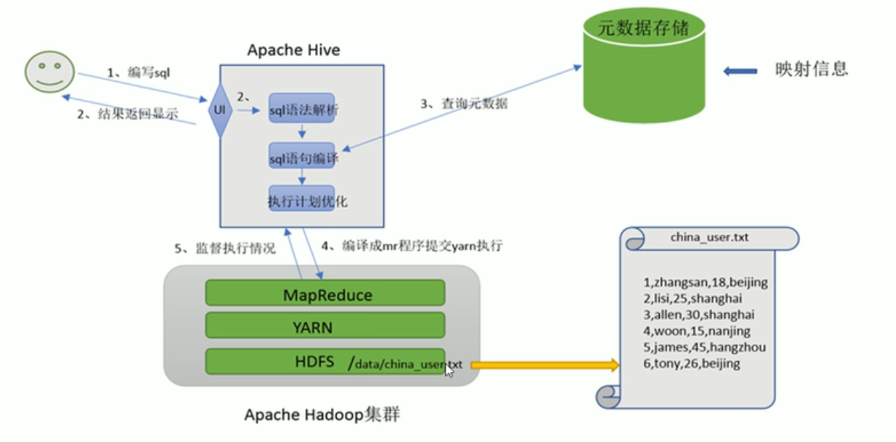

     - 存储元数据信息

     - 编译SQL解析SQL

     - 监督执行情况

       

2. 实现重点

   - Hive将数据文件映射问一张表，映射指的是什么？
   - Hive的功能职责？

01-12-HIV呃呃架构

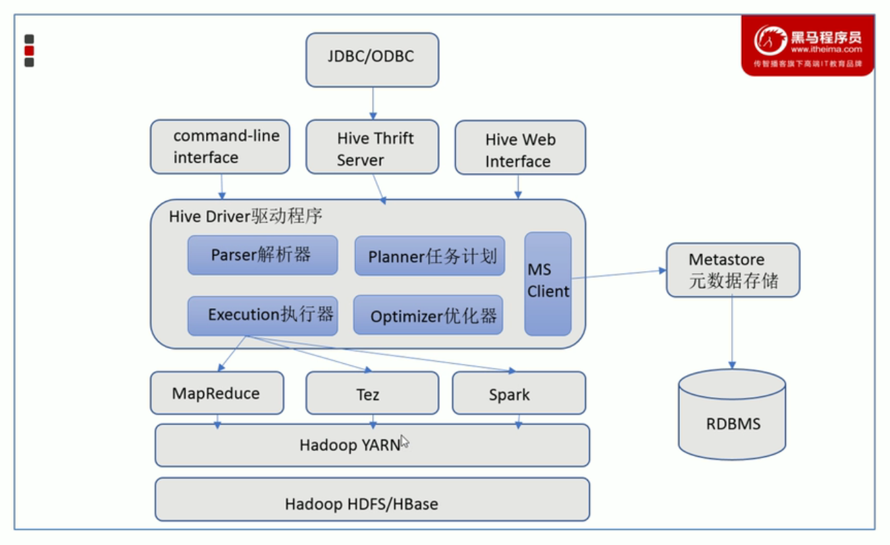

1. 用户接口：包含CLI（shell命令行）、JDBC（Thrift服务器允许外部通过网络接口访问Hive）、WebGUI

（通过浏览器访问Hive）

2. 元数据存储：主要包含表的名字、表的列表和分区及其属性、表的属性、表的数据所在目录等等
3. Driver驱动程序:语法解析、计划编译器、优化器、执行器
4. 执行引擎：Hive支持MapReduce、Tez、Spark3

01-13-数据模型

1. DataModel概念：用来描述数据\组织数据和对数据进行操作,是对现实世界数据特征的描述

   - Hive中数据模型类似RDBMS库表结构,而且还有自己特有的模型,可以在粒度级别上分为三类

     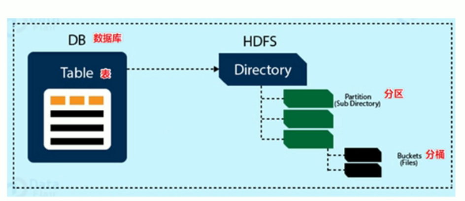

     - Table:表
     - Partition:分区
     - Bucket:分桶

2. Database数据库

   - Hive是数据仓库,结构上也区分数据库,每个数据块下有各自的表;默认的数据是default
   - hive的数据存储在HDFS上,默认只有一个跟目录,配置在hive-site.xml中的`hive.metastore.warehouse.dir`指定;默认值是/usr/hive/warehouse,因此Hive中的数据在HDFS上的存储路径文件${dir}/数据库名称.db

3. Table表:Hive中的表对应的数据存储在HFDS上,而表的元数据存储在RDBMS总

   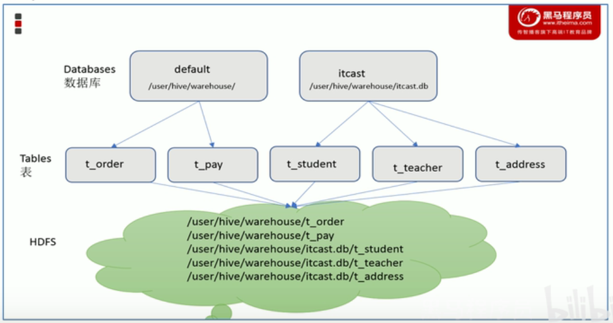

4. partition分区:是Hive的一种优化手段,分区指根据分区列的值将表划分为不同的分区,可以快速定位

   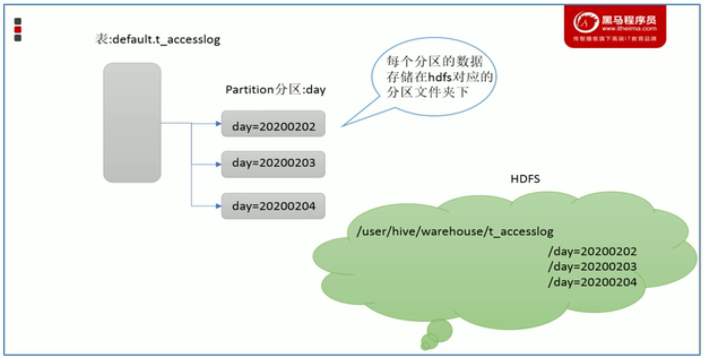

   - 分区在存储层面表现为:table表目录下以子文件夹信息存储
   - 一个文件表示一个分区:分区命名规格:分区类=分区值
   - Hive支持在分区下继续创建分区,即多重分区

5. Bucket桶:是Hive的一种优化手段,分桶指根据表中子弹的指,进过hash计算将数据划分成指定的若干小文件,分桶规则:hash函数 % 桶个数,余数相同分到同一个文件

   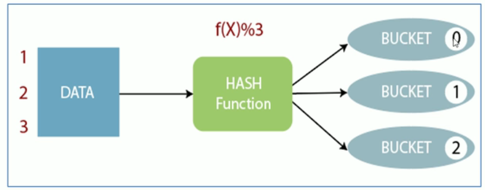

01-14-Hive和MySQL对比

- Hive只用来做数据的离线分析,MySQL承担事务业务处理

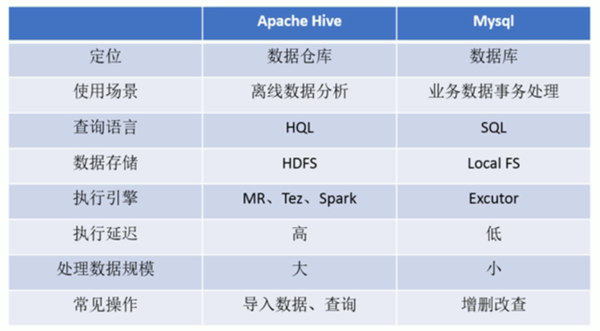

01-15-安装部署-metadata\metastore

1. 元数据:Metadata有称中介数据,为描述Hive数据库和数据表的数据:主要是描述数据数学的信息,即粗才能位置,历史数据,资源查找,文件记录等,元数据存储在关系型数据库中
2. metastore元数据服务,metastore服务作用是管理元数据,对外暴露服务地址,用户端通过服务地址连接服务

01-16-metastore三种配置方式

1. 对应Hive的三种配置方式

   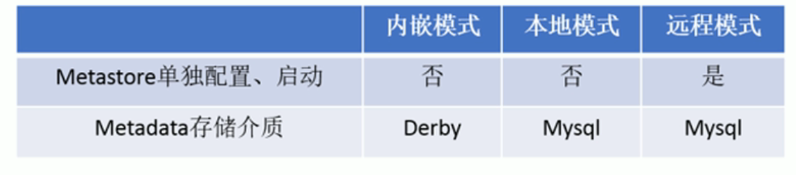

   - 内嵌模式:默认的部署方式,元数据存储在Derby数据库,并且metastore服务嵌入在Hiveserver进程中,一次只能支撑一个用户访问

   - 本地模式:修改配置将元数据存储在MySQL数据库,但是metastore服务与Hiveserver在同一个进程中,每个Hiveserver服务都内置启动了一个metastore服务,hive根据`hive.metastore.uri`判断,如果为空表示是本地模式

   - 远程模式:Metastore服务在自己单独的JVM上运行,客户端可以使用ThriftNetWorkAPI进行通信,需要配置`hive.metastore.uri`指定metastore服务的机器IP和端口,并且需要单独启动metastore服务

     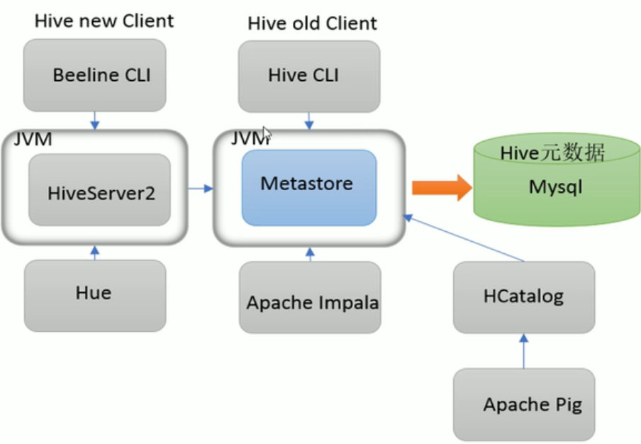

01-17-安装前准备

1. Hadoop集群启动健康可用

2. Hadoop与Hive整合:需要在Hadoop中天健相关配置,以满足Hive在Hadoop上运行,修改Hadoop中core-site.xml

   ```xml
   <property>
       <name>hadoop.proxyuser.xxx.hosts</name>
       <value>*</value>
   </property>
   <property>
       <name>hadoop.proxyuser.xxx.groups</name>
       <value>*</value>
   </property>
   ```

01-17-内嵌模式启动

1. 解压hive安装包到Linux安装目录

2. 解决Hadoop和hive直接guava的版本差异

   ```sh
   # 删除hive中guava-xxx.jar
   # 将hadoop中的jar拷贝到hive中的lib
   cp  $HADOOP_HOME/share/hadoop/common/lib/guava-*.jar ./lib/
   ```

3. 修改Hive环境变量

   ```sh
   cd hive/conf
   mv hive-env.sh.template hive.sh
   vim hive.env.sh
   
   export HADOOP_HOME=
   export HIVE_CONF_DIR=
   export HIVE_AUX_JAR_PATH=
   ```

4. 初始化metadata:derby

   ```sh
   bin/schematool --dbType derby -initSchema
   ```

5. 启动hive服务

   ```sh
   bin/hive
   ```

01-19-本地服务安装mysql

01-20-本地服务配置hive

1. 需要安装一个mysql

2. 配置Hive元数据存储到MySQL的链接

   ```xml
   <?xml version="1.0" encoding="UTF-8" standalone="no"?>
   <?xml-stylesheet type="text/xsl" href="configuration.xsl"?>
   
   <configuration>
     <!-- JDBC.url -->
     <property>
       <name>javax.jdo.option.ConnectionURL</name>
       <value>jdbc:mysql://hadoophost:3306/hive_metastore?useSSL=false</value>
     </property>
     <!-- JDBC.Driver -->
     <property>
       <name>javax.jdo.option.ConnectionDriverName</name>
       <value>com.mysql.cj.jdbc.Driver</value>
     </property>
     <!-- JDBC.usename -->
     <property>
       <name>javax.jdo.option.ConnectionUserName</name>
       <value>root</value>
     </property>
     <!-- JDBC.password -->
     <property>
       <name>javax.jdo.option.ConnectionPassword</name>
       <value>root</value>
     </property>
     <!-- Hive元数据版本验证 -->
     <property>
       <name>hive.metastore.schema.verification</name>
       <value>false</value>
     </property>
     <!-- 元数据授权 -->
     <property>
       <name>hive.metastore.event.db.notification.api.auth</name>
       <value>false</value>
     </property>
     <!-- Hive默认在HDFS的工作目录 -->
     <property>
       <name>hive.metastore.warehouse.dir</name>
       <value>/user/hive/warehouse</value>
     </property>
   </configuration>
   ```

3. 将MySQLjdbc驱动包添加到hive的lib目录中

4. 初始化元数据

   ```sh
   bin/schematool -initSchema --dbType mysql -verbos
   ```

5. 启动hive

   ```sh
   bin/hive
   ```

01-20-远程模式

1. 远程模式特点:元数据在mysql,单独的metastore服务

2. 安装mysql

3. hive安装:解决hivejar包差异问题

4. 添加mysql驱动

5. 修改hive配置文件:hive-site.xml,

   ```xml
     <!-- 远程模式部署metastore -->
     <property>
       <name>hive.metastore.uris</name>
       <value>thrift://hadoop201:9083</value>
     </property>
   ```

6. 初始化元数据

   ```sh
   bin/schematool -initSchema --dbType mysql -verbos
   ```

7. 启动hive的metastore服务

   ```sh
   # 前台启动
   hive --service metastore
   # 后台挂起
   nohup hive --service metastore &
   # 启动开启日志
   hive --service metastore --hiveconf hive.root.logger=DEBUG,console
   ```

8. 启动hive

   ```sh
   bin/hive
   ```

01-21-HiveCli客户端

1. 命令行客户端:hive经历了两代客户端工具:

   - 第一代客户端是bin/hive,主要功能一个是可以用交互或批处理模式运行Hive查询,二是利用Hive相关服务启动

   - 第二代客户端bin/beeline.是一个jdbc客户端.性能和安全性提高,在嵌入式hive可以直接执行,而在远程模式下beeline通过Thrift链接到单独的HiveServer2上,然后HiveServer2链接metastore服务访问元数据

     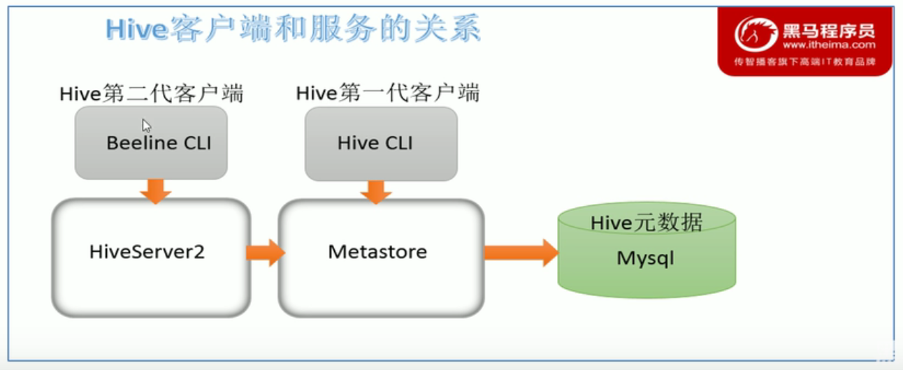

01-23-hive客户端

1. 远程模式使用hive客户端

   - 初始化元数据

   - 手动启动metastore服务

     ```sh
     hive --service metastore
     ```

   - 启动hive和客户端

     ```sh
     hive
     ```

01-24-beeline客户端

1. 初始化元数据

   ```sj
   schematool -dbType mysql -initSchema
   ```

   

2. 启动metastore服务

   ```sh
   url: jdbc:mysql://localhost:3306/test?useUnicode=true&amp;characterEncoding=utf8&amp;autoReconnect=true&amp;failOverReadOnly=false&amp;serverTimezone=Asia/Shanghai&amp;useSSL=false&amp;allowPublicKeyRetrieval=true
   hive --service metastore
   nohup hive --service metastore 2>&1 >> /opt/module/hive3/log/metastore.log &
   
   739949
   ```

3. 启动hiveserver2服务

   ```sh
   hive --service hiveserver2 
   nohup hive --service hiveserver2 2>&1 >> /opt/module/hive3/log/hiveserver2.log &
   
   746613
   ```

4. beeline连接hiveserver2

   ```sh
   ! connect jdbc:hive2://hadoop201:10000
   ```

5. 用户名密码:用户:root 免密可以不输入直接回车

01-25-初体验1

1. 创建数据库

   ```sql
   create database db_test01;
   ```

2. 使用新建的数据库

   ```sql
   use db_test01;
   ```

3. 创建表

   ```sql
   create table tb_test01(id string);
   ```

4. 插入数据

   ```sql
   insert into tb_test01 values(1001);
   ```

5. 查询SQL

   ```sql
   select * from tb_test01;
   ```

6. 结论

   - HQL和标准SQL类似
   - Hive底层通过MapReduce执行数据插入动作,执行效率慢
   - Hive有自己特有的数据插入表达式,结构化文件映射为表

01-26-初体验2

1. 将结构化数据映射问表

2. 新建结构化文件

   ```tex
   1,张三,23
   2,李四,16
   3,王五,16
   ```

3. 根据结构化创建表

   ```sql
   create table tb_test02(id int,name varchar(255),age int);
   ```

4. 将数据文件上传到hdfs的表目录下,查询结果是null,是因为建表语句没有指定文件分隔符

5. 重新建表

   ```sql
   create table tb_test03(id int,name varchar(255),age int) ROW FORMAT DELIMITED FIELDS TERMINATED BY ','
   ```

6. 重新将数据文件添加到表目录中,查询数据会得到签字数据

7. 测试建表语句和文件内容不匹配:得到数据类型字符串不能转换为int

   ```sql
   create table tb_test04(id int,name int,age varchar(255)) ROW FORMAT DELIMITED FIELDS TERMINATED BY ',';
   ```

8. 结论

   - 建表时候字段顺序字段类型要和数据文件中保持一致

01-27-初体验3

1. 使用Hive进行小数据分析:查看小数据分析效率

   ```sql
   select count(id) from tb_test01 where  age > 20;
   ```

2. Hive底层 通过MR执行引擎处理数据,所以执行时间非常长

02-01-DDL课程内容和大纲

1. 课程内容
   - 数据定义语言DDL概述
   - DDL建表基础语法
   - DDL建表高级语法
   - DDL其他语法
   - show语法
2. 学习目的
   - 重点掌握建表语句
   - 掌握Hive数据类型,读写机制,数据存储路径
   - 掌握HIVE内部表,分区,分桶表
   - 掌握HIVE DDL语法

02-02-厂家HIVE开发方式

1. 可视化工具Idea连接Hive

02-03-DDL概述

1. DDL作用:数据定义语言(Data Definition Language).对数据块内部的对象结构进行穿甲,删除,修改等操作.数据块对象包括:database,table,view,index.
   - DDL核心关键字:CREATE,DROP,ALRER
2. Hive中DDL的使用:HQL与SQL语法基本相同,其中create语法是DDL的重中之重

02-04-建表语法

1. 完整建表语法树

   ```sql
   
   CREATE [TEMPORARY] [EXTERNAL] TABLE [IF NOT EXISTS] [db_name.]table_name    -- (Note: TEMPORARY available in Hive 0.14.0 and later)
     [(col_name data_type [column_constraint_specification] [COMMENT col_comment], ... [constraint_specification])]
     [COMMENT table_comment]
     [PARTITIONED BY (col_name data_type [COMMENT col_comment], ...)]
     [CLUSTERED BY (col_name, col_name, ...) [SORTED BY (col_name [ASC|DESC], ...)] INTO num_buckets BUCKETS]
     [SKEWED BY (col_name, col_name, ...)                  -- (Note: Available in Hive 0.10.0 and later)]
        ON ((col_value, col_value, ...), (col_value, col_value, ...), ...)
        [STORED AS DIRECTORIES]
     [
      [ROW FORMAT row_format] 
      [STORED AS file_format]
        | STORED BY 'storage.handler.class.name' [WITH SERDEPROPERTIES (...)]  -- (Note: Available in Hive 0.6.0 and later)
     ]
     [LOCATION hdfs_path]
     [TBLPROPERTIES (property_name=property_value, ...)]   -- (Note: Available in Hive 0.6.0 and later)
     [AS select_statement];   -- (Note: Available in Hive 0.5.0 and later; not supported for external tables)
    
   CREATE [TEMPORARY] [EXTERNAL] TABLE [IF NOT EXISTS] [db_name.]table_name
     LIKE existing_table_or_view_name
     [LOCATION hdfs_path];
    
   data_type
     : primitive_type
     | array_type
     | map_type
     | struct_type
     | union_type  -- (Note: Available in Hive 0.7.0 and later)
    
   primitive_type
     : TINYINT
     | SMALLINT
     | INT
     | BIGINT
     | BOOLEAN
     | FLOAT
     | DOUBLE
     | DOUBLE PRECISION -- (Note: Available in Hive 2.2.0 and later)
     | STRING
     | BINARY      -- (Note: Available in Hive 0.8.0 and later)
     | TIMESTAMP   -- (Note: Available in Hive 0.8.0 and later)
     | DECIMAL     -- (Note: Available in Hive 0.11.0 and later)
     | DECIMAL(precision, scale)  -- (Note: Available in Hive 0.13.0 and later)
     | DATE        -- (Note: Available in Hive 0.12.0 and later)
     | VARCHAR     -- (Note: Available in Hive 0.12.0 and later)
     | CHAR        -- (Note: Available in Hive 0.13.0 and later)
    
   array_type
     : ARRAY < data_type >
    
   map_type
     : MAP < primitive_type, data_type >
    
   struct_type
     : STRUCT < col_name : data_type [COMMENT col_comment], ...>
    
   union_type
      : UNIONTYPE < data_type, data_type, ... >  -- (Note: Available in Hive 0.7.0 and later)
    
   row_format
     : DELIMITED [FIELDS TERMINATED BY char [ESCAPED BY char]] [COLLECTION ITEMS TERMINATED BY char]
           [MAP KEYS TERMINATED BY char] [LINES TERMINATED BY char]
           [NULL DEFINED AS char]   -- (Note: Available in Hive 0.13 and later)
     | SERDE serde_name [WITH SERDEPROPERTIES (property_name=property_value, property_name=property_value, ...)]
    
   file_format:
     : SEQUENCEFILE
     | TEXTFILE    -- (Default, depending on hive.default.fileformat configuration)
     | RCFILE      -- (Note: Available in Hive 0.6.0 and later)
     | ORC         -- (Note: Available in Hive 0.11.0 and later)
     | PARQUET     -- (Note: Available in Hive 0.13.0 and later)
     | AVRO        -- (Note: Available in Hive 0.14.0 and later)
     | JSONFILE    -- (Note: Available in Hive 4.0.0 and later)
     | INPUTFORMAT input_format_classname OUTPUTFORMAT output_format_classname
    
   column_constraint_specification:
     : [ PRIMARY KEY|UNIQUE|NOT NULL|DEFAULT [default_value]|CHECK  [check_expression] ENABLE|DISABLE NOVALIDATE RELY/NORELY ]
    
   default_value:
     : [ LITERAL|CURRENT_USER()|CURRENT_DATE()|CURRENT_TIMESTAMP()|NULL ] 
    
   constraint_specification:
     : [, PRIMARY KEY (col_name, ...) DISABLE NOVALIDATE RELY/NORELY ]
       [, PRIMARY KEY (col_name, ...) DISABLE NOVALIDATE RELY/NORELY ]
       [, CONSTRAINT constraint_name FOREIGN KEY (col_name, ...) REFERENCES table_name(col_name, ...) DISABLE NOVALIDATE 
       [, CONSTRAINT constraint_name UNIQUE (col_name, ...) DISABLE NOVALIDATE RELY/NORELY ]
       [, CONSTRAINT constraint_name CHECK [check_expression] ENABLE|DISABLE NOVALIDATE RELY/NORELY ]
   ```

2. 建表注释

   ```sql
   -- (Note: TEMPORARY available in Hive 0.14.0 and later)
   CREATE [TEMPORARY] [EXTERNAL] TABLE [IF NOT EXISTS] [db_name.]table_name    
      --定义列， 比如 id  Int comment '索引', name string comment '名字'
     [(col_name data_type [COMMENT col_comment], ... [constraint_specification])]   
     [COMMENT table_comment]  -- comment 表示表的注释    
     --分区，括号内的定义类似列的定义，分区可以根据默写字段比如日期，城市，进行分区，可以加快某些条件下的查询
     --部分列的集合，根据分区列的进行粗粒度的划分，一个分区，代表着一个目录
     [PARTITIONED BY (col_name data_type [COMMENT col_comment], ...)]  
     --分桶，在分区的基础上，可以进行分桶，分桶的原理是，根据某几列进行计算hash 值，
     --然后hash 值对分成的桶的个数取余操作，决定放在哪个桶里面
     --在数据量足够大的情况下，分桶比分区，更高的查询效率 
     --分桶，还可以使抽样更加高效
     [CLUSTERED BY (col_name, col_name, ...) 
               [SORTED BY (col_name [ASC|DESC], ...)] INTO num_buckets BUCKETS]  ---- 分桶
     ---大致上Skewed，对数据倾斜处理有很大帮助，没用过 
     [SKEWED BY (col_name, col_name, ...)                  -- (Note: Available in Hive 0.10.0 and later)]
        ON ((col_value, col_value, ...), (col_value, col_value, ...), ...)
        [STORED AS DIRECTORIES]
     [
      [ROW FORMAT row_format] 
      [STORED AS file_format]
        | STORED BY 'storage.handler.class.name' [WITH SERDEPROPERTIES (...)]  -- (Note: Available in Hive 0.6.0 and later)
     ]   -- 表示文件的存储格式， 其中store by 指的是自定义文件格式，用得不多，笔者没有用过。
     [LOCATION hdfs_path]
     [TBLPROPERTIES (property_name=property_value, ...)]    --  表示表格的附加属性和表述。 
                                                            -- (Note: Available in Hive 0.6.0 and later)
     [AS select_statement];  
      -- 建立表格的时候同时从其他表格select 数据进行填充表格。
      -- (Note: as  select_statement Available in Hive 0.5.0 and later; not supported for external tables)
   
   ```

02-05-Hive中数据类型

1. 注意事项

   - 数据类型大写不敏感
   - 复杂数据类型使用通常需要和分隔符指定的语法配合使用
   - Hive会尝试隐式数据类型转换

2. 数据累整体分内两类:原生数据类型和复杂数据类型

   - 数字类

   | 类型     | 长度  | 备注                     |
   | :------- | :---- | :----------------------- |
   | TINYINT  | 1字节 | 有符号整型               |
   | SMALLINT | 2字节 | 有符号整型               |
   | INT      | 4字节 | 有符号整型               |
   | BIGINT   | 8字节 | 有符号整型               |
   | FLOAT    | 4字节 | 有符号单精度浮点数       |
   | DOUBLE   | 8字节 | 有符号双精度浮点数       |
   | DECIMAL  | --    | 可带小数的精确数字字符串 |

   - 日期累

   |           |      |                                              |
   | :-------- | :--- | :------------------------------------------- |
   | 类型      | 长度 | 备注                                         |
   | TIMESTAMP | --   | 时间戳，内容格式：yyyy-mm-dd hh:mm:ss[.f...] |
   | DATE      | --   | 日期，内容格式：YYYY­MM­DD                   |
   | INTERVAL  | --   |                                              |

   - 字符串

   | 类型    | 长度                | 备注           |
   | :------ | :------------------ | :------------- |
   | STRING  | --                  | 字符串         |
   | VARCHAR | 字符数范围1 - 65535 | 长度不定字符串 |
   | CHAR    | 最大的字符数：255   | 长度固定字符串 |

   - Misc累

   | 类型    | 长度 | 备注                |
   | :------ | :--- | :------------------ |
   | BOOLEAN | --   | 布尔类型 TRUE/FALSE |
   | BINARY  | --   | 字节序列            |

   - 复杂数据类型

   | 类型      | 长度 | 备注                                                         |
   | :-------- | :--- | :----------------------------------------------------------- |
   | ARRAY     | --   | 包含同类型元素的数组，索引从0开始 ARRAY<data_type>           |
   | MAP       | --   | 字典 MAP<primitive_type, data_type>                          |
   | STRUCT    | --   | 结构体 STRUCT<col_name : data_type [COMMENT col_comment], ...> |
   | UNIONTYPE | --   | 联合体 UNIONTYPE<data_type, data_type, ...>                  |

3. 隐式类型转换

   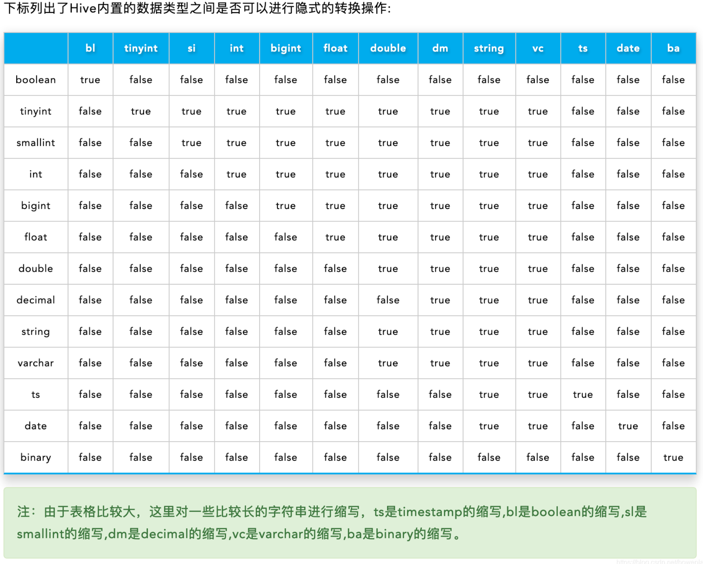

4. hive显示转换函数

   - cast(值 as 类型): 转换失败返回null

02-05-Serde是什么

1. SerDerby是:Serializer,Deserializer用于序列号和反序列化

2. Hive使用SerDe读取和写入表的行对象,key部分在读取时候会被忽略,而在写入时候key是常数

3. Read

   ```tex
   HDFS File -> InputFileFormat -> <key:value> -> Deserializer --> RowObject
   ```

4. Wirte

   ```tex
   RowObject -> Serializer -> <key:value> -> OutputFileFormat -> HDFS File
   ```

02-06-row format语法

1. FOW FORMAT代表读写文件,序列号相关的语法

   - 使用哪个SerDe类进行序列化
   - 如何指定分隔符

2. 基本格式

   ```sql
   row_format
     : DELIMITED [FIELDS TERMINATED BY char [ESCAPED BY char]] [COLLECTION ITEMS TERMINATED BY char]
           [MAP KEYS TERMINATED BY char] [LINES TERMINATED BY char]
           [NULL DEFINED AS char]   -- (Note: Available in Hive 0.13 and later)
     | SERDE serde_name [WITH SERDEPROPERTIES (property_name=property_value, property_name=property_value, ...)]
   ```

   - DELIMITED:表示使用默认的SerDe来处理数据
     - [FIELDS TERMINATED BY char [ESCAPED BY char]] - 字段之间的分隔符
     - [COLLECTION ITEMS TERMINATED BY char] - 集合原生之间的分隔符
     - [MAP KEYS TERMINATED BY char] - Maori映射VK之间的分隔符
     - [LINES TERMINATED BY char] - 行数据之间的分隔符
     - [NULL DEFINED AS char] - null值代表的字符
   - SERDE表示使用自定义的Serde类处理数据

02-07-默认分隔符

1. DDL中format语法是可选,有默认的分隔符
   - \n    每行一条记录 
   - ^A    分隔列（八进制 \001） 
   - ^B    分隔ARRAY或者STRUCT中的元素，或者MAP中多个键值对之间分隔（八进制 \002） 
   - ^C    分隔MAP中键值对的“键”和“值”（八进制 \003）

02-08-默认存储路径

1. Hive表默认存储路径由$HIVE _HOME/conf/hive-site.xml中配置项hive.metastore.warehouse.dir属性指定,默认值是/user/hive/warehouse
2. 建表时候通过location语法修改存储在HDFS上的存储路径,
   - LOCATION 'HDFS中的路径'
   - 对于已经生成号的数据文件,使用location指定文件路径

02-09-建表语法练习

1. 源文件

   ```tex
   
   ```

2. 数据类型

   ```sql
   
   ```

3. 分隔符指定

   ```sql
   
   ```

4. 默认分隔符

   ```sql
   
   ```

5. 指定数据存储路径

   ```sql
   ```

02-10-建表语法练习

1. 复杂数据类型的使用: map类型数据映射

   ```SQL
   map<string,int>
   ```

02-11-建表语法练习

1. 默认分隔符的使用

02-12-建表语法练习

1. 指定数据表文件存储路径

02-13-内部表\外部表

1. EXTERNAL

2. 获取表的元数据描述信息

   ```sql
   describe formatted 表名称;
   ```

3. 内部表:称为被Hive拥有和管理的tuiguan托管表,默认情况下创建的表就是内部表,hive拥有该表的结构和文件,也就是指Hive管理管理表的生命周期,当删除内部表时候,也会删除数据以及表的元数据

4. 外部表:部署Hive所管理的,Hive只管理表的元数据的生命周期,在创建表需要使用EXTERNAL关键字. 在Hive外部仍然可以访问实际数据,在实际应用中,外部表搭配location语法指定数据的路径,可以让数据更安全;

5. 内外表差异

   - Hive都会管理表的元数据信息
   - 删除内部表会删除表的元数据,而且也会删除HDFS中保存的数据文件
   - 删除外部表只会删除表的元数据

02-14-内部表和外部表的location

1. 外部表不指定location会保存在默认路径

02-15-分区表

1. 分区表产生背景:数据量太大,查询需要加载一个完整文件,消耗时间,全表扫描
2. 当Hive表对应的数据量大,文件个数多时,为了避免查询时全表扫描数据,Hive支持根据指定的字段对表进行分区:如根据日期,种类等具有标志意义的字段(把一年的数据根据月份划分为12分区)

02-16-分区表建表

1. 建表语法

   ```sql
   [PARTITIONED BY (col_name data_type [COMMENT col_comment], ...)]
   ```

   - 指定分区表的字段,字段的数据类型:分区字段也是表的一个单独的字段
   - 分区字段不能是表中已经存在的字段,因为分区字段最终也会以虚拟字段的形式显示在表结构上

02-17-加载数据到分区表

1. 分区表数据加载:静态分区-所谓静态分区指的是分区的属性值是由用户在加载数据时候手动指定的

   ```sql
   load data [local] inpath '文件路径' into table 表名 partition(分区字段='分区值');
   ```

   - local参数用户指定待加载的数据位于本地文件系统还是HDFS文件系统
   - 分区表文件系统的文件名称:分区字段=分区值

2. 分区表本质

   - 分布的概念提供了一种将Hive表数据分离为多个文件的方法
   - 不同的分区对应的不同的文件夹,统一分区的数据存储在同一个文件夹下
   - 查询过来的时候只需要根据分区值好到指定的文件夹,扫描本分区下的文件,避免全表扫描

02-18-多重分区表

1. 多重分区表:通过建表语句支持多个分区字段
   - 多重分区下,分区直接是一种递进关系,可以理解为在前一个分区的基础上继续分区
   - 从HFDS角度看就是在文件夹下继续划分子文件夹,
   - 根据分区字段的顺序分区
2. load多重分区文件到分区表

02-19-动态加载分区表

1. 动态分区指的是分区字段值是基于查询结果自动推断出来的,启用hive动态分区,需要在Hive回话中设置两个参数

   ```SQL
   - 是否开启动态分区功能
   set hive.exec.dynamic.partition=true;
   -- 指定分区模式:非严格模式与严格模式-表示至少有个分区是静态分区
   set hive.exec.dynamic.partition.mode=nonstrict;
   ```

2. 核心语法:元数据已存在

   ```sql
   insert into table 表名 partition(分区字段)
   select *,分区字段 form 表名
   ```

02-20-分区表注意事项

1. 分区表部署建表必须语法规则,是一种优化手段
2. 分布字段不能是表中已有的字段
3. 分区字段是虚拟字段,数据并不存储在地城的文件中
4. 分区字段值的确定来自用户价值数据手动指定或者根据查询结果自动推断
5. Hive支持多重分区

02-21-分桶表

1. 
