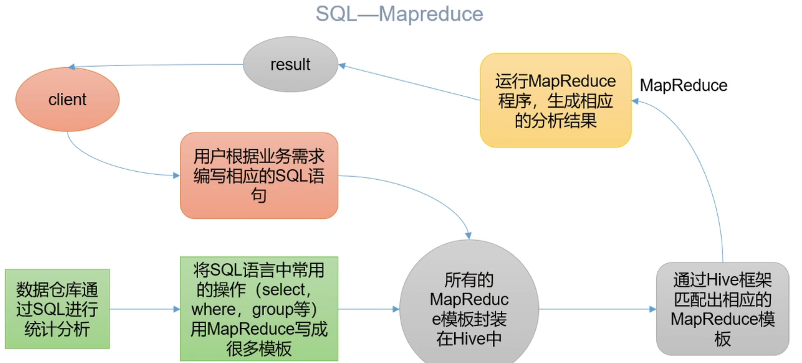
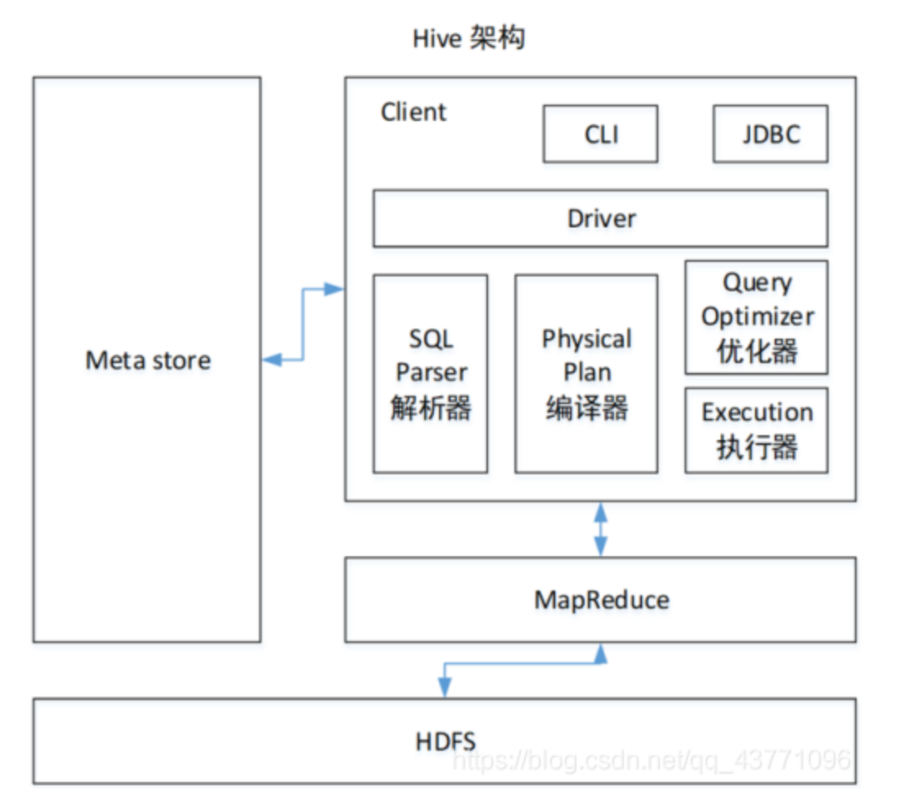

# 前言

001-课程介绍

1. 课程大纲
   - 第一张 Hive基本概念
   - 第二章 Hive安装
   - 第三章 Hive数据类型
   - 第四章 DDL数据定义
   - 第五章 DML数据操作
   - 第六章 查询
   - 第七章 分区表和分桶表
   - 第八章 函数
   - 第九章 压缩和函数
   - 第十章 企业级调优
   - 第十一章 Hive实战

002-概念介绍 ★

1. 什么是hive

   - 由Faceboot开源用户解决海量结构化日志的数据统计工具
   - 是基于Hadoop的一个数据仓库工具,可以将结构化数据文件映射为一张表,并提供类SQL查询功能

2. Hive的本质:将HQL转为MapReduce程序

   

   - hive处理的数据存储在HDFS
   - HIVE分析数据底层实现是MapReduce
   - 执行程序运行在Yarn上

003-Hive优缺点

1. 优点
   - 操作接口采用类SQL语法，提供快速开发的能力（简单、容易上手）。
   - 避免了去写MapReduce，减少开发人员的学习成本。
   - Hive的执行延迟比较高，因此Hive常用于数据分析，对实时性要求不高的场合
   - Hive优势在于处理大数据，对于处理小数据没有优势，因为Hive的执行延迟比较高。
   - Hive支持用户自定义函数，用户可以根据自己的需求来实现自己的函数。
2. 缺点
   - Hive的HQL表达能力有限：①迭代式算法无法表达，表达能力有限（复杂的逻辑算法不好封装）②数据挖掘方面不擅长，由于MapReduce数据处理流程的限制（比较慢，因为底层的缺点也都还在），效率更高的算法却无法实现。
   - Hive的效率比较低：①Hive自动生成的MapReduce作业，通常情况下不够智能化（机器翻译比较死板，可能不是最优解，但是一定可以实现）②Hive调优比较困难，粒度较粗（只能在框架的基础上优化，不能深入底层MR程序优化）

004-Hive架构原理

1. 架构原理：Hive都是用别人来存东西，自己一点都不存，只负责翻译HQL成MR程序

   - Client是hive自己的东西

     - 写代码通过访问JDBC通过Driver解析SQL，编译为MR任务，优化器和执行器执行MR
     - CLI（command-line interface）、JDBC/ODBC(jdbc访问hive)、WEBUI（浏览器访问hive）

   - Driver

     - 解析器（SQL Parser）：将SQL字符串转换成抽象语法树AST，这一步一般都用第三方工具库完成，比如antlr；对AST进行语法分析，比如表是否存在、字段是否存在、SQL语义是否有误。
     - 编译器（Physical Plan）：将AST编译生成逻辑执行计划。
     - 优化器（Query Optimizer）：对逻辑执行计划进行优化。
     - 执行器（Execution）：把逻辑执行计划转换成可以运行的物理计划。

   - 用MR执行任务

   - 用HDFS存储数据

   - MetaStore元数据管理：用于记录Hive的表和HDFS的映射关系,默认使用derby数据块，需要切换使用MySQL

     - HDFS数据文件没有被映射成数据库的表结构，文件中没有这些数据的描述性语句（元数据），这个得自己定义。

       元数据包括：表所属数据库（默认是default）、表的拥有者、表名及表的注释、字段及字段的注释、列/分区字段、表的类型（是否是外部表）、表数据所在目录等。而表里面具体的内容则在HDFS里，很多框架比如Atlas就是监控元数据库matestore中的表信息来实现元数据管理，后面有时间会出一篇如何利用元数据库制作企业数仓数据字典以及常用SQL查询语句的文章；

       元数据默认存储在自带的derby数据库（小巧但是很多缺点，比如不支持并发连接，可以理解为轻量级的MySQL数据库）中，一般都采用MySQL存储Metastore（即换成用MySQL来存元数据）。

   

005-Hive与数据块比较

1. Hive不是数据库！他只是框架！！只是用法比较像，因为95%以上SQL语句都封装了MR程序，其实没什么可比性，只是语句很像。

   由于 Hive 采用了类似SQL 的查询语言 HQL(Hive Query Language)，因此很容易将 Hive 理解为数据库。其实从结构上来看，Hive 和数据库除了拥有类似的查询语言，再无类似之处。本文将从多个方面来阐述 Hive 和数据库的差异。数据库可以用在 Online 的应用中，但是Hive 是为数据仓库而设计的，清楚这一点，有助于从应用角度理解 Hive 的特性。

   - 查询语言：由于SQL被广泛的应用在数据仓库中，因此，专门针对Hive的特性设计了类SQL的查询语言HQL。熟悉SQL开发的开发者可以很方便的使用Hive进行开发。
   - 数据更新：由于Hive是针对数据仓库应用设计的，而数据仓库的内容是读多写少的。因此，Hive中不建议对历史数据的改写，所有的数据都是在加载的时候确定好的。而数据库中的数据通常是需要经常进行修改的，因此可以使用 INSERT INTO … VALUES 添加数据，使用 UPDATE … SET修改数据，虽然HQL也可以但是这样会慢，原理是先下载修改后上传。
   - 执行延迟：Hive 在查询数据的时候，由于没有索引，需要扫描整个表（如果没有分区分桶，则都是暴力扫描，复杂度都是ALL），因此延迟较高。另外一个导致 Hive 执行延迟高的因素是 MapReduce框架。由于MapReduce 本身具有较高的延迟，因此在利用MapReduce 执行Hive查询时，也会有较高的延迟。相对的，数据库的执行延迟较低。当然，这个低是有条件的，即数据规模较小，当数据规模大到超过数据库的处理能力的时候，Hive的并行计算显然能体现出优势。
   - 数据规模：由于Hive建立在集群上并可以利用MapReduce进行并行计算，因此可以支持很大规模的数据；对应的，数据库可以支持的数据规模较小，能用MySQL算的就不要用Hive了。

006-hive安装

1. 下载hive：http://hive.apache.org/

2. 下载MySQL驱动

3. 上传到/opt/software

4. 解压到module中

5. 配置环境变量

   ```sh
   export HIVE_HOME=
   export PATH=$PATH:$HIVE_HOME/bin
   ```

6. 初始化源数据库 

   ```sh
   bin/schematool -dbType derby -initSchema
   ```

7. 启动使用Hive

   - 启动hive

     ```sh
     /bin/hive
     ```

007-简单使用

1. 基本操作

   ```sh
   show databases;
   create table test01(id string);
   show tables;
   insert into test01(id) values ('1001');
   ```

2. 查看dfs新增的数据

3. 使用derby如果启动两个hive客户端会报错

008-MySQL的安装

1. 拷贝MySQL的JDBC驱动到hive的lib目录中

   ```sh
   
   ```

2. 修改配置文件: hive-site.xml

   ```xml
   <?xml version="1.0" encoding="UTF-8" standalone="no"?>
   <?xml-stylesheet type="text/xsl" href="configuration.xsl"?>
   
   <configuration>
     <!-- JDBC.url -->
     <property>
       <name>javax.jdo.option.ConnectionURL</name>
       <value>jdbc:mysql://hadoophost:3306/hive_metastore?useSSL=false</value>
     </property>
     <!-- JDBC.Driver -->
     <property>
       <name>javax.jdo.option.ConnectionDriverName</name>
       <value>com.mysql.cj.jdbc.Driver</value>
     </property>
     <!-- JDBC.usename -->
     <property>
       <name>javax.jdo.option.ConnectionUserName</name>
       <value>root</value>
     </property>
     <!-- JDBC.password -->
     <property>
       <name>javax.jdo.option.ConnectionPassword</name>
       <value>root</value>
     </property>
     <!-- Hive元数据版本验证 -->
     <property>
       <name>hive.metastore.schema.verification</name>
       <value>false</value>
     </property>
     <!-- 元数据授权 -->
     <property>
       <name>hive.metastore.event.db.notification.api.auth</name>
       <value>false</value>
     </property>
     <!-- Hive默认在HDFS的工作目录 -->
     <property>
       <name>hive.metastore.warehouse.dir</name>
       <value>/user/hive/warehouse</value>
     </property>
   </configuration>
   
   ```

3. 查看系统中的

   ```sh
   rpm -qa | grep mariadb
   rpm -e --nodeps xxx
   ```

4. rpm安装MySQL

   ```sh
   yum install -y libaio
   sudo rpm -ivh *.rpm
   ```

5. 删除/etc/my.cnf文件中datadir指向目录下的所有内容

6. 初始化数据块

   ```sql
   sudo mysqld --initialize --user=mysql
   ```

7. 查看临时生成的root用户密码

   ```sh
   sodu cat /var/log/mysqld.log
   ```

8. 启动mysql服务

   ```sh
   sudo systemctl start mysql
   ```

9. 登录mysql数据块

   ```sh
   mysql -uroot -p
   ```

10. 修改密码

    ```sql
    set password=password('root');
    ```

11. 允许任意IP

    ```sql
     update mysql.user set host = '%' where user='root';
     flush privileges;
    ```

009-Hive配置元数据mysql

1. mysql创建配置文件中数据库

2. hive初始化mysql元数据库

   ```sh
   schematool -initSchema -dbType mysql -verbose
   ```

3. 启动hive

4. 

5. 基本使用hive

   ```sql
   ```

010-使用元数据服务方式访问hive

1. 在hive-site.xml中添加配置信息,配置服务后就需要先开启元数据服务,才能使用hive连接

   ```xml
   <property>
     <name>hive.metastore.uris</name>
     <value>thrift://hadoop201:9083</value>
   </property>
   ```

2. 启动metastore:前台命令

   ```sh
   hive --service metastore
   ```

011-使用jdbc的方式访问hive

1. 在hive-site.xml中添加配置信息

   ```xml
   <!-- 指定hiveserver2的host -->
   <property>
     <name>hive.server2.thrift.bind.host</name>
     <value>hadoop201</value>
   </property>
   <!-- 指定hiveserver2的端口 -->
   <property>
     <name>hive.server2.thrift.bind.port</name>
     <value>10000</value>
   </property>
   ```

2. 启动server2 -> 需要连接元数据服务(metastore) -> 用jdbc连mysql -> 从mysql找到hdfs

   - 启动成功用,在用idea客户端通过jdbc连接到server2

   ```sh
   hive --service hiveserver2
   ```

3. 启动beeline客户端

   ```sh
   beeline -u jdbc:hive2://hadoop201:10000 -n panda
   ```

4. 

058_分区表

1. 介绍：分区表实际上就是对应一个HDFS文件系统上独立的文件夹，该文件夹下是该分区所有的数据文件，HIVE中分区就是分目录把一个大的数据集分割为多个小的数据集，查询的时候通过where子句中表达式中分区值查询

059-分区表创建

1. 先准备三个数据文件

2. 创建分区表

   ```sql
   ```

3. 将数据文件用partition关键字load到分区表中

   ```sql
   ```

4. 查询分区表中加载的数量

060-分区表 的增删查

1. 增加分区:实际上就是新增一个分区目录

2. 删除分区

3. 查询分区

   ```sql
   show partition 表名;
   ```

4. 查询分区表结构

061-二级分区

1. 介绍:比如一个分区是日期的数据集任然是很大的数据集,需要再讲日期的数据集继续分区为小时,就是在日期目录下继续分小时目录
2. 创建具有二级分区的表
3. 加载数据到二级分区表
4. 查询分区表数据

062-使HDFS与分区表产生联系

1. 问题:先手动在hdfs中新建符合规则的分区目录,再把数据文件拷贝打目录中,然后从hive中查询数据发现查不到,需要将HDFS与分区表产生联系

2. 方式一:上传数据后修复分区

   ```sql
   msck repair tabel 表名;
   ```

3. 方式二:上传文件后添加分区

   ````sql
   alter table 表名 add partition(分区字段=分区值);
   ````

063-load分区时候不指定分区

1. load时候如果不指定分区会在目录下新增一个默认分区

064-动态分区调整

1. 动态分区指的是分区字段值是基于查询结果自动推断出来的,启用hive动态分区,需要在Hive回话中设置两个参数

   ```SQL
   -- 是否开启动态分区功能
   set hive.exec.dynamic.partition=true;
   -- 指定分区模式:非严格模式与严格模式-表示至少有个分区是静态分区
   set hive.exec.dynamic.partition.mode=nonstrict;
   -- 最大动态分区数
   hive.exec.max.dynamic.partitions=100
   -- 每个MR任务最大可以创建的分区
   hive.exec.max.dynamic.partitions.pernode=100
   -- 整个MR中最大可以创建多少个分区
   hive.exec.max.created.files-10000
   -- 当有空分区生成时候是否抛出异常
   hive.error.on.empty.partition=false
   ```

2. 核心语法:元数据已存在,插入时候只指定分区字段,不区分字段的值,但是字段的值是根据查询结果进行分区进行保存到对应的分区

   ```sql
   insert into table 表名 partition(分区字段)
   select *,分区字段 form 表名
   ```

065-动态分区3.0新特性

1. 如果分区表已存在,则inset时候不需要指定分区字段,并且将select中最后的字段作为动态分区的字段;

066-分桶表

1. 介绍:分区提供一个隔离数据和优化查询的便利方式,不过,并非所有的数据集都可以形成合理的分区,对于一张表或者分区,HIVE可以进一步组织成桶,也就是更为细粒度的数据范围划分,

   - 分桶是将数据集分解成更容易管理的若干部分的另一个技术
   - 分区针对的是数据的存储路径,分桶针对的是数据文件,将一个文件拆分为一个个的小文件

2. 创建分桶表

   - 准备数据文件

   - 创建分桶表:分桶字段必须是数据中的字段

     ```sql
     clustered by(分桶字段)
     into 分桶个数 buckets 
     ```

   - loader数据到hive

     ```sql
     -- 会根据ID分为4个文件
     ```

3. 分桶规则

4. 分桶表操作的注意事项

5. 抽象查询:

   ```sql
   tablesimple(bucket x out of y on 分桶字段)
   ```

   - x必须小于y,x是从哪个桶后开始找数据
   - y表示数据拆分y等份

# 函数

067-查询系统函数

1. 查询系统自带函数

   ```sql
   show functions;
   ```

2. 显示自带函数的用法

   ```sql
   desc function 函数名;
   desc function extended 函数名;
   ```

3. 常用内置函数

   | 函数                                                         | 说明 |
   | ------------------------------------------------------------ | ---- |
   | <span title='nvl(字段,0) = 如果字段为null返回第二个参数'>nvl</span> |      |
   | <span title=''>case-when then-else-end</span>                |      |
   | sum-if                                                       |      |
   |                                                              |      |

070-课程回顾

071-072-拼接字符串

073-explode

074-行转列

075-081-窗口函数

082-086-其他函数

087-094-自定义UDF

# 压缩和存储

